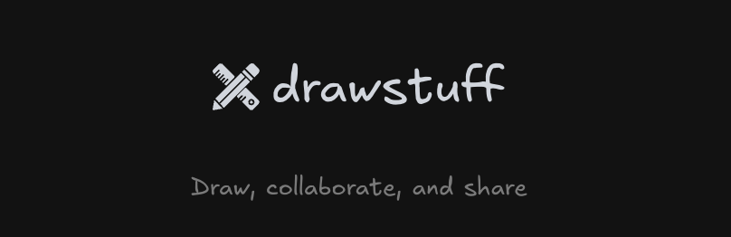

<p align="center">
  
</p>

<p align="center">
  A cloud-backed whiteboard built on Excalidraw.
</p>

<p align="center">
  <a href="https://draw.ericts.com">Live app</a> ·
  <a href="./docs/README.md">Documentation</a>
</p>

## Overview

drawstuff combines a full-screen Excalidraw editor with cloud persistence, workspace organization,
encrypted sharing, real-time collaboration, and public read-only pages.

### Features

- Import, export, autosave, thumbnails, and attached binary assets
- Workspaces with scene search, filters, and categories
- Client-side compressed and AES-GCM-encrypted private share links
- Encrypted real-time collaboration through a Cloudflare Durable Object gateway; members reopen rooms from any device
- Public read-only pages at `/p/[slug]`
- English and Traditional Chinese UI

## Tech Stack

| Layer          | Technology                       |
| -------------- | -------------------------------- |
| Framework      | Next.js 16, React 19             |
| Drawing engine | Excalidraw                       |
| API            | tRPC v11                         |
| Database       | PostgreSQL, Drizzle ORM          |
| Authentication | Better Auth, Google OAuth        |
| Storage        | UploadThing                      |
| UI             | Tailwind CSS v4, Base UI, Sonner |
| Realtime       | Cloudflare Durable Objects       |

## Getting Started

### Prerequisites

- Node.js 24+
- pnpm 11+
- PostgreSQL
- UploadThing
- Google OAuth credentials
- Upstash Redis
- A deployed or locally running collaboration Worker

### Setup

```bash
git clone https://github.com/EricTsai83/drawstuff.git
cd drawstuff
pnpm install
cp apps/web/.env.example apps/web/.env
```

Fill in `apps/web/.env`, then initialize the database and start the web app:

```bash
pnpm db:push
pnpm dev
```

Open `http://localhost:3000`. The collaboration Worker runs separately from `pnpm dev`; see
[apps/collaboration-do/README.md](./apps/collaboration-do/README.md) for its configuration and
deployment workflow.

## Environment Variables

The complete template is [apps/web/.env.example](./apps/web/.env.example), and the validation schema
is [apps/web/src/env.ts](./apps/web/src/env.ts).

| Purpose        | Variables                                                                                              |
| -------------- | ------------------------------------------------------------------------------------------------------ |
| Database       | `POSTGRES_URL`, `POSTGRES_URL_NON_POOLING`                                                             |
| Authentication | `BETTER_AUTH_SECRET`, `BETTER_AUTH_URL`, `GOOGLE_CLIENT_ID`, `GOOGLE_CLIENT_SECRET`                    |
| Storage        | `UPLOADTHING_TOKEN`                                                                                    |
| Public origin  | `NEXT_PUBLIC_BASE_URL`                                                                                 |
| Collaboration  | `COLLAB_IDENTITY_SECRET`, `COLLAB_AUTHORITY_SECRET`, `COLLAB_ADAPTER_SECRET`, `COLLAB_CONTROL_URL`, `UPSTASH_REDIS_REST_URL`, `UPSTASH_REDIS_REST_TOKEN` |
| Maintenance    | `CRON_SECRET`, `CLEANUP_OWNER_EMAIL`                                                                   |

Optional collaboration settings:

- `COLLAB_ROOMS_DISABLED=true` prevents new room creation and joins during an incident.

The three collaboration secrets must each be at least 32 characters and match the corresponding Worker capabilities. The coordinated schema reset and deployment are described in the [P3 runbook](./docs/deployment/collaboration-reset/README.md).
`BETTER_AUTH_URL` and `NEXT_PUBLIC_BASE_URL` must be the same origin. For Google OAuth, register
`<origin>/api/auth/callback/google` as an authorized redirect URI.

## Architecture

```text
apps/
  web/                   # Next.js UI, tRPC API, and persistence
  collaboration-do/      # Cloudflare Worker and CollaborationRoom Durable Object
packages/
  excalidraw-adapter/    # The only package allowed to import Excalidraw
  collaboration/         # Transport-neutral protocol, crypto, and recovery
```

Dependencies flow one way: the web app consumes both shared packages, while the Worker consumes
only the server-safe collaboration entries. See the
[architecture contract](./docs/architecture/architecture-contract.md) for ownership rules.

Collaboration room content is encrypted in the browser before it reaches the relay, database, or
object storage. Rooms are not end-to-end encrypted: the room Durable Object keeps a custody copy of
each room key, wrapped under a Worker secret, and releases it to the owner and members
([plan 19](./plans/19-server-room-key-custody.md)). The full design and limitations are documented
in the [collaboration system design](./docs/architecture/collaboration-system-design.md) and
[threat model](./docs/architecture/collaboration-threat-model.md).

## Useful Scripts

| Command                                         | Purpose                                                  |
| ----------------------------------------------- | -------------------------------------------------------- |
| `pnpm dev`                                      | Start the web development server                         |
| `pnpm build`                                    | Build all workspaces                                     |
| `pnpm check`                                    | Run formatting, lint, types, tests, and dead-code checks |
| `pnpm lint`                                     | Run ESLint                                               |
| `pnpm typecheck`                                | Run TypeScript checks                                    |
| `pnpm test`                                     | Run unit tests                                           |
| `pnpm test:e2e`                                 | Run Playwright tests                                     |
| `pnpm db:push`                                  | Push the Drizzle schema to the configured database       |
| `pnpm admin:bootstrap --email user@example.com` | Provision the first operator                             |

Cloudflare commands such as `pnpm cf:preflight`, `pnpm cf:deploy`, and `pnpm cf:smoke` are described
in the [Worker README](./apps/collaboration-do/README.md).

## Administration and Operations

After the first production deployment, sign in once with the intended operator account, then run:

```bash
pnpm admin:bootstrap --email operator@example.com
```

Use `/admin` for later access changes and retirement operations. Production schema changes,
bootstrap safety, and recovery procedures are covered by the
[administrative runbook](./docs/operations/admin-data-retirement.md). Collaboration deployment and
rollback procedures live in the
[Worker deployment runbook](./docs/operations/collaboration-do-deployment.md).

The scheduled cleanup endpoint is `POST /api/maintenance/cleanup`, authenticated with
`Authorization: Bearer <CRON_SECRET>`. Review its retention behavior before enabling the default
Vercel schedule (`30 3 * * 1`).

## Documentation

Start with the [documentation guide](./docs/README.md) for architecture contracts, ADRs, operations,
performance budgets, and reusable system-design notes.

## License

[MIT](./LICENSE)
