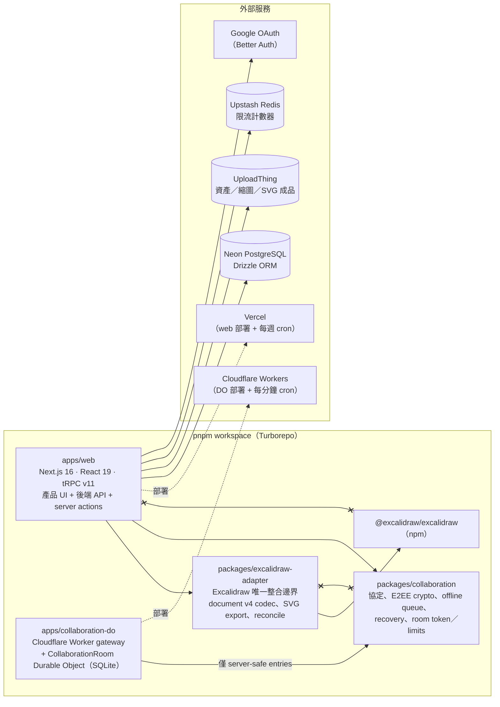
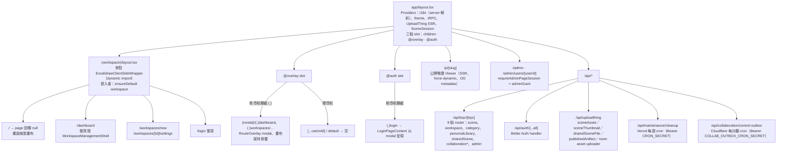
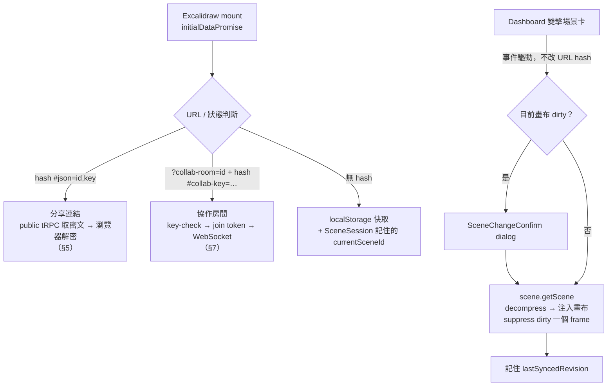
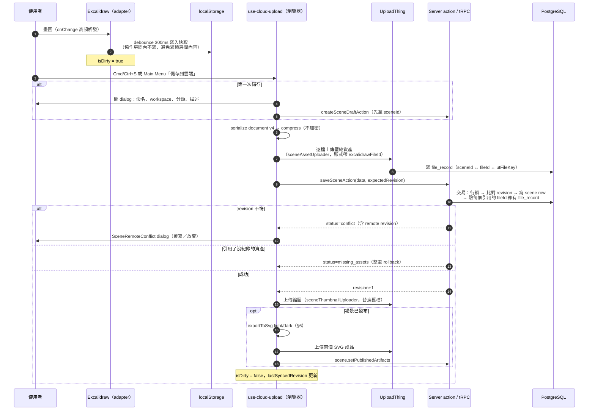
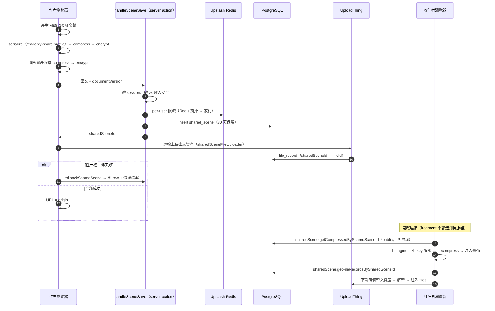
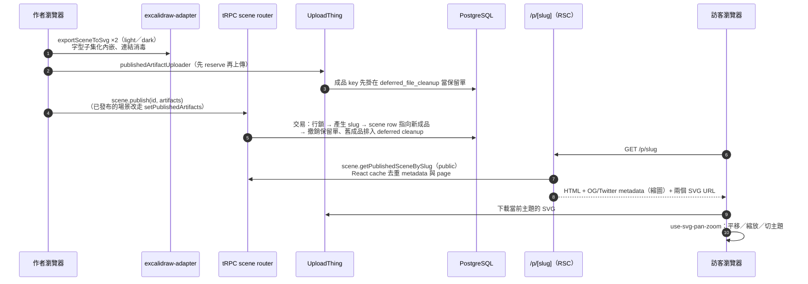
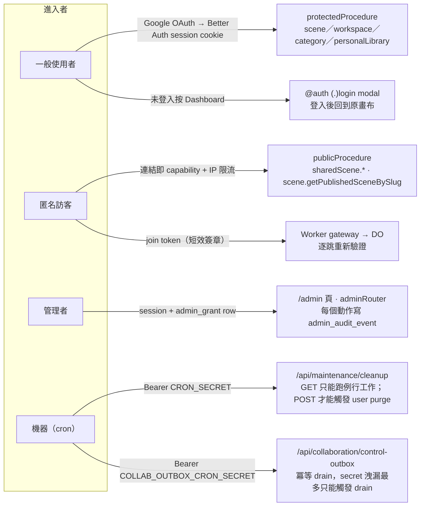
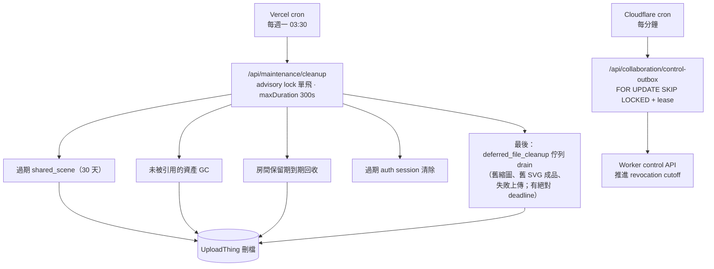

# 以頁面與場景看 drawstuff：面試／onboarding 導覽

> 這篇是「照使用者會碰到的頁面與場景」重新切一次系統，適合口頭介紹。
> `system-design/` 是照 pattern 切，兩者互補：這裡每一段末尾都指回對應的 pattern 文件，
> 那些文件裡已有更細的圖，本篇不重畫。

建議講法：先用 §1 說「有哪幾塊、各部署在哪」，再用 §2 說「一個網址進來會落到哪個頁面」，
然後挑 §3–§8 其中兩三個場景深入。

## 1. 全貌：Monorepo、部署與依賴方向

`system-design/system-overview.md` 的架構圖用的是角色名（Web App、Coordinator）；
這張改用實際的 package／服務名稱，方便對照 repo。

一句話總結依賴：**web 是兩個 package 唯一相遇的地方**；Worker 只吃 collaboration 的
server-safe 入口，不知道 React 也不知道 Excalidraw。這條規則由 exports map、ESLint、
AST 架構測試三層機器強制，見 [模組邊界](../system-design/module-boundaries.md)。

## 2. 路由地圖：一個網址會落到哪裡

`apps/web/src/app` 用 App Router 的 route group 與 parallel route：畫布是常駐的
layout，Dashboard／Workspaces／Login 都是「有 URL 的 overlay」，硬導航時才變成整頁。

同一份 `DashboardContent` 會被 canonical page 與 intercepted page 各包一次殼；
為什麼這樣設計、關閉／前進後退怎麼處理，見
[持久工作區與 URL-Addressable Overlay](../system-design/persistent-shell-overlay-routing.md)
（內含三張圖）與 [workspace overlay routing 契約](./workspace-overlay-routing-system-design.md)。

## 3. 場景：編輯器頁（載入 → 編輯 → 儲存）

這是使用者停留最久的頁面。重點有二：**畫布資料有四種進來的方式**，以及
**「本地快取」與「雲端儲存」是兩條獨立路徑**。

### 3.1 畫布資料從哪來

### 3.2 儲存：本地 debounce 與雲端 optimistic lock

值得帶走的點：

- **Excalidraw 不知道雲端存在**。序列化、restore、reconcile 全走 adapter 的 document v4
  codec；web 端不碰 element model。見 [第三方引擎 Adapter](../system-design/third-party-engine-adapter.md)。
- **revision 是 optimistic lock**，衝突交給使用者決定，不做自動合併。
- **儲存時驗資產引用**在同一交易的行鎖下進行，與清理 action 互斥，避免「commit 了卻指向
  不存在的檔案」。見 [封閉結果型別與純決策函式](../system-design/typed-results-and-pure-decisions.md)。
- 回灌遠端內容時要壓住 dirty flag，否則載入本身會被當成使用者修改。見
  [遠端狀態回灌的重入抑制](../system-design/reentrancy-suppression-for-echoed-remote-state.md)。

## 4. 場景：Dashboard 與 Workspaces（overlay）

使用者按 Dashboard 時 URL 變成 `/dashboard`、可分享可書籤，但畫布不 remount：
viewport、undo、dirty 狀態、協作連線全部保留。資料流很單純
（`scene.getUserScenesInfinite` 無限捲動、`category.*`、`workspace.*`），
架構重點全在 routing，圖已在
[持久工作區與 URL-Addressable Overlay](../system-design/persistent-shell-overlay-routing.md)：

- 三層結構圖：共享 layout → 工作區層／overlay 層 → 本地 dialog 層；
- 決策圖：軟導航走 intercepted page，硬導航走 canonical page；
- 時序圖：開啟、Esc／backdrop 關閉、Forward 重建。

## 5. 場景：私人分享連結（客戶端加密）

「分享」不是把場景設成公開，而是**產生一把只存在 URL fragment 的金鑰**。伺服器存的是密文，
連結本身就是 capability，所以讀取端是 public procedure，只按 IP 限流。

與協作房間金鑰的差異：分享連結是**一次性快照**、單一金鑰；協作房間是 root key 經 HKDF
衍生出 realtime／snapshot／asset／keycheck 四把 purpose-scoped 鍵，見
[瀏覽器端 E2EE 與金鑰生命週期](../system-design/e2ee-key-lifecycle.md)。

## 6. 場景：發布為公開頁 `/p/[slug]`

公開頁**不載入 Excalidraw**。作者在儲存／發布時就把場景渲染成 light／dark 兩個 SVG 上傳；
訪客只下載 SVG 加一層平移縮放。

為什麼不在訪客端渲染、字型為何要在匯出時子集化、CSP 怎麼配合，見
[Render once, serve many](../system-design/render-once-serve-many.md) 與
[以引擎的靜態匯出當唯讀 Viewer](../system-design/static-export-as-read-only-viewer.md)。

## 7. 場景：即時協作房間

這是系統最複雜的部分，圖已經齊全，這裡只列講述順序與對應的圖：

1. **整體時序**（加入 → 協作 → 快照 → 撤銷）：
   [系統總覽](../system-design/system-overview.md) 的 sequenceDiagram。
2. **拓撲與狀態機**（gateway、DO、hibernation、generation）：
   [即時協作房間](../system-design/realtime-room-coordination.md) 三張圖。
3. **金鑰**（fragment、HKDF、key-check fail-closed）：
   [E2EE 金鑰生命週期](../system-design/e2ee-key-lifecycle.md) 三張圖。
4. **撤銷成員的一致性**（同交易寫 outbox、best-effort control、cron 補送）：
   [Transactional Outbox](../system-design/transactional-outbox.md)。
5. **誰負責寫快照、多久寫一次**：
   [Client 寫入節奏與 writer 選舉](../system-design/client-write-pacing-and-writer-election.md)。

口頭一句話：**Durable Object 只做 coordination，不存明文也不存權威畫布**；授權在
PostgreSQL 決定、以短效 token 帶到 Worker、每一跳重新驗證。

## 8. 場景：登入、授權與後台入口

系統有四種「進門」的方式，各用一種機制，不混用。

設計原則見 [分層授權](../system-design/layered-authorization.md)；限流為何 fail-open 而
授權為何 fail-closed，見 [防禦性邊界](../system-design/defensive-boundaries.md)。

## 9. 幕後：兩個時鐘與資料生命週期

兩個 cron 刻意分開：一個是儲存清理（慢、每週、可以晚），一個是授權撤銷的修復路徑
（快、每分鐘、不能被清理工作拖住）。保留矩陣與 GC 的有界設計見
[資料生命週期](../system-design/data-lifecycle-and-gc.md) 與
[data lifecycle 契約](./data-lifecycle.md)。

## 附錄：資料表一覽（口頭介紹用）

| 群組 | 表 |
| --- | --- |
| 身分 | `user`、`session`、`account`、`verification`、`admin_grant`、`admin_audit_event` |
| 組織 | `workspace`、`user_default_workspace`、`user_last_active_workspace`、`category`、`scene_category` |
| 內容 | `scene`（含 revision、slug、成品指標）、`personal_library`、`shared_scene`、`file_record` |
| 協作 | `collaboration_room`、`collaboration_room_member`、`collaboration_snapshot`、`collaboration_asset`、`collaboration_control_outbox` |
| 維護 | `deferred_file_cleanup` |
