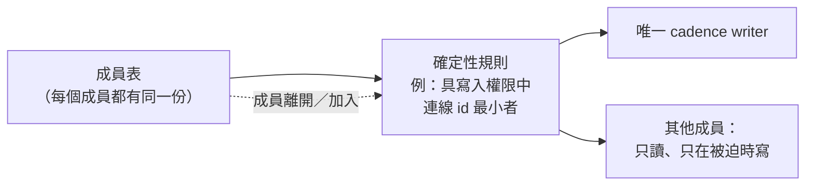
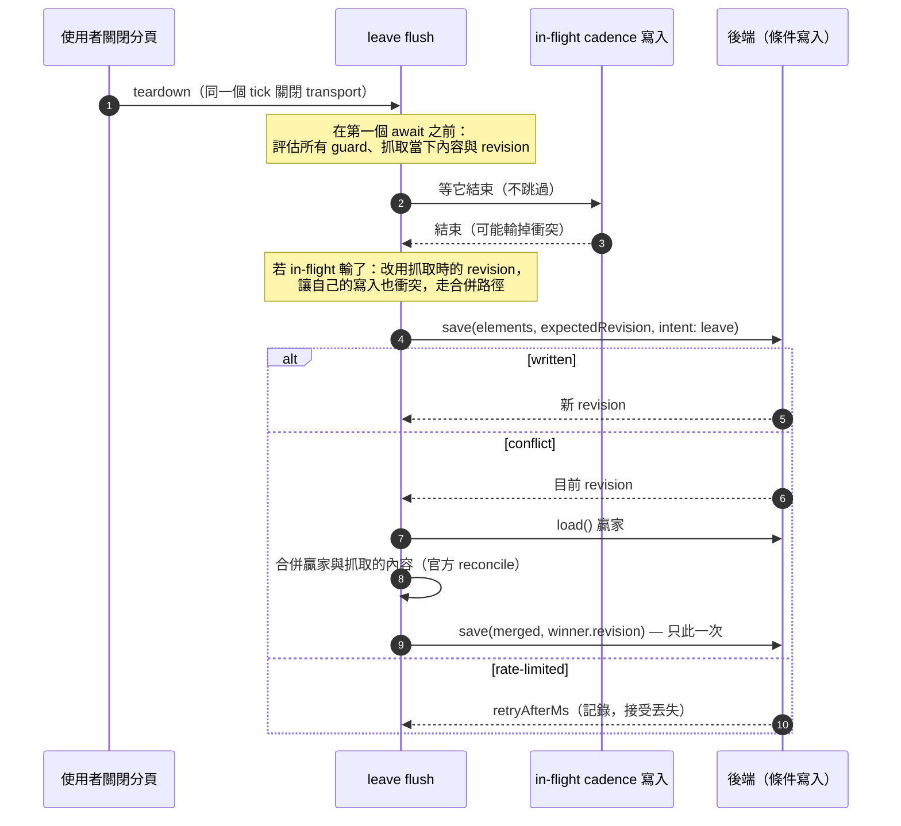

# Client 寫入節奏與 writer 選舉：cadence cooldown、伺服器指定的 notBefore 與最後一筆寫入

> **Pattern 一句話**：多個 client 共享同一份持久狀態與同一個寫入預算時，讓 client 自己節制：
> 以確定性規則從成員表選出**唯一的** cadence writer；伺服器的 429 帶回 deadline，client 記成
> `notBefore` 並跳過視窗內的 tick；「離開時的最後一筆寫入」是另一種工作——它無視 cooldown 與
> 選舉、等待 in-flight 寫入、衝突時合併贏家再重試一次，但**授權 guard 一律照常**。

## 問題

即時協作的每個 client 都持有完整狀態，也都能把它持久化。若每個 client 都按自己的節奏寫：

- N 個成員 = N 倍的寫入量與 N 倍的 optimistic-revision 衝突，房間越熱鬧越浪費；
- 伺服器的限流回 429 之後，把它當一般錯誤處理的 client 會在下一個 tick 立刻再撞一次，
  形成永遠不會成功的 round trip；
- 「使用者關閉分頁」是最容易丟資料的時刻——teardown 在同一個 tick 關閉一切，而此刻
  可能是房間裡最後一個人，儲存的基準是場景僅存的副本；
- 一個讀不到基準的 client（拿錯金鑰、快照 fetch 失敗）若照樣寫入，會用一張空白畫布
  覆蓋房間的歷史。

## Pattern

### 1. 選一個 writer，不是所有人寫

從成員表以**純函式**選出 writer：每個 client 看同一份成員表就算出同一個答案，
不需要協商回合、不需要 lease；writer 離開時下一個 tick 自然換人。
合格條件（有寫入角色）要包含在規則裡——只有 viewer 的房間就不寫，保留既有快照。

writer 也不是每次 tick 都寫：對即將寫入的內容算 digest，與上次**成功落地**的 digest 相同
就跳過。閒置的房間零寫入。

### 2. Cadence 的形狀：重新掛載的 timeout，不是 interval

- 每個 tick 結束才排下一個 tick（`setTimeout` 重掛而非 `setInterval`），慢的寫入永遠
  不會排出重疊的 tick；
- 同時最多一個 in-flight 寫入；
- 寫入是條件式的（帶 `expectedRevision`），結果是封閉 union：
  `written | conflict | rate-limited | oversize | …`（見
  [封閉結果型別](./typed-results-and-pure-decisions.md)）。

### 3. 伺服器指定的 cooldown：`notBefore`

429 一定帶機器可讀的 `retryAfterMs`／`reset`。client 記成 `notBefore = now + retryAfterMs`，
之後的 tick 若落在 `notBefore` 之前就直接返回——視窗內的每一次呼叫都是**不可能成功**的
round trip。永不 parse 訊息文字；deadline 存在 cadence 這一層（決定「不要再叫」的是
cadence，store 只回報 deadline）。

`notBefore` **只約束 cadence**，理由見 §5。

### 4. 只有知道基準的人可以取代基準

「這個 client 知道目前儲存的基準是什麼」是一個獨立的布林狀態，與 revision 一起管理：

- 剛加入時基準未知 → 不得寫；載入快照成功（或確認房間為空）→ 已知；
- 每次衝突都把它重設為未知——贏家存了這個 client 沒讀過的內容，宣稱取代它等於抹掉它；
- 「未知」是安全方向，但**不得永久**：cadence tick 在未知時改成重試讀取基準，
  讀不到就繼續停寫，讀到了就恢復寫入。真正壞掉的快照會一直讀不到，停寫正確。

### 5. 強制 leave flush：另一種工作

離開前的 flush 與 cadence 寫入是**不同的工作**，因為「離開」可能是房間清空——
此後沒有任何 tick 會把最後那筆編輯撿起來。所以強制 flush：

| 面向                                      | Cadence 寫入             | 強制 leave flush                                                |
| ----------------------------------------- | ------------------------ | --------------------------------------------------------------- |
| writer 選舉                               | 只有被選中者寫           | **無視**（崩潰 writer 的離開通知可能還沒到）                    |
| `notBefore` cooldown                      | 遵守                     | **無視**（被拒的請求什麼都不花；被略過的 flush 可能丟整個場景） |
| session 已 destroy                        | 不寫                     | 仍寫（teardown 與 flush 在同一個 tick）                         |
| 有 in-flight 寫入                         | 跳過這個 tick            | **排隊等它**（它載的是使用者最後編輯**之前**的場景）            |
| 衝突                                      | 記下贏家，下個 tick 重試 | **載入贏家、合併、重試一次**（沒有下個 tick）                   |
| 授權、角色、世代、基準已知、條件 revision | 全部適用                 | **全部適用**——繞過選舉不等於繞過授權                            |

三個容易寫錯的細節：

1. **所有 guard 與內容抓取都在第一個 `await` 之前**。teardown 在同一個 tick 清掉連線狀態、
   畫布可能隨即被交給別的場景；await 之後再讀 guard 或畫布，看到的是被拆掉的世界。
   寫入本身走 HTTP、不需要活的 socket，所以「現在決定、稍後寫」是安全的。
2. **排隊等 in-flight 寫入時，要追蹤它有沒有輸掉衝突**——不是看「基準是否已知」（衝突
   路徑可能已經修好它），而是專門記一個旗標。否則 flush 會拿著贏家的 revision、寫入贏家
   之前的內容，條件寫入放行，贏家被抹掉。
3. **合併用領域的官方 reconcile，不碰畫布**：畫布此時可能已不屬於這個房間，而結果必須同時
   包含雙方。

伺服器端與之配對的是一個小額「保留預算」：只有正常預算明確拒絕後才能動用、上限只夠
一次最終寫入加一次衝突重試（見 [防禦性邊界](./defensive-boundaries.md) §5）。

### 6. 接受的殘餘風險

瀏覽器 process 被殺、裝置離線、請求沒離開 process——這筆寫入就是會丟。
是否為此加離線佇列是一個要**明確拒絕或明確採納**的決策，而不是待辦
（見 [記錄下來的拒絕](./recorded-refusals.md)）。

## 評估

- 「選舉 + digest」把持久寫入量從 O(成員數 × tick) 壓到 O(有變化的 tick)，
  而且不需要任何伺服器端協調。
- 「leave flush 是不同的工作」這個切分最值得帶走：它讓「無視 cooldown」有清楚的邊界
  （只有 flush、只有一次、授權照常），而不是散落各處的 `if (force)`。
- `notBefore` 讓 client 與伺服器限流成為**合作**而非對抗：伺服器說什麼時候，client 就
  等到什麼時候。

## Trade-offs

- 選舉依賴成員表一致；成員表的傳播延遲會造成短暫雙 writer 或零 writer，
  由條件寫入（衝突）與下一個 tick 吸收——這要求後端寫入本來就是條件式的。
- 一次「合併後重試」是有意的上限：更多重試會把離開變成無界迴圈。丟失的機率不為零，
  要寫進限制。
- guard 表有六七項，任何新增的寫入路徑都必須重新過表；把它們收在一個函式裡是
  唯一可維護的方式。

## 本專案中的實例

- 完整規則（writer 選舉、cadence、leave flush、殘餘風險）：
  [collaboration system design](../architecture/collaboration-system-design.md) 的
  Join bootstrap, snapshots, and recovery 與 Leave snapshot finalization reserve 兩節。
- 實作：`apps/web/src/lib/collab/session/snapshot-cadence.ts`（guard、`notBefore`、
  in-flight 追蹤、合併重試；註解記錄每個非顯然決策）、
  `packages/collaboration/src/snapshot.ts` 的 `electSnapshotWriter`（最小 `peerId` 的
  editor／owner）、`packages/collaboration/src/client-pacing.ts`（client 節奏常數，
  與 Durable Object 的速率預算以契約測試綁定）。
- 數字：cadence 30 s、room 預算 6 次／分鐘、保留預算 2 次／使用者／房間／分鐘——
  [collaboration SLO §5](../performance/collaboration-slo-capacity.md)。
