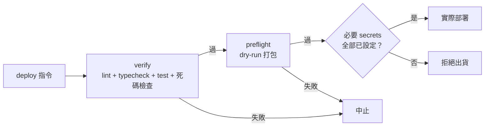
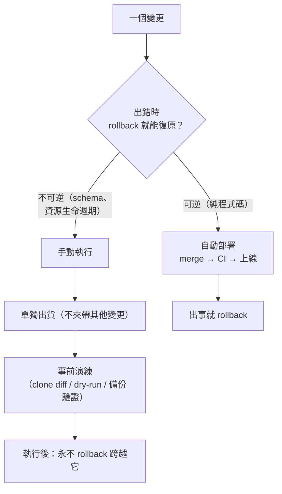

# Config 與部署是受測工件，不是儀表板設定

> **Pattern 一句話**：環境變數在啟動／build 時以 schema 驗證、缺失即失敗；
> 部署設定檔由測試逐欄位釘住（改不可逆的欄位必須同時改測試——那就是 review 訊號）；
> deploy 是一連串 gate 的最後一步，不是一個裸命令。

## 問題

Config 是系統裡最少被測試、卻最常引發事故的部分：一個 env var 沒設，
在第一個請求碰到它時才爆；儀表板上手動改的設定在下次部署被覆蓋；
一次「順手」的設定變更觸發了不可逆的資源生命週期操作。

## Pattern

### 1. Env 驗證：啟動即驗、缺失即死、註明信任邊界

- 所有環境變數集中在一個 schema 模組（server／client 分開，client 變數強制前綴）；
- 這個模組在 build 入口被 import——**壞的 env 讓 build 失敗**，而不是讓某個
  深夜請求失敗；
- 每個變數附註它的信任邊界與用途；空字串視為未設定；
- 明確的逃生門（一個具名的「跳過驗證」旗標）只給 CI 的特定情境，且逃生門的語意是
  「**省略**該功能」而不是「放寬成萬用值」。

### 2. 憑證按爆炸半徑分離

不同用途的 machine-to-machine secret 不共用：維運 cron 一把、佇列 drain 一把、
token 簽章一把。任何一把外洩的影響範圍是清楚可述的。可選的 secret 未設定時
fail closed（整個 endpoint 401），不是靜默停用驗證。

### 3. 部署設定檔是受測工件

把部署設定（worker 平台的部署描述檔、CI workflow、header 政策）當程式碼對待：

- 測試用**平台自己的 config resolver** 讀取設定檔，逐欄位斷言：綁定、
  compatibility 版本、必要 secrets 清單、cron 表達式、允許的 vars key 集合……
  「測試斷言的就是一次 deploy 會實際送出的」；
- **不可逆的欄位被測試釘住**是刻意設計：改資源生命週期（如 stateful class 的
  建立／改名／刪除）必須同時修改測試，這個 diff 就是強制的 review 訊號；
- 測試專用的注入點（假時鐘、test binding）在型別上存在，但 config 測試斷言
  它**不在** production 設定檔裡。

### 4. Deploy 是 gate 鏈

部署命令永遠不裸跑。

### 5. 可逆自動、不可逆手動

一條非常好用的分類法：**可逆的變更走自動部署**（code push → 自動上線，
出錯 rollback 即可）；**不可逆的變更手動執行、單獨出貨、永不跨越 rollback**
（schema 變更、資源生命週期操作）。同一原則同時適用於資料庫（程式碼變更走 CI 自動
部署；schema push 手動執行、事前在 clone 上演練 diff）與 worker 平台（git 觸發的自動
build vs 手動 CLI 部署）。

### 6. 單一環境是一個「決策」，不是缺漏

小型自營專案可以沒有 staging——但要寫下來：為什麼（成本、單人維運）、
邊界靠什麼補（token 授權而非環境隔離、kill switch 作為事故邊界、
可逆變更全部可 rollback）。沒寫下來的省略是債，寫下來的省略是決策——
這是 [記錄下來的拒絕](./recorded-refusals.md) 的一個實例。

### 7. 行為開關的紀律

kill switch／feature flag 讀取集中在一個具名函式；fail-closed 的開關
（如「停用建立房間」）要保留維運出口（既有資源的關閉操作仍可用）。
每個 flag 有 owner 與移除條件，否則它就是永久的第二套行為。

## 評估

- 「config 錯誤在 build/deploy 期爆炸」把一整類 production 事故左移到 CI；
- 「釘住不可逆欄位的測試」是這組 pattern 裡最巧的一招：它把「這個變更需要
  特別小心」從 tribal knowledge 變成機器強制的流程；
- 「可逆自動、不可逆手動」給了自動化程度一個原則性的答案，
  不用逐項辯論「這個要不要自動化」。

## Trade-offs

- config 測試與平台 resolver 綁定，平台升級時要跟著動；
- 單一環境的前提是影響面可承受（個人／小型服務）；多人團隊或高風險變更頻繁時，
  staging 的成本就值得付。

## 本專案中的實例

- Env schema 與 build 期驗證：`apps/web/src/env.ts`（`@t3-oss/env-nextjs` + zod，
  被 `next.config.ts` 頂部 import）；逃生門是 `SKIP_ENV_VALIDATION`（僅 Playwright E2E）。
- 可逆自動／不可逆手動的具體工具：DB 走手動 `db:push`；worker 走 Cloudflare Workers Builds
  （自動）與手動 `wrangler deploy`；部署描述檔為 `wrangler.jsonc`。
- 憑證分離：`CRON_SECRET` 與 `COLLAB_OUTBOX_CRON_SECRET` 分開（理由註在 env.ts）。
- config 稽核測試：`apps/collaboration-do/tests/config-audit.test.ts`
  （wrangler 官方 resolver 讀入、逐欄位釘住、`exports` 生命週期欄位即 review 訊號、
  test-only binding 禁入 production vars）。
- deploy gate 鏈與 secrets.required：`apps/collaboration-do/package.json`、`wrangler.jsonc`。
- 可逆自動／不可逆手動、單一環境決策：
  [collaboration DO deployment](../operations/collaboration-do-deployment.md)、
  [engineering conventions](../operations/engineering-conventions.md) 的 DB 章節。
- kill switch：`COLLAB_ROOMS_DISABLED`（`apps/web/src/server/collab/relay-routing.ts`）。
