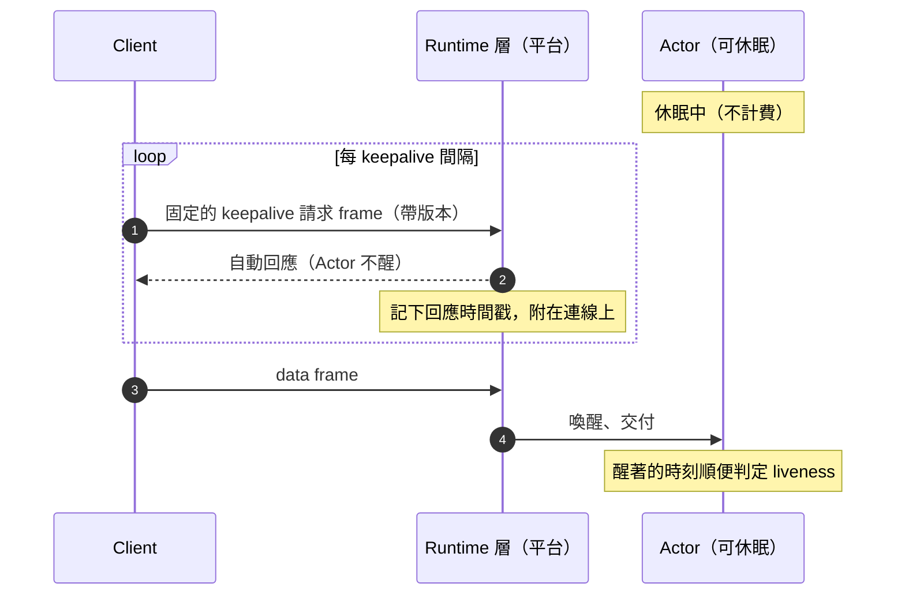
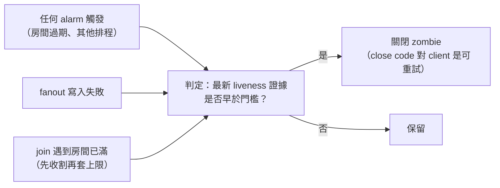

# 成本感知的有狀態服務：可休眠、按 wall-time 計費的 actor 如何做 liveness

> **Pattern 一句話**：當有狀態服務可以休眠、而醒著的每一毫秒都計費，任何「伺服器主動定期做事」
> （ping、liveness alarm、prewarm）都直接變成帳單。改成：client 驅動 keepalive、由 runtime 層
> 自動回應而不喚醒服務、liveness 只在**本來就要醒來**的時刻順便判定；偵測延遲因此變長，
> 把上界算出來寫進 SLO，而不是假裝沒有。

## 問題

傳統長連線服務（Node process、VM）的 dead-peer 偵測是伺服器每 N 秒 ping、漏一次 pong 就
terminate。搬到可休眠的 actor 平台（per-key 有狀態 runtime，閒置即休眠、按醒著的時間計費）
後，同一套設計有三個問題：

1. 伺服器發 ping 需要醒來，等於永不休眠——「每 15 秒醒一次」的服務不會有閒置時段；
2. 用高頻 alarm 檢查 liveness 一樣抵銷休眠；
3. 瀏覽器的 WebSocket API 不能發 protocol-level ping，client 端無法直接複製舊機制。

而不偵測 dead peer 也不行：zombie socket 佔房間名額，tab crash 後立刻重連的人會被自己的
殭屍擋在門外。

## Pattern

### 1. 先拆開三個常被混用的概念

| 概念     | 問的問題               | 證據                                  | 到期後果     |
| -------- | ---------------------- | ------------------------------------- | ------------ |
| liveness | socket 還活著嗎？      | keepalive 回應、任何 frame、join 本身 | 收割 zombie  |
| activity | session 還在被使用嗎？ | **只有** data frame                   | idle timeout |
| wake     | 服務現在醒著嗎？       | 平台事件                              | 計費         |

keepalive **只證明 liveness，不算 activity**：被遺忘的分頁會一直 keepalive，但 idle
deadline 只讀 data frame，它仍會被 idle timeout 關掉。混用兩者的結果是名額被永遠佔住。

### 2. Client 驅動的 keepalive + runtime 自動回應



- client 以固定間隔送一個**固定內容、帶版本**的 keepalive frame；
- 平台的 auto-response 機制回應它，**不喚醒** actor；平台順帶記錄回應時間戳；
- 回應在契約上是 optional：client 永不依賴回應存在；只有伺服器端把時間戳當 liveness 證據。
  這讓「伺服器忽略 keepalive」也是合法狀態，部署順序不受限。

### 3. Lazy liveness：只在本來就醒著的時刻判定

不設專屬的 liveness alarm。liveness 只在這些「反正要醒」的時刻檢查：



「join 遇到房間已滿先收割」尤其重要：它讓 tab crash 後的立即重連不被自己的殭屍擋住，
而且這一刻 actor 本來就醒著。

### 4. 持久化的寫入放大也是成本

actor 每次醒來都從持久化的連線附件重建狀態，所以 `lastFrameAt` 之類的欄位要寫進附件。
但每個 data frame 都重寫附件（幾十個 socket × 每秒上百 frame）是純粹的序列化放大。
解法：**只在持久值落後超過一個 quantum 時才重寫**，而每一條讀這個值的 deadline 都把
quantum 加回去。誤差因此有界、**單向**（只會晚關、不會早關）、且相對 idle 預算可忽略。

### 5. 醒來即重建；例外要有證明

「記憶體裡的任何東西都只是快取」是可休眠 actor 的基本紀律：每個事件從持久附件與本地
儲存重建它需要的東西，constructor 不碰 alarm（否則每次醒來都會覆寫排程）。
允許的例外必須有等價論證——例如每連線的速率桶在醒來時重建為**滿桶**：只要
「補滿一桶所需時間 ≤ 最短休眠門檻」，重建滿桶與持久化在行為上等價。
這個不等式寫成 module-load 時的 assertion（見 [測試作為契約](./testing-as-contracts.md) §2），
任何人改其中一個常數，啟動即爆。

### 6. 把偵測上界算出來、寫進 SLO

```text
dead-peer 偵測上界 = 2 × keepalive 間隔 + 排程餘裕
                   + 附件落後 quantum
                   + 到下一個 lazy 檢查時刻的延遲
```

比伺服器 ping 的「2 × 間隔」長得多，方向是「只會晚、不會早」。這是刻意的取捨，
要寫進 SLO 文件而不是讓讀者以為 dead peer 會在 30 秒內消失。

## 評估

- 「liveness ≠ activity ≠ wake」的三分法是最值得帶走的：大多數 keepalive 相關 bug
  （名額被佔、永不休眠、提早關閉）都來自混用其中兩個。
- lazy 判定把「偵測 zombie」的成本壓到零額外喚醒，代價只是偵測延遲——對協作房間這是
  完全可接受的交換。
- 「例外要有 module-load 證明」讓成本最佳化不會靜默變成正確性缺口。

## Trade-offs

- 偵測延遲從數十秒變成一兩分鐘再加不確定的 lazy 延遲；若產品需要即時的「他離線了」
  訊號，要另外從 client 端的 presence 過期推導，不能靠伺服器收割。
- 依賴平台提供 auto-response 與持久附件這類原生機制；沒有這些機制的平台無法照搬，
  也不應該為它們建假的 portability layer。
- 設計被成本形塑得很深：換到按請求或按記憶體計費的平台，這些取捨要重新評估。

## 本專案中的實例

- 機制、偵測上界與 taxonomy 對應：
  [collaboration SLO §9](../performance/collaboration-slo-capacity.md)。
- 實作：`apps/collaboration-do/src/room.ts`（`setWebSocketAutoResponse`、lazy 收割的
  三個時刻、hibernatable accept、constructor 不碰 alarm）、
  `apps/collaboration-do/src/room-policy.ts`（`ROOM_LIVENESS_TIMEOUT_MS`、
  `LAST_FRAME_PERSIST_QUANTUM_MS`、`HIBERNATION_MIN_IDLE_MS` 與滿桶重建的等價論證）、
  `packages/collaboration/src/client-pacing.ts`（`KEEPALIVE_INTERVAL_MS` = 15 s）。
- 「不移植 Node process primitives、不預建 Object」的決策：
  [ADR-0003](../adr/0003-collaboration-do-gateway-foundation.md) CLAIM-MIG-5／6。
