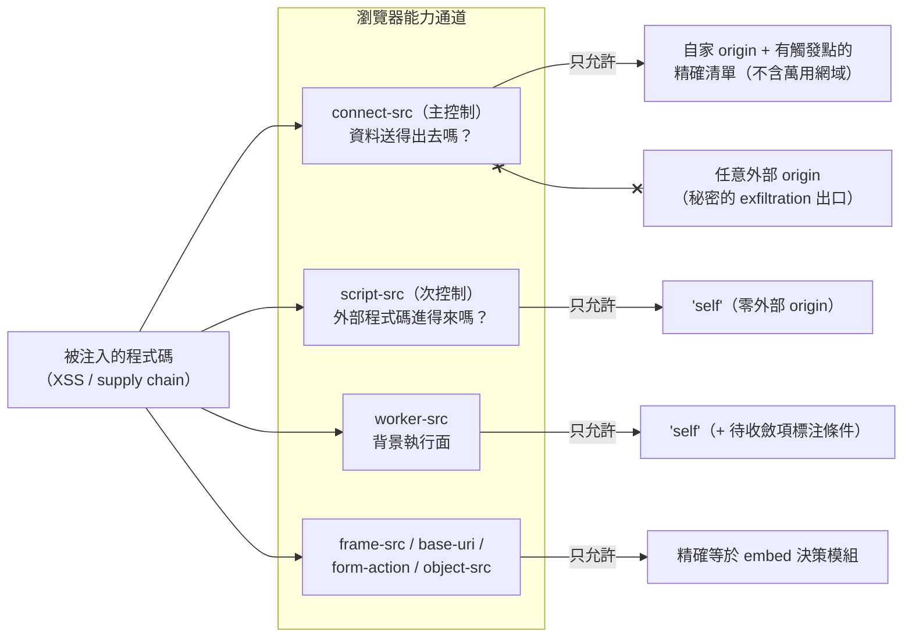
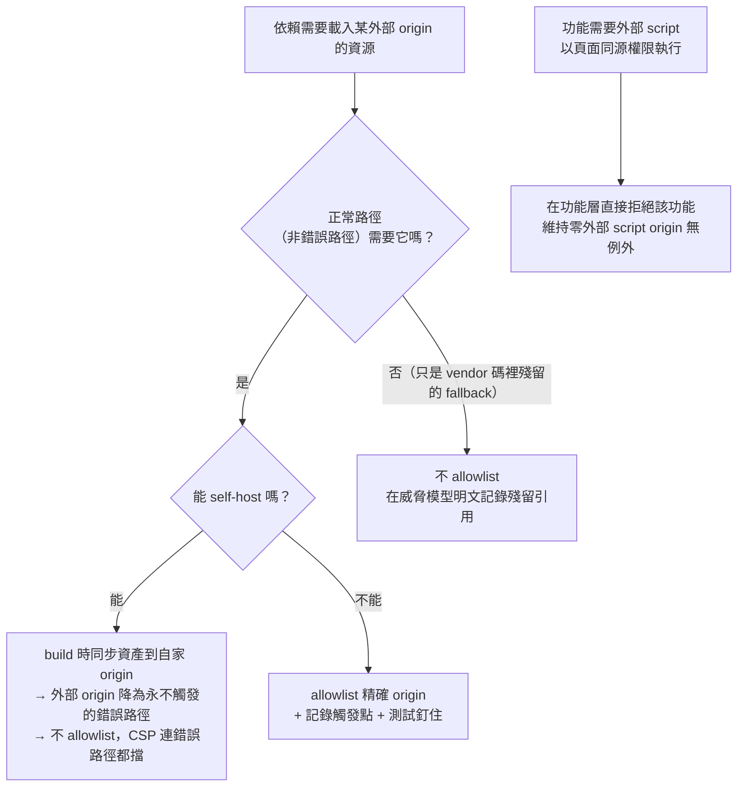

# CSP 與 Code Delivery：以「通道」為單位收斂瀏覽器能力

> **Pattern 一句話**：不要逐條抄 CSP 安全建議——把瀏覽器能力拆成幾類「通道」，
> 對每類通道問「被注入的程式碼能用它做什麼」，收斂到正常功能所需的最小集合；
> 政策由單一 config 模組產生、被測試釘住，且對「CSP 擋不住什麼」保持誠實。

## 問題

CSP 通常是「上線前照 checklist 補一下」的產物：directive 抄範本、allowlist 越加越寬、
沒人記得每個 origin 為什麼在清單裡、`unsafe-inline` 被視為恥辱但也沒人敢動。
結果是一份既不能解釋也不能收緊的政策。

## Pattern

### 1. 通道模型：每個 directive 回答同一個問題

把 directive 按「被注入的程式碼能拿它做什麼」分類：

| 通道 | Directive | 注入程式碼的用途 |
| --- | --- | --- |
| 執行外部程式碼 | `script-src` | 載入任意外部 script 以頁面權限執行 |
| 背景執行 | `worker-src` | `new Worker(url)` 同等級的執行面 |
| **把資料送出去** | `connect-src` | fetch／XHR／WebSocket 外送任意資料 |
| 內嵌別人 | `frame-src` | 嵌入外部頁面（跨 origin iframe 摸不到父頁） |
| 改寫解析基準 | `base-uri` | 注入 `<base>` 讓相對路徑 script 指向外部 |
| 表單外送 | `form-action` | 注入表單送出輸入 |

然後**排定主從**：如果頁面持有秘密（金鑰、token），`connect-src` 是主控制——
它決定秘密「送得出去嗎、送得到哪」；`script-src`／`worker-src` 是次控制——
決定「惡意程式碼多容易進來」。主從排序決定妥協時犧牲誰：可以容忍
`script-src 'unsafe-inline'`（framework 的串流 inline script 無法事先 hash），
但堅守「零外部 script origin」與 connect-src 精確清單。

### 2. Allowlist 的判準：正常路徑需要什麼

每個 origin 進清單前回答：哪個功能、哪個正常（非錯誤）路徑需要它？
依賴套件寫死的第三方 fallback，用 self-host 把它從「例行路徑」降級為
「永不觸發的錯誤路徑」，然後**不 allowlist 它**——enforce 的 CSP 會把殘餘的
錯誤路徑也擋掉。判準是實際網路行為，不是 vendor 程式碼裡有沒有那個字串。

需要外部 script 才能動的功能（某些第三方 embed），如果那個 script 會以頁面
同源權限執行，直接在功能層拒絕該功能，讓「零外部 script origin」保持無例外。

收斂第三方 fallback 的決策流：

### 3. 政策是 config 模組，不是 dashboard 設定

- header 由一個**純函式** config 模組產生（所有環境依賴是明確參數），
  build 時凍結進部署——所以測試可以釘住整份政策；
- 測試斷言：allowlist 精確等於核准清單、禁止萬用網域、dev 放寬不進 production、
  `frame-src` 精確等於 embed 決策模組（**同一個模組**同時餵 runtime validator
  與 CSP header，兩者不可能各說各話）；
- 環境值缺失時 **fail build**，不退回寬鬆值（寧可 build 失敗，不要靜默送出
  `*.example.com`）；
- 政策、測試、營運文件的觸發點表在同一個 commit 對齊；
- 收緊流程：改動 → report-only 走查 → enforce。

### 4. 對「擋不住什麼」誠實

CSP 是 defense-in-depth，不是授權機制：

- 它不阻止把秘密送到 allowlist **內**的 origin（包括自家）；
- 它完全不約束能改動 bundle 本身的人（部署操作者、supply chain）；
- 若頁面秘密會出現在 URL 上，違規報告端點（`report-uri`）本身就是一條外送
  URL 的通道——「為了緩解而新增出口」可能是負收益，值得明確決策拒絕。

配套的 supply-chain 常態要求（都是為了「誰能改 bundle」這個清單保持最小）：
lockfile 凍結安裝、依賴 postinstall 預設拒絕、CI actions 釘 commit SHA、
production 零第三方瀏覽器 SDK、部署路徑不留長期可推 production 的憑證。

## 評估

- 通道模型讓 CSP 從 checklist 變成可以推理的設計：每個 allowlist 條目有觸發點、
  每個妥協有主從排序的依據、收緊有明確條件。
- 「config 模組 + 測試釘住 + fail build」把 header 從「部署平台上會漂移的設定」
  變成有版本控制、有 review 的程式碼。
- 「誠實劃界」防止安全機制被行銷成它做不到的事，也防止未來的決策建立在錯誤前提上。

## Trade-offs

- 靜態（build 時）CSP 換不到 per-request nonce；要 nonce 就要 middleware 與
  對所有 inline 注入源的全面處理——這是一個明確的取捨點，兩邊都可以選，
  但要寫下選了哪邊、為什麼。
- self-host 資產有同步成本（build script 保證版本與 lockfile 一致）。

## 本專案中的實例

- 通道模型與逐 directive 理由：[web CSP design](../architecture/web-csp-design.md)。
- 決策與妥協記錄（CLAIM-CDB-1～4、字型自託管判準、embed 拒絕）：
  [ADR-0004](../adr/0004-code-delivery-trust-boundary.md)。
- config 模組與測試：`apps/web/src/config/security-headers.ts`、
  `apps/web/tests/security-headers.test.ts`、
  embed 單一來源 `apps/web/src/config/embed-allowlist.ts`。
- 營運程序（report-only → enforce）：[web security headers](../operations/web-security-headers.md)。
