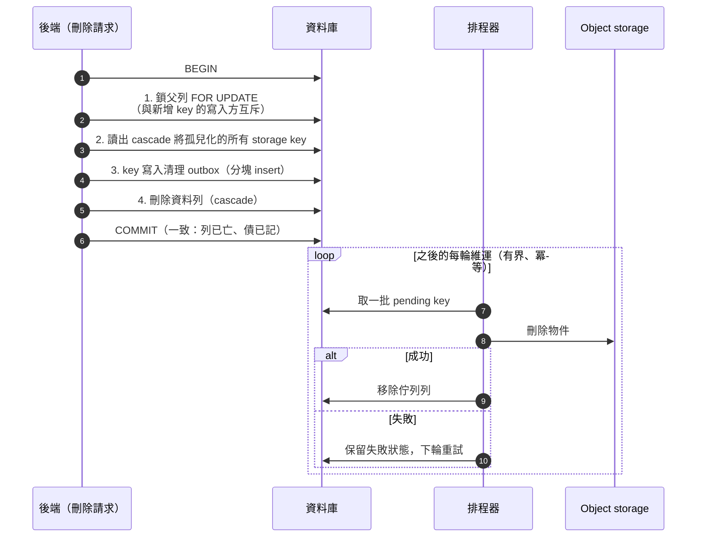
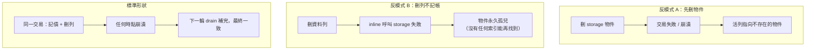

# 資料生命週期：保留矩陣、有界 GC 與並發安全的刪除

> **Pattern 一句話**：為每一類資料寫一列「身分 × 保留條件 × 退場路徑」；刪除永遠是
> 「鎖父列 → 收集孤兒 key → 同交易寫入清理 outbox → 刪列」；所有清理 job 每輪有界，
> 積壓靠多輪消化而不是一輪跑到死。

## 問題

資料的「出生」都有人寫，「死亡」通常沒有：孤兒檔案在 object storage 累積、
過期資料永久佔表、兩個並發操作各刪各的留下懸空引用。而一次「補救式大掃除」
的 job 又常常因為無界執行而 timeout 在一半，留下更糟的中間態。

## Pattern

### 1. 生命週期矩陣：一類資料一列

| 資料 | 身分 | 活躍保留 | 退場路徑 |
| --- | --- | --- | --- |
| 使用者快照 | user id | 每人一列（optimistic revision） | 帳號刪除 cascade |
| 文件資產 | 文件 id + 檔案 id | 被已提交文件引用期間 | 未引用 GC |
| 分享物 | 自身 id | 固定天數 | 排程回收 |

寫這張表的過程會逼出所有沒人決定過的問題：這類資料誰擁有？什麼時候可以死？
誰負責殺它？每一列的退場路徑必須是**具名的機制**，不是「應該會被清掉吧」。

### 2. 世代分域的自我回收（self-bounding persistence）

複合主鍵 `(資源 id, 世代)` + 「新世代寫入成功那一刻，同交易刪除舊世代列」。
儲存量天然有界（每資源至多一個活躍世代），不需要獨立的 reaper 掃描。
特別適合密文資料：世代輪替後舊金鑰已撤銷，舊密文在密碼學上不可讀，
留著只有成本沒有價值。

### 3. 刪除的標準形狀（配合 transactional outbox）

跨越「資料庫 × object storage」的刪除固定走這個順序：

順序的理由：先刪物件、後刪列 → 中途崩潰留下指向空物件的活列；
刪列不入佇列 → 物件永久失聯（GC 只掃還存在的資料列，找不到它）。

**鎖的設計要讓「收集」與「新增」互斥**：新增 key 的寫入方要嘛拿同一把父列鎖，
要嘛因外鍵需要父列的 `FOR KEY SHARE`（與 `FOR UPDATE` 衝突）——
所以不可能有 key 在「收集完成」與「cascade 刪除」之間溜進來變成孤兒。

### 4. 單一可替換物的並發：compare-and-set

「一個資源恰有一個附屬物」（縮圖、頭像）不需要 GC，需要 CAS：
更新只在「資源仍持有上傳前讀到的舊 key（或無）」時落地；輸掉的那個 key
（成功時是舊縮圖、CAS 未中時是新上傳）進清理 outbox。兩個交錯上傳
最後恰留一個被引用的物件，零孤兒。

### 5. 有界 GC：每輪有預算，積壓跨輪消化

每個維運 job 的單輪工作量有上限（列數、物件數、絕對 deadline），超過就留給下一輪：

- **一輪跑不完不是失敗**，是設計——無界的一輪會餓死排在後面的 job，
  或在平台 timeout 時死在任意位置；
- job 之間**具名、獨立執行、獨立回報**，一個失敗不吞掉後面的；
- 會產生清理工作的 job 排在佇列 drain 之前，同一輪就能消化自己的產出；
- 抽樣掃描在 SQL 內做（`ORDER BY random() LIMIT n`），完整候選集不進記憶體；
- 全程冪等：任何一輪在任何位置被殺，下一輪從頭跑都安全；
- 入口用 advisory lock 單飛（single-flight），排程重疊不會並發互踩。

### 6. 回收前的復活競態

「過期資源轉為已結束」要在資源列的鎖底下做，並在拿到鎖之後**重新檢查資格**——
否則一個並發的續期／revive 操作會與回收互相踩踏。順帶把「已結束」保留為
生命週期歷史列（只刪內容、不刪 metadata），比徹底抹除更利於除錯與稽核。

### 7. 特權刪除走同一套服務 + 先寫意圖的稽核

管理員的跨使用者刪除**重用**擁有者刪除的同一套 lifecycle service（直接下 SQL 是
繞過所有上述保證的後門）。每個接受的特權操作先插入一筆 `started` 稽核列、
完成後標記成敗；稽核列**刻意不設對象的外鍵**——刪帳號不能順便刪掉自己的安全紀錄。

## 評估

- 「刪除的標準形狀」一旦建立，所有刪除路徑（單物、workspace、帳號、管理員清除）
  都是同一個模板的實例，review 時只需要檢查「有沒有走模板」。
- 有界 GC + 冪等 + 跨輪消化，是在 serverless／cron 環境下唯一穩健的維運 job 形狀。
- 生命週期矩陣是文件層面的低成本高回報：一張表逼出所有退場決策。

## Trade-offs

- outbox + 排程器 + 稽核是固定的基礎設施成本；資料類型很少的專案可以先只做
  「刪除標準形狀」，矩陣等第三類資料出現再補。
- 世代分域回收的前提是「舊世代確定無價值」；若產品需要歷史版本，這個 pattern
  要換成明確的版本保留策略。

## 本專案中的實例

- 完整矩陣、刪除形狀、鎖設計、有界 job、復活競態、管理員稽核：
  [data lifecycle](../architecture/data-lifecycle.md)。
- 世代分域快照／資產：[collaboration system design](../architecture/collaboration-system-design.md)。
- 縮圖 CAS、advisory lock 維運入口：`apps/web/src/server/maintenance/`、
  `apps/web/src/app/api/maintenance/cleanup/route.ts`。
