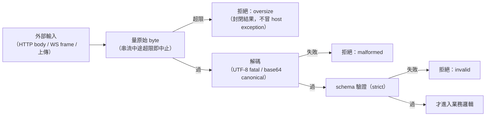
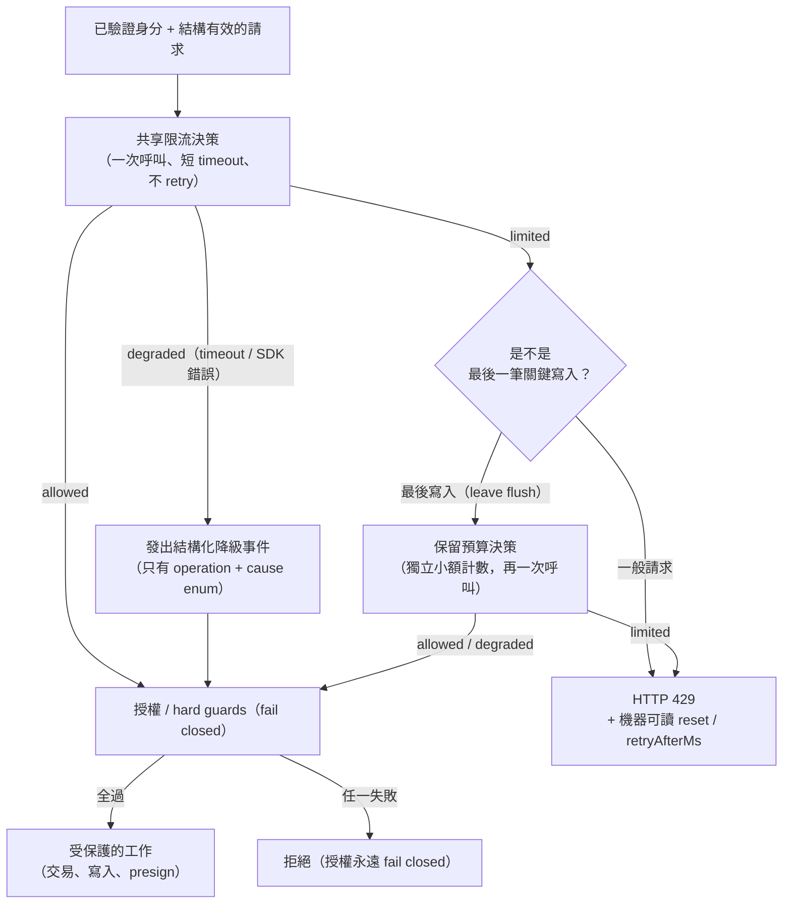

# 防禦性邊界：輸入界限、資源上限與 fail-open / fail-closed 分類

> **Pattern 一句話**：每一筆外部輸入在解碼前先量 byte、每一個佇列／快取／連線都有明確上限；
> 每一個防護機制都明文回答「故障時開還是關」——授權類 fail closed，容量類 fail open
> 且降級狀態必須可觀測。

## 問題

沒有上限的東西，遲早會被填滿：一筆 100 MB 的 JSON 在 parse 時吃光記憶體、
一個慢速消費者讓 outbound buffer 無限成長、一個重試迴圈在故障時放大故障。
而防護機制自己故障時的行為（限流服務逾時了怎麼辦？）通常沒人決定過，
於是由「當時剛好寫成什麼樣」決定。

## Pattern

### 1. Byte-bound before decode

外部輸入的處理順序固定為：**量原始 byte → 拒絕超限 → 解碼 → schema 驗證**。
在 parse 之後才檢查大小，防護就形同虛設（傷害發生在 parse 本身）。
串流輸入在讀取途中超過上限就中止讀取，不是讀完再算。

配套：解碼失敗回傳封閉的結果（`malformed | oversize`），不把 host exception
往上冒——不同 runtime 的 decoder 寬容度不同，冒出去的錯誤形狀不可控。

### 2. Bounded everything

一次列出所有會成長的東西並各給上限與滿載策略：socket buffer、inbound queue、
replay cache、offline queue、重試次數、併發傳輸數、計時器。滿載策略要按語意分：

- **volatile 資料**（presence、游標）：直接丟棄，零成本；
- **有序資料**（內容變更）：不可默默丟（會造成接收端察覺不到的收斂缺口）——
  寧可關閉該連線，讓既有的恢復路徑修復；
- **緩衝溢出**：丟整個 buffer 並標記「欠一次全量同步」，不要重放殘缺的前綴。

連「防護機制自己」也要有界：限流器的追蹤表滿了要 fail open 並在 metrics 可見，
否則限流器本身變成無界記憶體洞。

### 3. 上限的單一來源與推導鏈

同一個界限往往要在多層執行（codec、加密封裝、傳輸框架、資料庫 constraint）。
讓它們**從同一個常數推導**：`maxMessageBytes(channel)` → 加上封裝 overhead →
傳輸層上限 → DB `check()` constraint 直接 import 同一個常數。目標性質是：
「上層接受的資料，永遠不會被下層以大小為由拒絕」，並用契約測試把兩側釘在一起
（client 的節流常數改了，server 預算的測試會 fail）。

### 4. Fail-open / fail-closed：逐機制明文分類

判準：**這個機制保護的是授權，還是容量？**

| 類別 | 故障行為 | 例子 |
| --- | --- | --- |
| 授權、身分、世代、payload 界限 | fail **closed**：拒絕請求 | token 驗證不了、金鑰檢查缺失、配置解析失敗 |
| 容量與濫用防護 | fail **open**：放行 + 發出結構化降級事件 | 限流服務逾時、追蹤表滿載 |

fail open 的兩個紀律：

1. **降級必須可觀測**。「限流沒有在生效」是一個不會自己顯現的狀態（請求照常成功），
   所以每次降級發一筆結構化事件（欄位只有封閉的 operation 與 cause enum），
   對它的持續發生下 alert。
2. **不做本地 fallback、不做 inline retry**。serverless 裡的 process-local 計數器
   「看起來像共享限流」但每個 warm instance 一份，是假的安全；對非冪等的計數操作
   retry 可能重複扣點，並在故障期間放大延遲。一次呼叫、短 timeout、明確三態
   （allowed / limited / degraded）。

### 5. 共享限流器的正確形狀（serverless）

前端請求進入 serverless 後端時的完整決策流（含降級與保留預算）：

- 計數器放在**共享儲存**（serverless 的 process-local 計數器不是限流，是每個
  warm instance 各一份的幻覺），演算法選不會在視窗邊界穿透兩倍流量的那種（sliding
  window）；key 一律來自**已驗證的伺服器端狀態**（authenticated userId、已解析的
  resourceId），永不接受呼叫端自選的 key；
- namespace 帶版本，演算法或 key 語意改變就換新 namespace，不重用舊計數
  （見 [版本與相容性](./versioning-and-compatibility.md) §4）；
- 真正的拒絕回 429 + 機器可讀的 reset／retryAfter；client 依 deadline 排程，
  永不 parse 訊息文字；
- 對「最後一筆關鍵寫入」（例如離開前的 final flush）可以設計一個獨立的小額
  **保留預算**：只有正常預算明確拒絕後才能動用、上限極小（只夠一次最終寫入
  加一次衝突重試）、所有授權 guard 照常適用——謊報意圖最多多買到幾次有界嘗試，
  換不到 bypass。client 端如何配合這個預算，見
  [Client 寫入節奏與 writer 選舉](./client-write-pacing-and-writer-election.md)。

### 6. 檢查順序影響回報語意

一筆訊息同時超限、角色不符、超速時，使用者看到哪個錯誤？固定順序
（過期 → 解碼 → 角色 → 大小 → 速率）讓「協定違規」被回報成違規而不是節流，
避免把權限問題偽裝成容量問題誤導呼叫端。

## 評估

- 「每個防護機制明文回答 fail-open 還是 fail-closed」是這組 pattern 裡最值得帶走的
  一句話——它把一整類「沒人決定過的故障行為」變成 code review 可以檢查的項目。
- 上限推導鏈消滅了一種特別陰險的 bug：兩層各自維護的上限在某次修改後交錯，
  合法資料在中途被拒。

## Trade-offs

- 上限的具體數字需要證據（量測、fixture），拍腦袋的數字會誤傷正常使用者，
  而且錯誤往往在實作後才被 review 發現。上限要伴隨 **sustained-cadence 測試**：
  以合法客戶端的最快節奏持續打，證明它不會被自己的防線切斷。
- 上限是防護邊界而不是容量承諾，兩者混用會讓 SLO 與錯誤訊息一起說錯話
  （見 [上限是防護不是容量](./limits-as-protection-not-capacity.md)）。
- fail open 意味著接受「故障期間暫時沒有上界」；若某條路徑的濫用後果不可接受，
  它就不該被歸為容量類。

## 本專案中的實例

- byte-bound before decode 與封閉解碼結果：`@drawstuff/collaboration` 的 codec 與
  base64 模組；[collaboration system design](../architecture/collaboration-system-design.md)。
- bounded everything 清單與滿載策略：[threat model](../architecture/collaboration-threat-model.md)
  的 untrusted-input controls 表。
- 上限推導鏈：`messages.ts → realtime-crypto.ts → relay-protocol.ts`，
  DB `check()` constraint 直接 import 套件常數（`apps/web/src/server/db/schema.ts`）。
- 共享限流、三態決策、finalization reserve、429 契約：
  [collaboration system design](../architecture/collaboration-system-design.md) 的
  shared backend rate limits 章節。具體參數——Upstash Redis sliding window、
  750 ms timeout、namespace `drawstuff:collab:ratelimit:v1:<operation>`、
  reserve 每使用者每房間 2 tokens／分鐘——在
  [collaboration SLO §5](../performance/collaboration-slo-capacity.md)。
- 「數字推導錯誤、會斷開正常使用者」的真實案例與 sustained-cadence 測試的由來：
  同一份 SLO 文件的「修訂 R1」小節。
