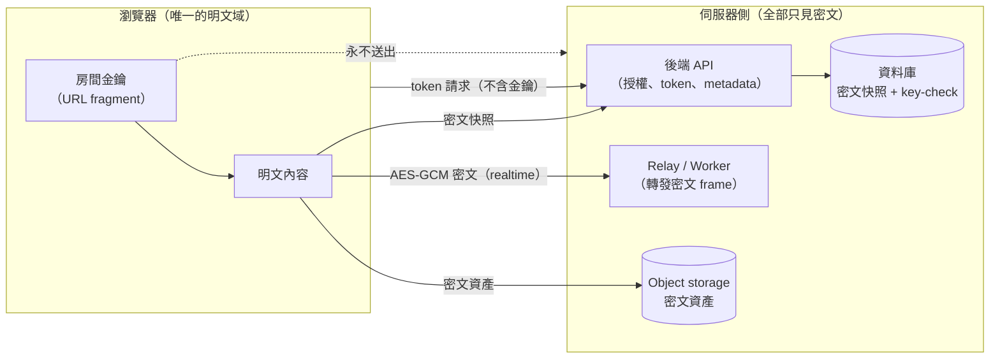
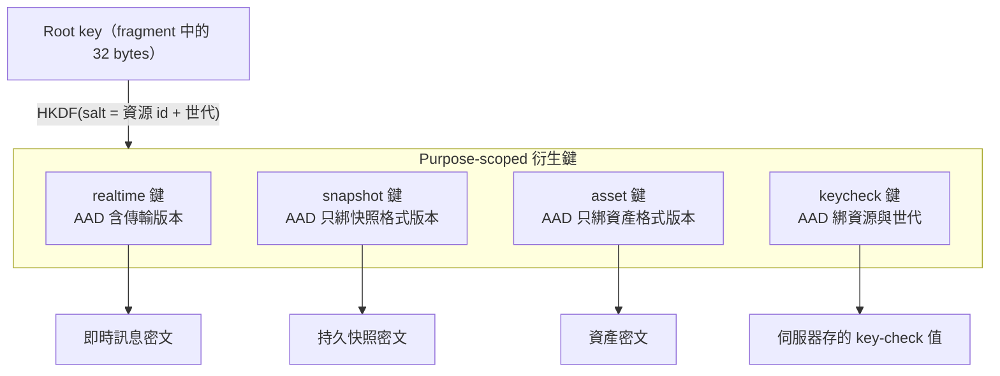
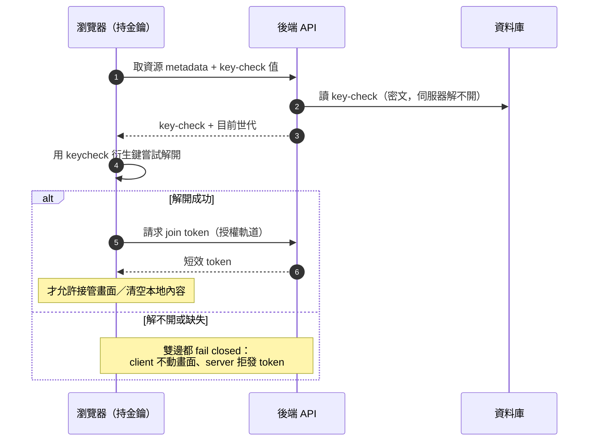

# 瀏覽器端 End-to-End Encryption 與金鑰生命週期

> **Pattern 一句話**：把「授權」與「機密性」拆成兩個獨立機制——伺服器決定誰可以進來
> （token），但讀懂內容的能力只來自一把伺服器從未見過的金鑰（URL fragment 中的 key）；
> 並誠實劃出這個保證的邊界：它擋不住能決定瀏覽器執行什麼程式碼的人。

## 問題

想讓伺服器「轉發、儲存使用者內容，但讀不懂內容」——常見於共編工具、分享連結、
私密筆記。天真的做法（伺服器持有金鑰、或金鑰跟著登入身分走）會讓資料庫外洩、
營運者窺看、中間人攔截全部變成內容外洩。

## Pattern

整體資料流——誰看得到什麼：

### 1. 金鑰放在 URL fragment，永不離開 client

`https://app.example/room#<random-32-byte-key>`。fragment 不會被瀏覽器送到伺服器，
所以「拿到完整連結」等於「拿到金鑰」，而伺服器、relay、storage 從頭到尾沒有金鑰。
這同時定義了它的弱點：**完整連結是 bearer secret**，貼到聊天室就等於把金鑰交出去。
這要作為明文接受的限制寫進威脅模型，而不是假裝不存在。

### 2. 授權與機密性是兩條獨立軌道

- **授權**（誰能連線、誰能寫）：伺服器發短效 token，綁定資源、主體、角色、有效期、
  授權世代。撤銷成員 = 推進世代 cutoff + 斷開現有連線。
- **機密性**（誰能讀懂）：只來自金鑰。持有有效 token 但金鑰錯誤，是一個**受支援且
  明確回報的狀態**，不是異常。

兩者分開的重要推論：**授權撤銷 ≠ 密碼學撤銷**。把成員移出名單能擋住未來的連線，
但無法從他腦中抹掉已經學到的金鑰。真正的密碼學撤銷是**世代輪替（generation rotation）**：
換一把新金鑰、換 salt、換頻道識別，舊世代的密文從此在密碼學上不可讀。

### 3. 用 HKDF 衍生 purpose-scoped 金鑰

一把 root key 不直接用，而是以 HKDF 按用途衍生：`realtime`、`snapshot`、`asset`、
`keycheck` 各一把，salt 綁定資源與世代：

好處：

- 一種用途的格式演進不會波及其他用途的既有密文；
- 每種密文格式有自己的版本號與 authenticated data（AAD）標籤。**傳輸層的版本只放進
  傳輸訊息的 AAD，不放進持久資料的 AAD**——否則一次協定升級會讓所有存檔變成不可解。

### 4. Key check：在動手之前驗證金鑰正確

伺服器存一個固定大小的加密「key-check 值」（用 keycheck 衍生鍵封裝、AAD 綁資源與世代）。
client 在接管畫面、清空本地內容、或請求 token **之前**先驗證手上的金鑰能否解開它。
沒有 key check 或驗證失敗一律 fail closed。這防止的是很具體的災難：拿錯金鑰的 client
以為房間是空的，把垃圾覆寫到正確的存檔上。

配套規則：**驗證值在同一世代內不可變**；輪替時清除並由知道新金鑰的人重算。

### 5. 錯誤分級：單筆損壞 vs 系統性錯鑰

單筆解不開的訊息或資產：靜默丟棄、標記不可用，session 繼續——一筆損壞不該終結整個
session。但「金鑰整個錯了」的表現正是「每一筆都解不開」，若只做單筆丟棄，使用者會
看到一個永遠安靜的空房間。解法是**聚合判定**：連續 N 次失敗且零成功 → 判定為不可讀；
一次成功 → 永久解除該判定。這是「區分雜訊與系統性故障」的通用手法。

### 6. 誠實劃界：code delivery 是信任邊界

瀏覽器端 E2EE 有一條無法用密碼學跨越的邊界：**金鑰被誰讀寫？被伺服器送來的 JavaScript。**
所以任何能決定這段程式碼內容的人——部署平台的操作者、build 期的 supply chain、
runtime injection（XSS）——都能拿到金鑰。從同一條通道送出更多密碼學（attestation、
第二層加密）無法解決，因為驗證程式的程式碼仍由被懷疑的通道交付。

正確的做法不是修復（修不了），而是：

1. 在威脅模型中把它寫成明確的 boundary 與 accepted limitation；
2. 對外宣稱時嚴守措辭：「資料庫外洩／被動窺看讀不到內容」可以說，
   「即使伺服器被入侵我們也讀不到」不可以說；
3. 用 defense-in-depth 縮小攻擊面（CSP 收斂外送出口、鎖 lockfile、部署路徑最小化），
   但文件不得把這些描述成「防止」。

## 評估

- 「授權 / 機密性分離」讓伺服器端可以正常做權限、限流、生命週期管理，完全不需要碰內容——
  伺服器程式碼的攻擊價值大幅下降。
- 世代輪替是少數真正可執行的「撤銷」語意，值得作為預設設計而不是事後補丁。
- 誠實劃界本身就是 pattern：一個寫清楚「這裡擋不住」的威脅模型，比一個處處宣稱安全的
  文件更能防止未來的錯誤決策。

## Trade-offs

- 伺服器讀不懂內容 = 伺服器無法做內容檢索、伺服器端渲染預覽、內容審查；
  這些功能需求會直接與 E2EE 衝突，要在產品層面先做取捨。
- 金鑰在連結裡 = 分享體驗與安全綁死；換金鑰必須換連結。
- 多一整層格式版本、AAD、key check 的複雜度；小專案要衡量是否值得。

## 本專案中的實例

- 金鑰／衍生／key check／聚合錯鑰判定：
  [collaboration system design](../architecture/collaboration-system-design.md)。
- 邊界與威脅編號（B5 fragment、B6 code delivery、T16 accepted limitation）：
  [collaboration threat model](../architecture/collaboration-threat-model.md)、
  [ADR-0004](../adr/0004-code-delivery-trust-boundary.md)。
