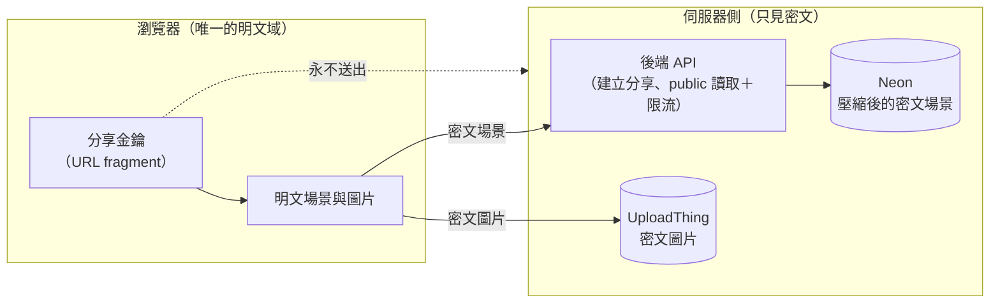

# 瀏覽器端 End-to-End Encryption：分享連結

> **範圍**：drawstuff 只有**分享連結**（給沒有帳號的人看的唯讀快照，`use-scene-export` 與
> `sharedScene` router）是端對端加密。共編房間不加密，與「我的場景」一樣以登入＋存取規則保護
> （見
> [collaboration authority](../architecture/collaboration-authority.md)）。

> **Pattern 一句話**：讀懂內容的能力只來自一把伺服器從未見過的金鑰（URL fragment 中的 key），
> 伺服器只轉存密文；並誠實劃出這個保證的邊界：它擋不住能決定瀏覽器執行什麼程式碼的人。

延伸閱讀：[以 Excalidraw 理解共享金鑰架構（HTML）](../learning/browser-e2ee-excalidraw.html)。

## 問題

想讓伺服器「儲存並提供使用者內容，但讀不懂內容」——分享連結的對象沒有帳號，沒有登入身分
可以授權，連結本身就是 capability。天真的做法（伺服器持有金鑰、或明文公開存放）會讓資料庫
外洩、營運者窺看、物件 URL 外流全部變成內容外洩。

## Pattern

整體資料流——誰看得到什麼：

```mermaid
flowchart LR
    subgraph B["瀏覽器（唯一的明文域）"]
        K["分享金鑰<br/>（URL fragment）"]
        P["明文場景與圖片"]
        K --> P
    end
    subgraph S["伺服器側（只見密文）"]
        API["後端 API<br/>（建立分享、public 讀取＋限流）"]
        DB[("Neon<br/>壓縮後的密文場景")]
        OS[("UploadThing<br/>密文圖片")]
    end
    P -->|"密文場景"| API --> DB
    P -->|"密文圖片"| OS
    K -.->|"永不送出"| S
```

### 1. 金鑰放在 URL fragment，永不離開 client

匯出時瀏覽器產生一把 AES-GCM 金鑰（`apps/web/src/lib/encryption.ts`），場景先壓縮再加密存進
Neon `sharedScene`，圖片逐檔加密後上傳 UploadThing。分享連結是
`https://<app>/#json=<sharedSceneId>,<key>`：fragment 不會被瀏覽器送到伺服器，所以伺服器、
資料庫與 object storage 從頭到尾沒有金鑰。

這同時定義了它的弱點：**完整連結是 bearer secret**，貼到聊天室就等於把金鑰交出去。這要作為
明文接受的限制寫進威脅模型，而不是假裝不存在。配套是縮小 URL 外洩面：`Referrer-Policy`
取最嚴格值（[web security headers](../operations/web-security-headers.md)）、登入回呼網址不帶
fragment、個人 library catalog 不接收 fragment key。

### 2. 授權與機密性分開

分享連結沒有授權軌道：讀取端點是 public procedure，只依 IP 限流
（`apps/web/src/server/rate-limit/shared-scene.ts`），回傳密文與圖片 URL。能讀懂內容只取決於
是否持有 fragment 中的金鑰。建立分享（與上傳失敗時的回滾）則走登入身分。

推論：連結沒有個別撤銷機制，只有到期——maintenance 的 `expired-shared-scenes` 工作在 30 天後刪除
分享與其圖片；帳號刪除時也一併刪除。金鑰無法輪替（換金鑰等於產生新的連結），已下載並解密的內容也無法收回。

### 3. 每份分享一把獨立金鑰

每次匯出都產生新金鑰，金鑰只綁定這一份唯讀快照。一份連結外流不影響其他分享，也不影響
「我的場景」或共編房間（它們本來就不加密，靠帳號權限保護）。

### 4. 誠實劃界：code delivery 是信任邊界

瀏覽器端 E2EE 有一條無法用密碼學跨越的邊界：**金鑰被誰讀寫？被伺服器送來的 JavaScript。**
所以任何能決定這段程式碼內容的人——部署平台的操作者、build 期的 supply chain、
runtime injection（XSS）——都能拿到金鑰。從同一條通道送出更多密碼學（attestation、
第二層加密）無法解決，因為驗證程式的程式碼仍由被懷疑的通道交付。

正確的做法不是修復（修不了），而是：

1. 在威脅模型中把它寫成明確的 boundary 與 accepted limitation；
2. 對外宣稱時嚴守措辭：「資料庫外洩／被動窺看讀不到分享內容」可以說，
   「即使伺服器被入侵我們也讀不到」不可以說；
3. 用 defense-in-depth 縮小攻擊面（CSP 收斂外送出口、鎖 lockfile、部署路徑最小化），
   但文件不得把這些描述成「防止」。

## 評估

- 對「沒有帳號的讀者」這個情境，fragment 金鑰是最簡單且足夠的設計：伺服器不需要知道讀者是誰，
  也讀不懂內容。
- 範圍刻意只到分享連結。需要持續編輯、換裝置重開、多人權限管理的內容（共編房間）若也用
  fragment 金鑰，分享體驗與安全會綁死（遺失連結即遺失內容、撤權無法收回金鑰），所以改以帳號權限
  保護。
- 誠實劃界本身就是 pattern：一個寫清楚「這裡擋不住」的威脅模型，比一個處處宣稱安全的文件更能
  防止未來的錯誤決策。

## Trade-offs

- 伺服器讀不懂分享內容 = 無法做伺服器端預覽、內容檢索或審查。
- 金鑰只在連結裡 = 換金鑰必須換連結；到期前無法對已拿到連結的人撤銷。
- 連結是 bearer secret，安全性取決於使用者如何轉貼。

## 本專案中的實例

- 匯出與連結：`apps/web/src/hooks/use-scene-export.ts`、`apps/web/src/lib/export-scene-to-backend.ts`；
  讀取：`apps/web/src/server/api/routers/shared-scene.ts`、`apps/web/src/lib/import-data-from-db.ts`。
- 唯讀呈現：[以引擎的靜態匯出當唯讀 Viewer](./static-export-as-read-only-viewer.md)。
- Code delivery 邊界：[ADR-0004](../adr/0004-code-delivery-trust-boundary.md)、
  [CSP 與程式碼交付](./csp-and-code-delivery.md)。
