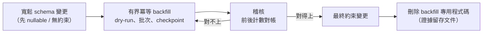
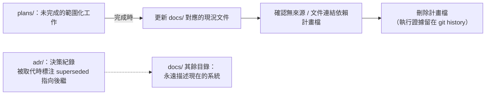

# 演進與清理紀律：No-Legacy 契約、分階段收緊與文件生命週期

> **Pattern 一句話**：取代舊路徑的變更必須在**同一個變更**內刪除被取代物；
> 對既有資料收緊約束走「先寬鬆、後回填、再稽核、最後收緊」的固定階段；
> 文件分成「現況契約」與「進行中計畫」兩類，計畫完成即回寫現況並刪除計畫。

## 問題

系統的熵不是來自寫新程式碼，而是來自沒刪的舊程式碼：被取代的 runtime path
「留著以防萬一」、feature flag 過了 rollout 期還在、相容 shim 沒有移除條件、
文件描述的是三個版本前的系統。每一項都在增加下一個變更的認知成本。

## Pattern

### 1. No-legacy 契約

定義：**legacy = 已被新責任取代、且不再服務真實資料或進行中 rollout 的**
runtime path、UI、export、依賴、flag、writer、fixture。

規則：負責取代它的變更，必須在同一個變更內刪除 implementation、wiring、
dead export、依賴、以及只測舊路徑的測試。rollback 依靠部署回滾與資料庫快照，
**不在 production 保留第二套實作當保險**——第二套實作不是保險，是每次修改
都要同步維護兩份的稅。

明確**不是** legacy 的四類（避免矯枉過正）：

1. 仍有真實舊資料要讀的 versioned reader（但它要有 owner、fixture、移除條件）；
2. 證明上游相容性的 differential fixture；
3. 有 owner 與到期條件的短期 rollout flag；
4. 獨立的產品模式（不是 fallback 的那種）。

機器輔助：把死碼檢查（knip 之類）放進標準檢查管線，「刪乾淨」才能過 CI。

### 2. 分階段收緊約束（expand–backfill–contract）

對已有資料的表加 NOT NULL／外鍵／格式約束，一步到位會鎖表或炸掉：

backfill 是**維運 job 不是 migration**：支援 dry-run、有界批次、checkpoint、
冪等、有並發寫入策略。中間的寬鬆／雙路徑狀態只存在於受控的執行窗口內，
完成後 backfill 專用的程式碼與腳本**必須刪除**（證據留存到文件或變更紀錄）。

### 3. 文件分兩類：現況契約 vs 進行中計畫

- `docs/`：**描述現在的系統**。ADR 記錄決策與理由（含被拒絕的替代方案），
  架構文件是可執行的現況契約（誰擁有什麼、什麼被禁止），不是實作編年史。
- `plans/`：**只放未完成的範圍化工作**。計畫完成時：更新對應的現況文件 →
  確認沒有連結依賴它 → 刪除計畫檔。執行證據留在 git history，
  現況文件描述結果而非決策時間軸。

推論：讀者永遠不需要「按時間順序讀完所有文件才能拼出現況」——
現況只有一份，過時的敘述會被更新或刪除，被取代的決策在 ADR 裡標注
superseded 並指向後繼。

### 4. 決策就地留痕：註解記錄被拒絕的替代方案

每個非顯然的決策，在**程式碼旁**留一句「考慮過 X，因為 Y 而不採用」：
為什麼這張表不加第三個 nullable parent、為什麼這個 limiter 不 retry、
為什麼這個檔案不標 server-only。搭配從程式碼指回 ADR 編號／威脅編號的
cross-reference。這是讓文件與程式碼保持同步的實際機制——
下一個人在改動點就能看到理由，而不是需要恰好想起去翻哪份文件。

### 5. 依賴的例外都帶移除條件

鎖版本的 override、audit ignore、workaround，每一條在 config 裡就地註明
「因為哪個 advisory／bug、上游修復到什麼版本時移除」。沒有移除條件的例外
會永久存活。

## 評估

- 「同一變更內刪除」是唯一真正有效的清理時機：取代者對舊路徑的理解在此刻最完整，
  之後只會衰減；「以後再清」的實際語意是「永遠不清」。
- 「plans 完成即刪」讓文件目錄的大小恆定反映系統現況的複雜度，
  而不是專案歷史的長度。
- expand–backfill–contract 把 schema 變更從賭博變成有 checkpoint 的流程。

## Trade-offs

- 「不留第二套實作」要求部署回滾與資料快照真的可用——這是前提投資，不是免費的；
- no-legacy 對「可能還會用到」的直覺是逆風的，需要團隊共識與 CI 強制才撐得住；
- 決策註解有密度上限：只註「非顯然」的，否則淹沒訊號。

## 本專案中的實例

- No-legacy 契約全文與非 legacy 清單：
  [ADR 0001](../adr/0001-excalidraw-persistence-boundary.md) 的「無 legacy code」契約、
  [engineering conventions](../operations/engineering-conventions.md)。
- 分階段收緊與 backfill 規則：
  [engineering conventions](../operations/engineering-conventions.md)。
- plans 生命週期：`plans/README.md` 與 conventions 的 active work retirement 節；
  實例——Node relay 於退役當日整體刪除，ADR-0002 就地標注哪些敘述自此僅為歷史。
- 帶移除條件的依賴例外：`pnpm-workspace.yaml` 的 `overrides` 逐條註記 advisory
  與移除條件。
