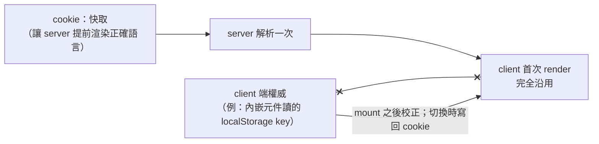

# Server 端解析狀態的 Hydration 邊界：權威 vs 快取、Provider 樹外的 UI

> **Pattern 一句話**：對「server 先決定、client 接手」的狀態（語言、主題、實驗分組），
> 先分清哪個來源是**權威**、哪個只是讓 server 能提前渲染正確畫面的**快取**；client 首次
> render 只沿用 server 值、mount 後才依權威校正。任何渲染在 Provider 樹**之外**的 UI
> 不得依賴 Provider——把已解析的值當參數明確傳入。

## 問題

SSR 應用裡有一類狀態同時存在於 server（cookie、header）與 client（localStorage、
`navigator`、內嵌元件自己的儲存）。兩邊各自推導會造成 hydration mismatch；選錯權威會
讓畫面分裂（app 字串與內嵌元件用不同語言）；而取代整個 root layout 的錯誤頁在
Provider 已不存在時渲染，一依賴它就直接崩潰。

## Pattern

### 1. 權威與快取分開，首次 render 只用 server 值

判準：**哪個來源不一致時代價比較大**。若頁面內嵌的元件有自己的語言來源，讓它當
權威、cookie 當快取——選錯的代價是畫面分裂，選對的代價只是 cookie 過期時 hydration
後閃一次。把取捨寫下來。

### 2. Provider 樹外的 UI 要明確接收已解析的值

先枚舉哪些 UI 會在 Provider 之外渲染：global error boundary（取代整個 root layout）、
portal 到 `document.body` 的 toast、由非 React 程式碼觸發的對話框。這些做成**純呈現
元件**，文案／語言由呼叫端傳入；最外層傳固定 fallback，route 層才走翻譯。
推論：已解析的字串只能當 props 下傳，不得存進 module 狀態（切換時會過期）。

## 評估

「權威 vs 快取」與「樹外 UI 不依賴 Provider」兩條規則都與 i18n 無關，任何
server-resolved 狀態（主題、feature flag、A/B 分組）都適用。

## Trade-offs

- 讀 cookie 使 root layout 變成逐請求渲染；全靜態的站要另想辦法。
- 「權威在 client」意味 server 偶爾渲染錯的值再校正——接受那一次閃動。

## 本專案中的實例

- 全套設計（含字典型別推導、dynamic import 分 chunk）：
  [i18n architecture](../architecture/i18n-architecture.md)。
- 實作：`apps/web/src/lib/i18n/`、`src/hooks/i18n-context.tsx`、global error 頁；
  測試 `tests/i18n-provider.test.tsx`、`tests/i18n-request-language.test.ts`。
