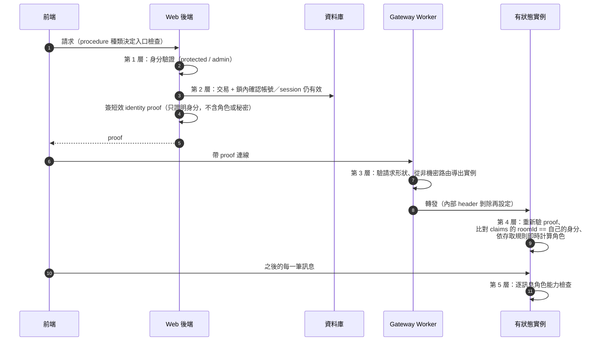

# 分層授權：每層一種機制、每跳重新驗證

> **Pattern 一句話**：授權不是一個 middleware，而是一疊各司其職的層——入口層驗身分、
> service 層在交易內驗資源所有權、跨服務用短效簽章 proof、特權操作用 DB-backed grant
> 加先寫意圖的稽核；client 端的 UI 狀態永遠不是授權控制。

## 問題

授權失敗的常見原因不是演算法錯，而是**位置**錯：檢查放在 client（disabled 按鈕當
權限控制）、放在入口但 service 被第二個入口重用時繞過了、或檢查與寫入之間隔著
競態窗口（檢查完、寫入前，權限被撤銷了）。

## Pattern

一個請求從前端到 worker 的完整驗證鏈：

```mermaid
sequenceDiagram
    autonumber
    participant B as 前端
    participant API as Web 後端
    participant DB as 資料庫
    participant G as Gateway Worker
    participant DO as 有狀態實例

    B->>API: 請求（procedure 種類決定入口檢查）
    API->>API: 第 1 層：身分驗證（protected / admin）
    API->>DB: 第 2 層：交易 + 鎖內確認帳號／session 仍有效
    API->>API: 簽短效 identity proof（只證明身分，不含角色或秘密）
    API-->>B: proof
    B->>G: 帶 proof 連線
    G->>G: 第 3 層：驗請求形狀、從非機密路由導出實例
    G->>DO: 轉發（內部 header 剝除再設定）
    DO->>DO: 第 4 層：重新驗 proof、<br/>比對 claims 的 roomId == 自己的身分、<br/>依存取規則即時計算角色
    B->>DO: 之後的每一筆訊息
    DO->>DO: 第 5 層：逐訊息角色能力檢查
```

### 1. 入口層：身分驗證做成 procedure 種類

API 層只提供幾種**具名的 procedure 建構器**：`public`、`protected`（未登入即拒）、
`admin`（再查一次特權 grant）。每個 endpoint 的授權等級在宣告處一眼可見，
而不是散在 handler 內文。管理頁面的入口守衛讓「無權限」與「不存在」
**刻意不可區分**（同一個 not-found），不洩漏資源與路徑的存在性。

### 2. Service 層：資源所有權在交易內驗證

「這個 user 能不能動這個資源」的檢查放在 service 的資料庫**交易內、行鎖之下**，
與寫入原子成立。理由有二：

- service 被多個入口重用時，授權跟著 service 走，不會漏；
- 行鎖消滅「檢查與寫入之間權限被改掉」的競態——授權變更與強制動作在同一交易
  serialize（見 [transactional outbox](./transactional-outbox.md) 的房間例子）。

角色解析收斂到**一個函式**（單一決策點），每次檢查都即時呼叫它，不把角色凍結在加入時的
紀錄或 token 裡——凍結的角色正是「收回權限擋不住已加入者」這類 bug 的根源。

### 3. 跨服務：短效簽章 proof，每跳重新驗證

服務 A 驗完身分後，發一個短效（秒級 TTL）、綁定單一資源的 HMAC proof 給
呼叫方轉交服務 B。原則：

- proof 綁定資源、主體、帳號 lifecycle 版本、協定版本、audience；**永不內含角色、金鑰或秘密**
  ——角色由持有存取規則的服務 B 自己算；
- claims 的鍵名清單被測試釘住，秘密無法被走私進 proof；
- 簽章驗證先於 payload parse，比較用 timing-safe；
- **不儲存已簽的 proof**——每次投遞現簽一個新的（儲存的 proof 是躺在資料庫裡的憑證）；
- 收回權限時推進單調遞增的 epoch 並關閉受影響的連線，不用牆鐘；舊 epoch 的持久寫入被 fence 擋下。

### 4. 每一跳重新導出，轉發的 metadata 只是待驗證的提示

多跳架構（gateway → 有狀態實例）中，每一跳都用同一套文法重新 parse 身分，
並將**已驗證 claims** 導出的身分與自己被定址的身分比對——「拿別的資源的有效
proof 打到這個路由」是授權失敗，不是路由巧合。gateway 轉發前剝除再設定內部
header；下游把它當提示重新驗證，永不當權威。授權的最終權威永遠是驗證後的
claims，不是請求路徑。

### 5. 逐請求之外，逐「訊息」也要重驗

長連線建立時驗過 proof 不夠：角色在加入時算出後，**每一筆入站訊息**再檢查
一次角色能力（viewer 直接驅動原始 transport 也改不了資料）。UI 的唯讀狀態
只是第二道防線。

### 6. 特權操作：DB-backed grant + 先寫意圖的稽核

管理員能力來自資料庫裡的 active grant 列（不是 email 清單、不是環境變數），
撤銷即時生效；自我撤銷被明確擋下。每個接受的特權操作先寫入 `started` 稽核列、
完成後標記成敗；稽核列不設對象外鍵，刪除目標帳號不能抹掉紀錄。
初始 bootstrap 是一個會自我關閉的鎖定路徑（第一個 grant 建立後即失效）。

## 評估

- 「procedure 種類」讓授權等級成為宣告式的、可 grep 的事實；
- 「授權在交易內」是被低估的一條：大量真實漏洞來自 check 與 write 之間的競態；
- 「每跳重驗」讓內部網路的信任假設歸零——任何一跳被繞過，下一跳還在。

## Trade-offs

- 每層都驗有重複成本（同一請求可能驗兩三次）；用「入口驗身分、service 驗資源」
  的分工把重複控制在便宜的層面。
- 短效 proof 要求簽發方與驗證方時鐘大致同步（留 skew 容忍）。

## 本專案中的實例

- procedure 種類與 admin grant：`apps/web/src/server/api/trpc.ts`、
  `src/server/admin/`；管理頁 not-found 不可區分：`src/server/admin/page-access.ts`。
- 交易內身分確認 + 鎖：`lockActiveAccount`／`issueAuthorityIdentity`
  （`src/server/collab/authority-identity.ts`）、`saveOwnedScene`。
- 房間存取規則的單一決策點：`apps/collaboration-do/src/room-authority.ts` 的 `access`
  （擁有者 → 邀請名單取較高者 → 一般存取權），見
  [collaboration authority](../architecture/collaboration-authority.md)。
- proof 設計（claims 釘住、timing-safe、不存 proof）：
  `packages/collaboration/src/room-token.ts`、`authority.ts`。
- 每跳重驗與 roomId 比對：`apps/collaboration-do/src/gateway.ts`、
  `src/internal.ts`、`src/room.ts`。
- 逐訊息角色檢查：DO 的 per-frame `roomRoleCanEditScene`。
- 稽核與 bootstrap：[data lifecycle](../architecture/data-lifecycle.md) 的
  operator retirement 節。
