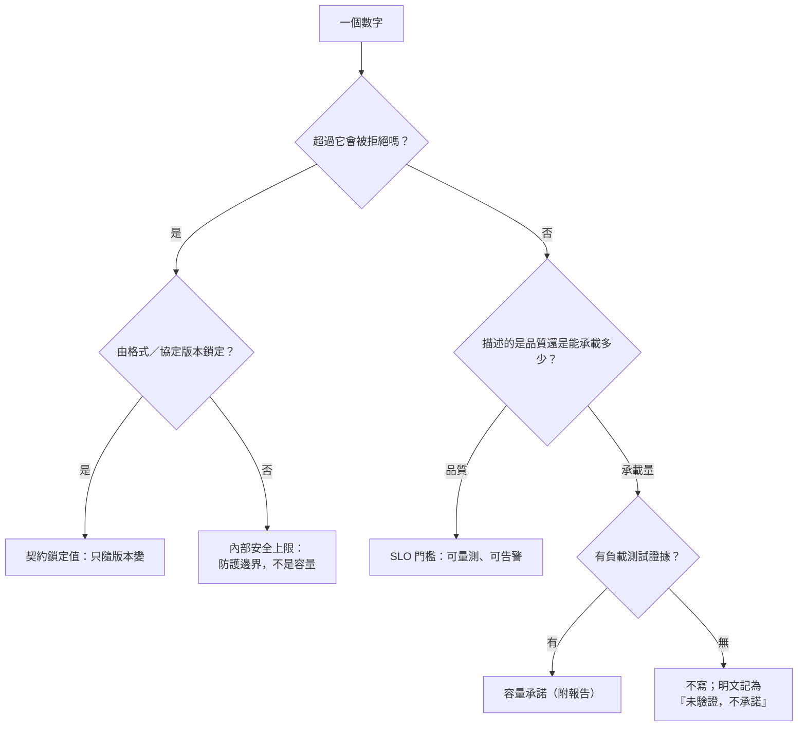

# 上限是防護，不是容量：把「拒絕邊界」與「服務承諾」分開

> **Pattern 一句話**：每個 hard limit 只回答「超過多少就拒絕」，永不反推成「支援多少」。
> 文件、SLO、告警與錯誤訊息都要分清兩件事：「防護邊界被觸發」是使用者的規模或行為，
> 不是服務品質；「服務品質退化」才是服務的問題。混在一起，SLO 會說錯話、上限會被
> 當成容量調高、使用者會看到「伺服器忙碌」而其實是「你的內容太大」。

## 問題

系統裡的數字一寫下來就會被解讀。「每房 32 人」被產品讀成「支援 32 人同時編輯」，
被維運讀成「32 人以內的延遲是承諾」，被使用者讀成「第 33 個人是 bug」。接著：

- 有人想「提升容量」就把 32 改成 64，沒有任何量測支持；
- 上限觸發（房間已滿、內容超限）被算進錯誤率，SLO 一直紅；
- 錯誤訊息把「你的畫布超過上限」說成「伺服器暫時無法處理」，使用者重試十次；
- 一份沒做過負載測試的服務，文件卻寫著容量數字，事故時才發現那是拍腦袋的。

## Pattern

### 1. 每個數字先分類

| 類別             | 回答的問題                       | 改動需要什麼                                                     | 例子                                           |
| ---------------- | -------------------------------- | ---------------------------------------------------------------- | ---------------------------------------------- |
| **契約鎖定值**   | 格式／協定允許的最大值           | 版本升級（見 [版本與相容性](./versioning-and-compatibility.md)） | 單則訊息明文上限、快照上限                     |
| **內部安全上限** | 超過多少就拒絕，以防無界資源使用 | 推導證據 + sustained-cadence 測試                                | 每房成員數、每連線 frame 速率、buffer 排水門檻 |
| **SLO 門檻**     | 正常運作時品質應該多好           | 量測與告警調整                                                   | 路由延遲 p95、session 成功率                   |
| **容量承諾**     | 保證能承載多少                   | **負載測試報告**；沒有就不寫                                     | （本 pattern 的預設：一個都沒有）              |

前三類可以沒有第四類而存在。文件開頭一句話定調：「以下數字是內部運作預算，不是產品
容量承諾」。

### 2. 上限從「合法客戶端的最快節奏」推導，不從容量量測

安全上限的正確來源是：**行為良好的 client 最快能有多快 × 安全係數**。例如 frame 速率上限
= 最快顯示器刷新率驅動的 flush 節奏 × 2；突發桶要吸收合法的尖峰（新人加入時的全量同步）。
把 client 的節奏常數與伺服器的預算放進**同一個契約套件**，用測試綁住：client 改了節奏，
伺服器預算的測試就失敗。推導寫在數字旁邊——錯的推導（例如把 backstop timer 誤當最小
間隔）會讓正常使用者被自己的防線切斷，這正是要 sustained-cadence 測試的原因。

### 3. 超限行為明確，且與「容量問題」區分

- 每種上限有**自己的** close code／HTTP 狀態與機器可讀 metadata：`oversize`、
  `roomAtCapacity`、`slowConsumer`、`rateLimited(retryAfter)`……不共用一個「伺服器錯誤」；
- 檢查順序固定，讓協定違規被回報成違規而不是節流
  （見 [防禦性邊界](./defensive-boundaries.md) §6）；
- 內容超限是 client 可以自己解決的狀態：暴露一個**可清除的 blocked 狀態**
  （「縮小內容後恢復同步」），而不是不斷重試的 transient error。

### 4. SLO 排除防護觸發，但把它當訊號

| 指標              | 計入                                     | 不計入                               | 理由                                    |
| ----------------- | ---------------------------------------- | ------------------------------------ | --------------------------------------- |
| 非預期斷線率      | 內部錯誤、協定違規、房間已滿、慢速消費者 | 使用者主動離開、房間結束、成員被撤銷 | 後三者是產品語意，不是故障              |
| 超限 block 發生率 | —                                        | （只記錄、不設門檻）                 | 那是使用者的內容大小，不是服務品質      |
| 慢速消費者斷線率  | 是，門檻極低                             | —                                    | 應該稀少；持續偏高 = 該重新檢視排水門檻 |

「只記錄不設門檻」與「計入但門檻極低」是兩種不同的處置：前者是純使用者行為，
後者是「上限可能設錯」的訊號。

### 5. 每個 host 擁有自己的容量信封

per-room 的上限（成員、速率）放在共用契約套件裡，因為兩端都要知道；
但 **host 層級**的上限（一個 process／實例能開多少 socket、pending 上限）不放——
它們約束的是一個 host 而不是一個房間，換 host 就換信封。

### 6. 文件與對外措辭

- 「服務不承諾特定人數、更新頻率或 production 容量；hard limits 只用來防止無界資源使用，
  效能數字只用於診斷 regression」——這句話放在 SLO 文件的狀態列；
- 「只驗證小群組 correctness，等真實使用量或 overload／延遲指標顯示需要時才做針對性
  load diagnosis」——把「沒做負載測試」寫成決策而不是缺漏
  （見 [記錄下來的拒絕](./recorded-refusals.md)）；
- 使用者可見文案三分：「房間已滿」（邊界）、「內容太大無法同步，縮小後恢復」（可自行
  解決）、「服務暫時降級」（我們的問題）。

## 評估

- 這個 pattern 幾乎沒有實作成本——它是**措辭與分類**的紀律——卻直接決定 SLO 是否可信、
  上限是否會被隨意調高、使用者是否知道該做什麼。
- 「從合法客戶端最快節奏推導」給了上限一個可以被 review 的來源；「拍腦袋」與「量測」
  之間其實還有第三種：**從已知的 client 行為推導並用測試釘住**。
- 「防護觸發不算錯誤率」讓 SLO 反映服務品質而非使用者規模，告警才有訊號。

## Trade-offs

- 不承諾容量意味產品層要接受「我們不知道能撐多少人」的答案；面向付費客戶的服務
  遲早要補負載測試，那時第四類才會出現。
- 每種上限一個 close code／狀態碼增加協定表面；換來的是 client 能做對的事。
- 分類本身需要維護：新數字出現時要問「這是哪一類」，否則表格會過時。

## 本專案中的實例

- 四類數字的實際表格與「不是容量承諾」的定調：
  [collaboration SLO](../performance/collaboration-slo-capacity.md)（§0–2 分類、§5 推導與
  修訂 R1、§6 SLO 的計入／不計入、§7 accepted limits）。
- per-room 上限與「host 上限刻意不放這裡」的註解：`packages/collaboration/src/room-limits.ts`；
  client 節奏常數：`packages/collaboration/src/client-pacing.ts`。
- 可清除的 blocked 狀態（T11）與 close code taxonomy：
  [collaboration threat model](../architecture/collaboration-threat-model.md)、
  `packages/collaboration/src/relay-protocol.ts`。
- 「房間人數是防護邊界不是容量承諾」的 trade-off 出處：
  [即時協作房間](./realtime-room-coordination.md) Trade-offs。
