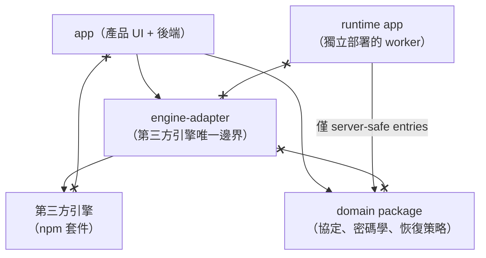
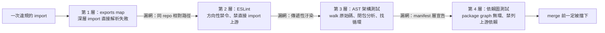

# 模組邊界：所有權表、單向依賴與機器強制

> **Pattern 一句話**：架構邊界要寫成「誰擁有什麼、誰**不得**擁有什麼」的表格與單向依賴圖，
> 然後用多層獨立的機制（package exports → lint → AST 測試 → 依賴圖測試）強制它——
> 邊界靠約定會腐蝕，靠機器才會存活。

## 問題

Monorepo 裡的邊界通常從一句「UI 不要直接碰資料庫」開始，然後在幾十個 PR 之後變成到處都是
深層 import、循環依賴，以及三個地方各自實作了一份合併演算法。根本原因是：邊界只存在於
口頭與 code review 的記憶中。

## Pattern

### 1. 所有權表：Owns 與 Must-not-own 一樣重要

為每個模組寫兩欄：

| 模組 | 擁有 | 不得擁有 |
| --- | --- | --- |
| UI app | 產品版面、對話框、驗證流程的組合 | 引擎依賴、合併演算法、history 引擎 |
| domain package | 協定、密碼學、恢復策略 | UI framework、runtime process、持久化 |
| runtime app | 連線生命週期、fanout | app code、明文內容、第二份權威資料 |

「不得擁有」那一欄才是防腐蝕的關鍵：它把「這個功能好像放這裡也行」的日常決策
變成可以直接查表回答的問題。

### 2. 依賴圖是單向 DAG，交會點只有一個

（`x--x` 表示被禁止的依賴方向：adapter 與 domain 互不依賴、app 不得直接碰引擎、
runtime 不得碰 adapter。）兩個底層 package 互不依賴；唯一允許它們「相遇」的地方
是最上層的 app。反向依賴與跨層深層 import 一律定義為架構缺陷，不是風格問題。

### 3. 共用契約套件（shared contract package）

兩個獨立部署的 runtime（例如 Next.js app 與 edge worker）之間**不互相 import**，
只共同依賴一個契約套件。這個套件要刻意貧瘠：

- runtime 依賴壓到最少（例如只有一個 schema 驗證函式庫）；
- 無 framework、無 transport、無 logging、無副作用（`sideEffects: false`）；
- 以多個窄的 subpath exports 提供，**沒有 root barrel export**——
  這讓「server 端只用 server-safe entries」成為可以逐 entry 檢查的敘述。

### 4. 用四層獨立機制強制，便宜的在前

1. **模組系統本身**：`package.json` `exports` map 不列的路徑，Node/bundler 直接解析失敗。
   深層 import 在最底層就不可能。
2. **Lint**：`no-restricted-imports` 做方向性禁令（A 不得 import B）、禁止直接 import
   被包裝的上游套件；規則片段抽成單一共用模組，讓多個 lint config 從同一份清單**產生**
   限制規則，而不是各抄一份（抄兩份的下場就是 drift）。
3. **AST 層的架構測試**：walk 真實原始碼樹，斷言「app 內零上游 import」「只用核准的
   entry」「無反向依賴」「無 import 循環」「server 模組的傳遞閉包碰不到 client entry」。
   這層抓得到 lint 抓不到的相對路徑逃逸與傳遞性汙染。
4. **依賴圖／manifest 測試**：斷言 workspace package graph 無環、app 的 `package.json`
   不得直接列出被包裝的上游套件。

每一層抓的是上一層抓不到的漏洞；四層都很便宜，都在 CI 跑。

### 5. Server/client 邊界也是模組邊界

server-only 模組全部標 `import "server-only"`（import 到 client 直接 build error）。
補一個結構性測試：server 程式碼的 import 傳遞閉包不得觸及任何 client entry 或引擎——
「secret 不會被打包進 browser bundle」從人工檢查變成一行斷言。

## 評估

- 這個 pattern 的投資報酬率極高：所有機制都是一次性設置，之後每個 PR 自動受檢。
- 「單一允許交會點」讓底層 package 可以獨立測試、獨立演進、甚至獨立抽出去重用。
- 最容易被忽略的部分是**從同一份清單產生多份規則**：任何需要在兩個 config 重複的
  allowlist，遲早會 drift，除非它只有一個來源。

## Trade-offs

- 前期要想清楚所有權，對探索期專案可能過早；但「上游引擎邊界」這一條在引入大型
  第三方依賴的第一天就值得立。
- AST 測試有維護成本（TypeScript API），適合邊界穩定後鎖住，不適合天天改。

## 本專案中的實例

- 所有權表與依賴圖：[architecture contract](../architecture/architecture-contract.md)。
- 四層強制：各 package 的 `exports` map、`eslint.shared.ts` 的共用規則片段、
  `packages/excalidraw-adapter/tests/package-boundaries.test.ts`（AST walk）、
  `packages/collaboration/tests/package-contract.test.ts`（entry 集合、依賴純度、
  零 logging、key material 限定在具名檔案集合）。
- 共用契約套件：`@drawstuff/collaboration`（唯一 runtime 依賴是 zod，21 個 subpath entry，
  Vercel app 與 Cloudflare Worker 各自依賴它、互不依賴）。
