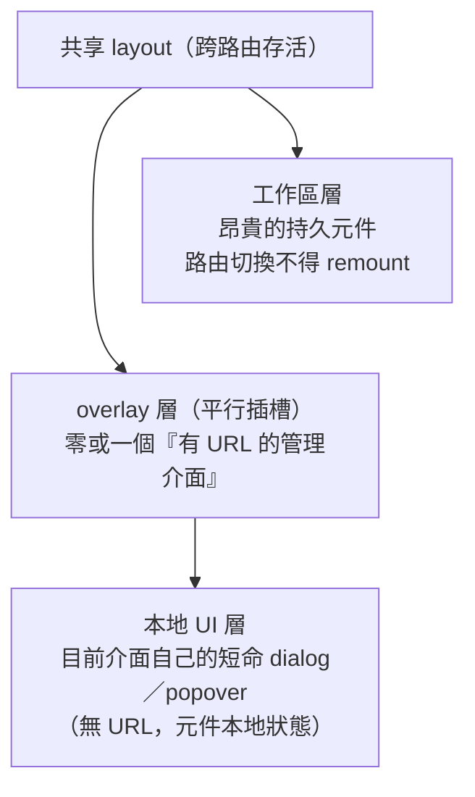
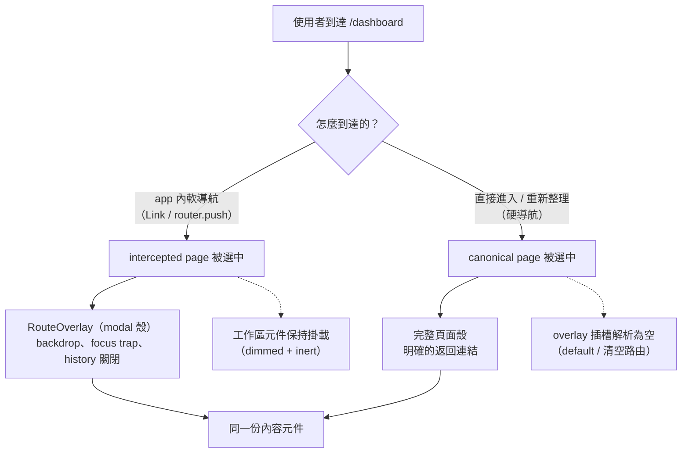
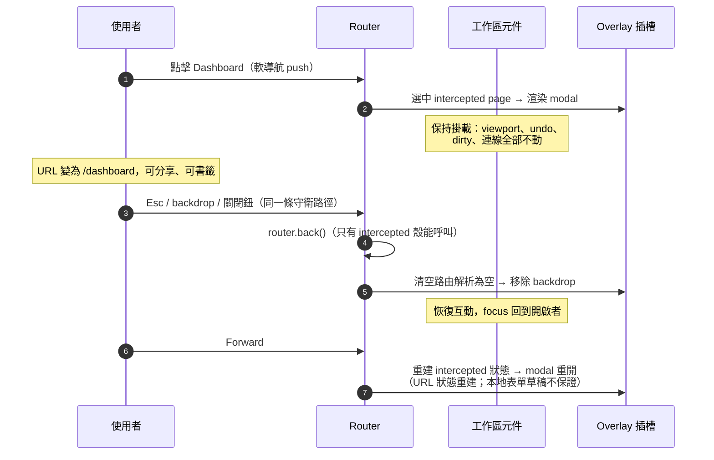

# 持久工作區與 URL-Addressable Overlay

> **Pattern 一句話**：當應用的核心是一個昂貴且有狀態的元件（畫布、編輯器、地圖、播放器），
> 讓它由共享 layout 持有並跨路由存活；管理介面做成「有正式 URL 的 overlay」——
> 軟導航時以 modal 呈現在工作區之上，直接進入或重新整理時渲染成完整頁面。

## 問題

工作區型應用（白板、IDE、地圖、DAW）的核心元件重建成本極高：viewport、選取、
undo 歷史、dirty 狀態、即時連線都會丟失。但產品仍需要 dashboard、設定頁這些
管理介面。兩個常見的壞解各有致命傷：

- **一切都是本地 dialog**：管理介面沒有 URL——不能分享、不能書籤、
  Back 鍵行為與使用者預期脫節、無法直接進入；
- **一切都是普通路由**：每次進 dashboard 都重建工作區，狀態全丟。

## Pattern

### 1. 三層模型，每層一個擁有者

分層的判準是**狀態的壽命**：可重複到達的目的地（dashboard、某資源的設定頁）
→ URL；檢視的篩選條件 → query string；表單草稿、確認輸入 → 元件本地狀態。

### 2. 一個目的地、兩種呈現、同一份內容

每個 overlay 目的地有 canonical page（直接進入／重新整理 → 完整頁面）與
intercepted page（app 內軟導航 → 蓋在工作區上的 modal），兩者組合**同一個內容元件**。
內容元件不知道自己被哪種呈現包著；canonical 包裝提供明確的返回連結、
intercepted 包裝提供 backdrop／focus／history 關閉。

重新整理後看到完整頁面而非「工作區+modal」是**預期行為**：硬導航本來就無法
保留記憶體中的工作區，誠實渲染 canonical 頁比假裝還在 overlay 好。

同一個 URL 在不同進入方式下的路徑：

開啟與關閉的導航時序：

### 3. 插槽清空是明確的路由語意

平行插槽在軟導航下是「黏的」（不匹配就保留舊內容），對 modal 插槽這是危險預設：
舊 dashboard 會殘留蓋在新目的地上。所以要為「無 overlay」寫**明確的清空路由**：
根路徑一個、其他不擁有 overlay 的路徑一個 catch-all、硬導航 fallback 一個——
三個檔案都回傳「空」，但觸發情境不同，缺一不可。並用路由測試釘住
「具體 intercepted 路由優先於 catch-all」的優先序。

### 4. History 政策成表

| 動作 | 操作 | 理由 |
| --- | --- | --- |
| 開啟管理介面 | push | Back 應回到先前脈絡 |
| 取消表單 | back | 精確還原開啟者與其篩選狀態 |
| 建立／刪除成功 | replace | 完成的表單、已刪除的 URL 不得因 Back 重現 |

關閉語意只有一個擁有者（intercepted 包裝）；內容元件不得自己呼叫 history 操作。
Escape、backdrop、關閉鈕走同一條守衛路徑；modal 的 focus trap／scroll lock／inert
全部複用一個共享 primitive，不允許元件各自用 z-index 修補層疊。

### 5. 跨層操作要指名協調

「刪除目前工作區正開啟的資源」跨越了路由層與工作區層：只重導向是不夠的——
記憶體裡的舊狀態可能被再次儲存（ghost save）。這種操作要作為一個使用者可見的
整體：清除工作區的身分／dirty／revision 狀態、釋放連線 claim、安全重置元件，
然後才完成導航。**任何「URL 變了但昂貴元件還活著」的架構都有這一類問題**，
要主動盤點而不是等 bug。

### 6. 路由參數是不可信輸入

overlay 的資源 id 參數每次都在伺服器端重新驗證授權；格式錯誤、不存在、
無權存取刻意共用同一個 not-found 結果（不洩漏資源存在性）。
client 端的選取狀態與 disabled 按鈕不是授權控制。

## 評估

- 「URL 該有的給 URL、該本地的留本地」這條分界日後每個新介面都用得上；
  表單草稿放進 URL 和 dashboard 沒有 URL 是同一個錯誤的兩個方向。
- 「同一份內容、兩種呈現」讓 modal 與完整頁面不會分岔成兩套實作。
- 插槽清空三檔案是 framework 特定（Next.js parallel routes）的細節，
  但「黏性導航狀態需要明確清空語意」這個問題在任何 SPA 路由器都存在。

## Trade-offs

- 平行路由／攔截路由的心智模型不便宜，團隊要先吃透 framework 的導航語意；
- 每個目的地要維護 canonical + intercepted 兩個殼（內容共用，殼很薄）；
- 昂貴元件跨路由存活意味著它的生命週期 bug（洩漏、殘留狀態）影響整個 session，
  對清理紀律的要求更高。

## 本專案中的實例

- 完整設計（三層模型、清空路由、history 表、a11y、驗證契約）：
  [workspace overlay routing system design](../architecture/workspace-overlay-routing-system-design.md)。
- 實作：`apps/web/src/app/@overlay/`、`src/components/route-overlay.tsx`、
  路由身分的 discriminated union `src/lib/routes.ts`、
  disk-walking 路由測試 `apps/web/tests/workspace-routes.test.ts`。
