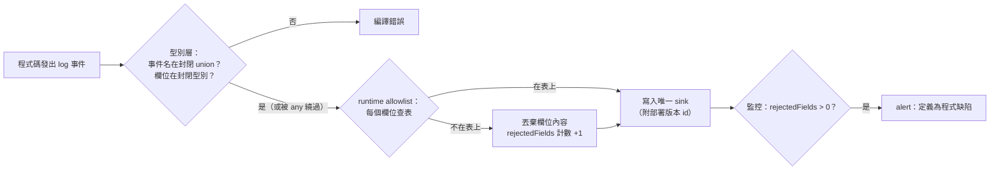
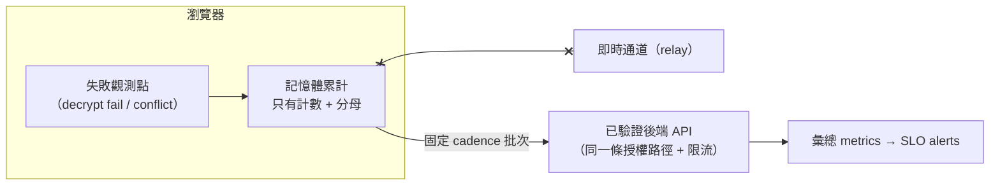

# 隱私安全的 Observability：封閉 schema、資料分級與 SLO 對齊

> **Pattern 一句話**：log 事件與欄位是封閉集合（型別層 + runtime allowlist 雙層強制），
> 資料分級明文寫出「允許欄位」與「禁止欄位」；每個 alert 都指回 SLO 文件的某一節，
> 不憑空發明門檻。

## 問題

Log 是最容易發生資料外洩的地方：一行 `console.log(error)` 就可能把含 token 的
SDK error message、含金鑰的 URL、使用者輸入的 payload 寫進第三方 log 平台。
另一頭的問題是雜訊：自由文本的 log 無法聚合、alert 門檻各自拍腦袋、
「這個 metric 為什麼存在」沒人答得出來。

## Pattern

### 1. 單一 sink + 封閉 schema

全系統只有一個 logger 建構器；事件名是封閉 union、欄位是封閉型別。
**沒有 `message`／`details`／`error` 這類自由文本逃生門。**

雙層強制：

- 型別層：closed union + closed fields type；
- runtime 層：`Record<keyof Fields, true>` 的 allowlist（編譯器雙向檢查完整性），
  被拒絕的欄位不寫入內容、但**計數**成 `rejectedFields` 出現在該筆紀錄上——
  任何非零值都定義為程式缺陷並直接下 alert。

這讓「smuggle 一個欄位進 log」在型別、runtime、監控三層都會被抓到。

### 2. 資料分級：允許與禁止都要成文

| 允許 | 禁止 |
| --- | --- |
| 驗證後的資源 id、伺服器產生的連線 id、封閉 enum（close code、失敗原因）、計數、latency | email、顯示名稱、訊息內容、密文片段、token 或其片段、金鑰、payload 衍生的錯誤細節、原始使用者識別 |

幾條在多數系統都適用的細則：

- **error 只記 constructor 名**，不記 `message`、不讀 instance 的 `name`——
  SDK 的 error message 常內嵌呼叫 URL 與憑證；`name` 與 `constructor` 都是可寫的，
  且 getter 可能在 exception handler 裡再丟一次。對照本地持有的 constructor 清單，
  輸出永遠是固定字串集合之一。
- **驗證前不記識別碼**：token 驗證前，路徑裡的資源 id 只是未驗證輸入；
  若識別碼與秘密共用字母表與長度（id 和 key 長得像），記錄它就是外洩通道。
- **需要關聯性但不能記原始身分**時，用 per-process HMAC pseudonym：
  重啟後就無法跨期關聯。
- **metrics label 禁高基數識別**（room/peer/user id）：同時防 label 爆炸與枚舉。

配套驗證：整合測試對完整 log／metrics 輸出掃描禁止值。

### 3. 遙測只走已驗證的通道，且批次上報

client 端的失敗計數（解密失敗、衝突）要回報時：**不走即時通道**（給 relay 加一條
client 上報通道 = 新的 untrusted input），走既有的已驗證 API；client 在記憶體累計、
固定 cadence 批次送——逐筆上報會讓「解密失敗」變成打後端的放大器。

（`x--x`：telemetry 不得走即時通道——relay 不是身分權威，多一條 client→relay
的上報通道就是多一個 untrusted input。）
欄位只有計數與分母（成功率需要分母：sessions started、writes total），
沒有任何 payload、checksum 或訊息 id。

### 4. Alert 與 SLO 對齊：門檻只有一個家

門檻數字集中在 SLO 文件；observability 文件的每條 alert 標注「依據：SLO §N」，
**不提出新門檻**。相反方向也成立：SLO 文件標明哪些門檻目前沒有 telemetry 載體、
因此不可判定——「量不到」誠實寫成缺口，好過假裝有覆蓋。

其他值得帶走的細節：

- 每筆 log 帶部署版本 id → canary 比較的分組鍵免費獲得；
- 一筆連線至多一筆 close 事件（重複 close 直接 throw）——因為 log 行就是 SLO 分母，
  重複會污染比率；
- health endpoint 只證明「process 可執行、config 就緒」，明文寫清它**不能**代表
  個別資源的健康，可用性判讀另有 synthetic check 的順序清單。

## 評估

- 封閉 schema 把「log 外洩」從 code review 問題變成編譯錯誤 + runtime 計數器 + alert，
  三層漏一層還有兩層。
- 「允許／禁止都成文」讓新增欄位的 PR 有明確的判準可引用，而不是每次重新辯論。
- 「alert 指回 SLO 節號」防止監控系統長出第二套沒有出處的數字。

## Trade-offs

- 封閉欄位在除錯時偶爾令人痛苦（就是查不到 error message）；解法是在**信任邊界內**
  的除錯管道（本地 repro、trace）補足，而不是打開 log 的逃生門。
- 前期要寫資料分級文件；但這份文件同時就是威脅模型的一節，成本可攤。

## 本專案中的實例

- 封閉 schema logger、`rejectedFields`、errorName、pre-auth 不記 id：
  `apps/collaboration-do/src/logger.ts`、
  [DO observability 契約](../observability/collaboration-do-observability.md)。
- 資料分級表：[threat model](../architecture/collaboration-threat-model.md) 的
  observability data classification。
- 限流降級事件（只有兩個封閉 enum）：`apps/web/src/server/rate-limit/collaboration.ts`。
- 未實作的 telemetry carrier 契約（批次、走已驗證 API、只有計數與分母）：
  [DO observability 契約](../observability/collaboration-do-observability.md) §8。
