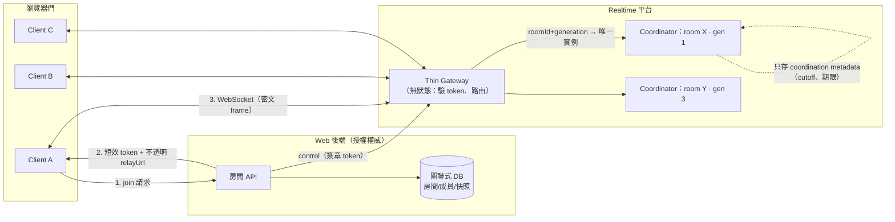
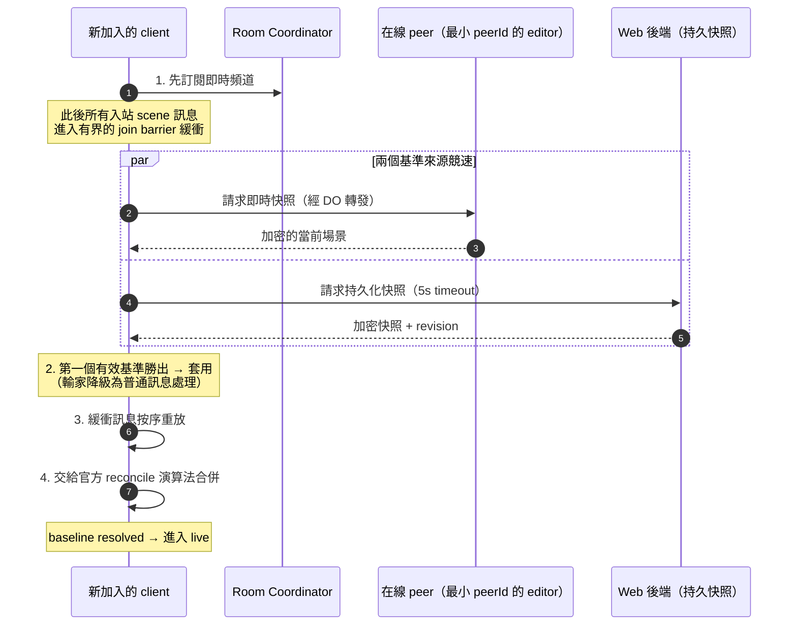
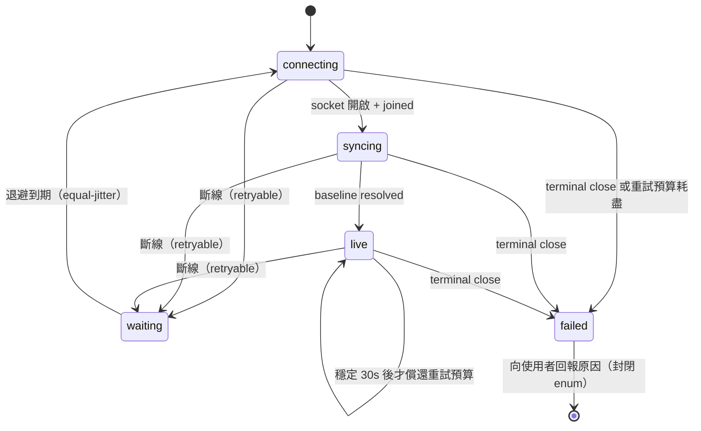

# 即時協作房間：Coordination Atom、Thin Gateway 與收斂式恢復

> **Pattern 一句話**：把每個「房間」做成一個單執行緒的 coordination atom（一房一實例，
> 平台保證唯一），前面擋一層只做驗證與路由的 thin gateway；恢復不靠 relay 重放歷史，
> 而是靠「快照基準 + 有界緩衝 + 官方合併演算法」收斂。

## 問題

多人即時協作（白板、文件、遊戲房間）需要一個地方序列化每個房間的狀態：誰在線上、
誰被踢了、訊息怎麼排序。用無狀態服務 + 外部 pub/sub 做，會遇到「同一房間的狀態
散落在多個 instance」的一致性問題；用單一大型有狀態服務做，會遇到擴展與部署的問題。

## 拓撲總覽

## Pattern

### 1. 一個房間 = 一個 coordination atom

以「房間 + 授權世代」作為實例身分（例如 Cloudflare Durable Object、或帶 sticky routing
的 actor）。平台保證同一身分只有一個實例，因此：

- 房間內的成員表、fanout、撤銷 cutoff 天然序列化，不需要分散式鎖；
- 「fanout 狀態被意外分裂到多個 instance」這類威脅**在結構上被消滅**，而不是靠小心維護；
- 水平擴展的單位是房間——房間之間天然平行，房間之內不需要平行。

反模式：建一個追蹤全站房間／連線的 global singleton。那會把「per-room 序列化」的優點
變成全站瓶頸。**授權世代輪替 = 新的實例身分**，讓「舊世代的連線」與「新世代的頻道」
在結構上不可能混在一起。

### 2. Thin gateway：驗證與路由，不碰狀態

實例前面放一層無狀態 gateway，只負責：公開請求形狀檢查、WebSocket upgrade 檢查、
token 驗證、從（非機密的）路由資訊導出實例身分、轉發。它不是第二個 backend、
不持有房間狀態、不能解密內容。

好處是攻擊面與信任等級分層：gateway 的部署憑證即使外洩，也只影響可用性，
碰不到內容（內容是 E2EE 密文）與持久資料（在別的系統）。

### 3. 每一層只持久化自己該有的東西

| 層 | 持久化 | 不得持久化 |
| --- | --- | --- |
| 房間實例 | 必須跨休眠/重啟存在的 coordination metadata（撤銷 cutoff、期限） | 場景內容、金鑰、事件歷史、第二份權威快照 |
| 交易性資料庫 | 房間/成員/授權、持久快照 | — |
| Object storage | 大型二進位資產 | — |

「relay 不是資料權威」是關鍵：relay 重啟只是所有人重連，不會丟資料、
不需要資料修復流程。

### 4. 身分由伺服器發，不由 client 自選

連線身分（peerId）由 relay 產生；重連就是新 peer。client 不得自選 identifier——
自選 ID 是把任意字串（可能是誤貼的金鑰）送進伺服器 log 的通道，也是偽裝他人的入口。
join 訊息只帶「房間 + token」。

### 5. 頻道分級：可靠的內容流 vs 可丟棄的 presence 流

- **內容訊息**（實際資料變更）：session 內可靠、有序，角色不符或超限直接拒絕；
- **presence**（游標、選取、視窗）：volatile，背壓時直接丟棄，不重傳。

把兩者混在一個可靠頻道，等於讓每秒 30 次的游標移動擁有和資料變更相同的投遞成本。
順帶的設計紅利：presence 訊息裡多帶「可視範圍 + 縮放 + 跟隨目標」，
「跟隨模式」就完全不需要伺服器支援。

### 6. 收斂式恢復：訂閱先於基準，快照競速，官方 reconcile

斷線恢復與初次加入共用同一條路徑：

「先訂閱、後取基準」的順序不可反轉：先取基準再訂閱，中間的訊息就永遠漏掉了。
relay 完全不需要保存或重放歷史——恢復的正確性來自「快照 + 合併」，
這讓 relay 保持無資料、可任意重啟。

斷線分類成三種結果驅動不同行為：terminal（不重試）、retryable（有界退避重連）、
generation rotation（換頻道重新加入）。所有關閉都帶明確的 close reason，
讓 client 能區分而不是猜。恢復本身是一台純 state machine：

注意 `syncing` 與 `live` 是分開的相位：連上又立刻死掉不算進展，
否則一個 crash-loop 的 relay 會把 client 變成最快節奏的無界重試迴圈。

### 7. 最後一筆寫入的生存設計

「使用者關閉分頁」是最容易丟資料的時刻。要點：

- flush 在**任何 await 之前**先評估 guard 並抓取當下內容——teardown 可能在同一個 tick
  關閉一切，await 之後再檢查的 guard 會否決掉唯一能保住資料的那次寫入；
- 終止狀態的 session 自己清理計時器與狀態，不依賴 transport 通知斷線；
- 接受殘餘風險並寫下來：browser process 被殺、離線時，這筆寫入就是會丟。
  （為此加 IndexedDB 佇列 / Background Sync 是一個可以做但要明確決策的延伸。）

## 評估

- 「structurally eliminated」是這個 pattern 最有價值的思考方式：與其在多 instance 架構上
  小心翼翼維護一致性，不如選一個讓錯誤狀態**無法表達**的拓撲。
- 「relay 無資料」讓部署、rollback、故障半徑都變得極簡單：重啟 = 全員重連，僅此而已。
- 收斂式恢復（快照 + reconcile）比事件重放簡單得多，前提是領域有一個可信的合併演算法
  ——若使用第三方引擎，直接複用它官方的 reconcile，不要自己寫第二套。

## Trade-offs

- 單房間內是單執行緒 O(members) fanout：房間人數有硬上限，這是**防護邊界，
  不是容量承諾**，兩者要在文件裡明確區分。
- coordination atom 依賴平台的唯一性保證（DO、actor framework）；
  在純 serverless / 純 VM 架構上要自己搭 sticky routing，成本不同。
- 收斂式恢復在超大場景下的成本是全量快照傳輸；事件重放在該情境反而可能更省。

## 本專案中的實例

- 拓撲、身分、頻道、join barrier、恢復分類：
  [collaboration system design](../architecture/collaboration-system-design.md)。
- coordination atom 的決策與邊界（CLAIM-DO-1～6）：
  [ADR-0002](../adr/0002-collaboration-durable-object-target.md)。
- 房間上限作為防護邊界而非容量承諾：
  [collaboration SLO](../performance/collaboration-slo-capacity.md)。
