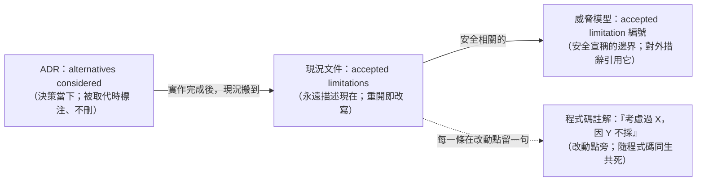
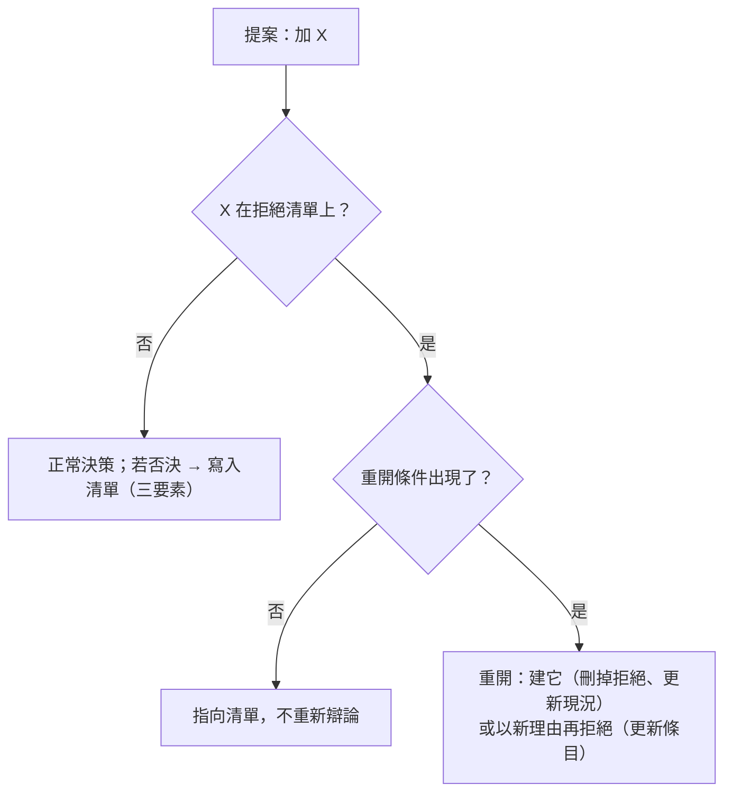

# 記錄下來的拒絕：把「刻意不做」寫成有理由、有重開條件的決策

> **Pattern 一句話**：每個刻意不建的東西——沒有離線佇列、沒有 staging、不預建實例、
> 不做 fallback、不宣稱某種安全性——都寫下三件事：**不做什麼、為什麼現在不值得、
> 什麼證據出現時重開**。放在現況文件的 accepted limitations 與 ADR 的 alternatives
> considered 裡。沒寫下來的省略是債，寫下來的省略是決策。

## 問題

系統裡「沒有的東西」比「有的東西」更難維護，因為它們不留痕跡：

- 同一個提案（「加個 IndexedDB 佇列吧」）每季被重新提出、重新辯論一次；
- 新成員把刻意的省略當成疏漏「順手補上」，引入當初拒絕的複雜度；
- reviewer 分不清「還沒做」與「決定不做」，對前者放水、對後者過度審查；
- 安全宣稱在沒有記錄邊界的情況下慢慢膨脹（「我們是 E2EE」→「伺服器被入侵也讀不到」）；
- 「暫時不做」沒有到期條件，於是永遠不做——或在最不該重開的時刻重開。

## Pattern

### 1. 每一筆拒絕三要素

| 要素             | 回答                   | 壞例子               | 好例子                                                                            |
| ---------------- | ---------------------- | -------------------- | --------------------------------------------------------------------------------- |
| 不做什麼         | 精確的否定             | 「離線支援之後再說」 | 「不加 IndexedDB 待寫快照、Background Sync 或持久 client 佇列」                   |
| 為什麼現在不值得 | 成本、風險、缺少的證據 | 「太複雜」           | 「殘餘風險只在 process 被殺／離線時出現；佇列會引入第二份權威狀態與過期寫入問題」 |
| 重開條件         | 可觀察的觸發           | （沒有）             | 「量測到 leave flush 丟失率 > X」「出現付費使用者」「平台提供 Y」                 |

沒有重開條件的拒絕是「永不」，那就明說「永不」及其理由——別用「暫不」偽裝。

### 2. 四個家，各有壽命

- **ADR** 記「當時考慮過什麼、為什麼否決」：擴充舊 relay、永久雙 provider、global
  singleton、預建實例、假 portability layer……被取代時就地標注，不刪；
- **現況文件**記「現在刻意沒有什麼」：沒有 staging、沒有負載測試、沒有事故 runbook、
  沒有隔離的整合測試資料庫……每一條寫成「accepted operating limit」而不是 TODO；
- **威脅模型**給安全性的拒絕一個編號（例：「被替換的 bundle 可讀金鑰」是 accepted
  limitation），所有對外宣稱必須引用它、不得超過它；
- **程式碼註解**在改動點留一句，讓下一個人在動手前就看到理由
  （見 [演進與清理紀律](./evolution-and-cleanup.md) §4）。

### 3. 拒絕的五種類型

| 類型               | 形狀                                   | 例                                                                   |
| ------------------ | -------------------------------------- | -------------------------------------------------------------------- |
| 接受的殘餘風險     | 「這種情況下就是會丟／會慢，我們接受」 | 瀏覽器 process 被殺時最後一筆寫入丟失                                |
| 營運上的省略       | 「小型自營服務不建 X，靠 Y 補」        | 無 staging（靠 kill switch + 可逆變更全可 rollback）                 |
| 否決的架構替代     | 「考慮過 X，因 Y 不採」                | 不預建實例、不做 fallback 路徑、不搬舊 runtime 的 process primitives |
| 明確不做的安全宣稱 | 「我們**不**宣稱 X」                   | 不宣稱對抗能改 bundle 的操作者；CSP 不是機密性邊界                   |
| 驗證邊界           | 「這件事目前沒有被測試證明」           | 沒有 live 限流 smoke test，直到有可拋棄的資料庫與 test-only 前綴     |

第四類最容易被忽略也最重要：**不宣稱**是一個要主動寫下的決策，否則行銷、README、
使用者的理解會各自填空。

### 4. 生命週期

- 拒絕住在**現況文件**，所以它會被更新而不是堆積；不住在 plans 或 issue tracker；
- 重開後「建它」要同時刪掉拒絕條目與它守著的簡化（例如「無佇列所以無過期寫入問題」
  的假設）；
- 寫下拒絕的人要抵抗「順便列出未來工作」的衝動——拒絕清單不是 roadmap，
  是「現在為什麼是這個形狀」的解釋。

### 5. 措辭紀律

- 否定要精確到可以被檢查：「不加 X、Y、Z」勝過「不做離線」；
- 「接受」要說明**誰**接受、在什麼前提下（「個人營運、有限公開測試」）——前提變了，
  接受就要重審；
- 拒絕旁邊寫「靠什麼補」：無 staging 靠什麼、無佇列靠什麼；沒有補償措施的拒絕
  是純風險，也該如實寫。

## 評估

- 這是所有 pattern 裡成本最低的一個——幾行文字——卻直接消滅「重複辯論」與
  「好心補上不該有的東西」兩種最耗人的損耗。
- 「不宣稱」作為一種拒絕類型，是安全文件保持誠實的機制：邊界寫成編號，
  宣稱只能引用編號。
- 重開條件把「暫不」變成可以自動到期的決策，而不是靠某人記得。

## Trade-offs

- 拒絕清單會長；要靠「住在現況文件、重開即改寫」維持它反映現在，否則變成歷史堆。
- 寫得太細會把每個微小的實作選擇都變成條目——只記「別人會再提、或會被誤補」的那些。
- 前提改變（規模、客戶、平台）時需要整批重審；把前提寫在文件開頭讓這件事可行。

## 本專案中的實例

- 殘餘風險與「刻意不加 IndexedDB／Background Sync／持久 client 佇列」：
  [collaboration system design](../architecture/collaboration-system-design.md) 的
  Leave snapshot finalization reserve 節；驗證邊界（無 live Redis smoke test）在同文件的
  Verification and deployment boundary 節。
- 營運省略（無 staging、無負載測試、無 runbook、kill switch 作為事故邊界）：
  同文件 Current operational boundaries、
  [collaboration SLO §7](../performance/collaboration-slo-capacity.md)、
  [Config 與部署是受測工件](./config-and-deployment-as-artifacts.md) §6。
- 否決的架構替代：[ADR-0001](../adr/0001-excalidraw-persistence-boundary.md)、
  [ADR-0002](../adr/0002-collaboration-durable-object-target.md)、
  [ADR-0003](../adr/0003-collaboration-do-gateway-foundation.md) 的 Alternatives
  considered（「不預建 Object」帶重開條件：「只有量測證明 cold placement 是問題後」）。
- 不宣稱的安全性：[threat model](../architecture/collaboration-threat-model.md) 的
  T7、T15、T16 與 [ADR-0004](../adr/0004-code-delivery-trust-boundary.md) CLAIM-CDB-1／2。
