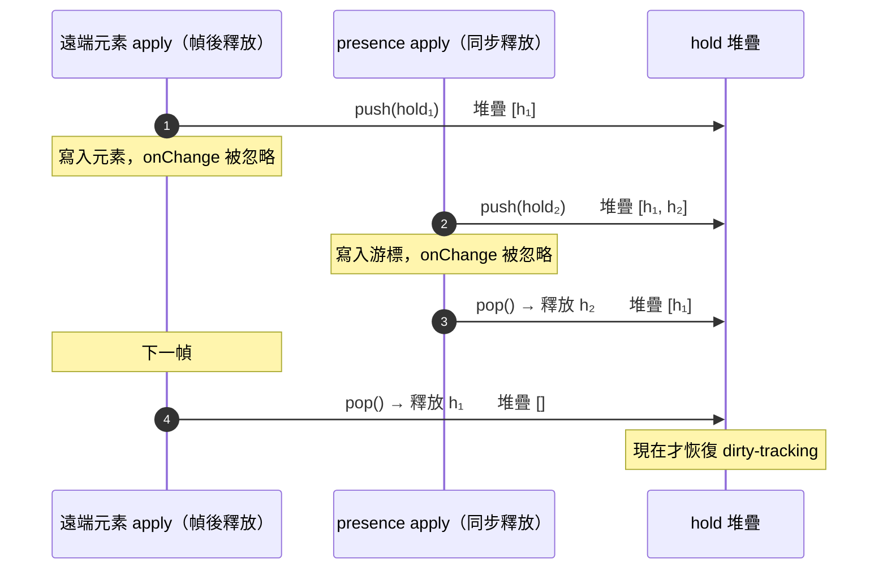

# 遠端狀態回灌的重入抑制：引用計數的 dirty-tracking suppression

> **Pattern 一句話**：把遠端狀態寫進一個對「任何變更」都發 onChange 的本地有狀態元件時，
> 元件分不出使用者編輯與回灌；在每條非使用者寫入路徑外包一個「抑制視窗」讓 dirty-tracking
> 忽略回呼。視窗必須是**引用計數**（重疊的視窗各放各的、後開先關）、釋放時機跟著元件的
> 通知時序走（同步 vs 下一幀）、每個 hold 帶 safety-net 到期，避免洩漏成永久靜音。

## 問題

宿主應用圍著一個有狀態的第三方元件（畫布、編輯器、表格）建功能：dirty 旗標驅動
「有未儲存變更」提示、自動儲存與衝突對話框。元件只有一個 `onChange`，對它而言
「使用者拖了一個圖形」與「程式把遠端 peer 的圖形寫進來」是同一件事。於是：

- 別人的編輯把**我的**場景標成 dirty；自動儲存存下我沒做的事；
- 載入場景、切換畫布、登出清空都觸發「要放棄未儲存變更嗎？」；
- 用一個布林旗標壓住 onChange 看似可行，直到兩個視窗重疊：內層的 resume 清掉外層的
  抑制，或外層的 resume 讓內層提早結束——而重疊在即時協作裡是常態。

## Pattern

### 1. 每條非使用者寫入路徑都有一個視窗

列出所有「不是使用者做的」寫入：遠端 delta、遠端快照、持久快照載入、場景檔載入、
畫布交接、登出清空。每一條都包在同一個 primitive 裡：

```ts
suppress(); // 開一個 hold
try {
  write();
} finally {
  release(); // 釋放一個 hold（時機見 §3）
}
```

遠端寫入只有**一條**路徑（所有來源——peer delta、peer 快照、持久快照——都走它），
視窗就只需要包一次。

### 2. 引用計數，後開先關



- 每次 `suppress()` 推一個 hold；`release()` 恰好釋放**一個**；「是否抑制」= 堆疊非空；
- 釋放**最新**的 hold（LIFO），不是最舊的：視窗是巢狀的（同步的 presence 視窗開在
  幀後釋放的元素視窗裡面）。若釋放最舊的，一個洩漏的外層 hold 會不斷「繼承」更新的
  safety timer，持續的 presence 流讓它永不到期；
- 沒有配對的 `release()` 找不到 hold，是 no-op，不是錯誤。

### 3. 釋放時機跟著元件的通知時序

| 元件何時發出 onChange            | 何時釋放                         | 用在                       |
| -------------------------------- | -------------------------------- | -------------------------- |
| 同步（寫入呼叫返回前）           | `finally` 裡同步釋放             | presence／游標等高頻小寫入 |
| 非同步（下一個 animation frame） | `requestAnimationFrame(release)` | 元素／內容寫入             |

高頻流**必須**同步釋放：每個 peer 每秒約 30 次 presence，若每次都延到下一幀釋放，
兩人以上的房間會讓抑制視窗連續重疊、永不關閉——使用者自己的編輯落在裡面，
永遠不會標 dirty。

### 4. Safety net：hold 會到期

每個 hold 帶一個計時器（秒級），到期自動移除自己。它**不是正確性機制**——正常路徑
永遠由 `finally` 釋放——只是把「某條路徑 throw 在 release 之前」「幀永遠沒來（隱藏分頁）」
這類洩漏從「永久靜音、之後所有變更都不算 dirty」降級為「幾秒內自癒」。

### 5. 告訴變更追蹤器「這些是採納的」

抑制只擋住 dirty 旗標；若宿主還有一個以版本比對算 delta 的追蹤器，遠端元素落地後要
明確標記為「已採納」，否則下一次 diff 會把它們當成本地新增再廣播出去，形成回音迴圈。
（「元素 = 上游原生形狀」讓比對能直接用上游的版本欄位，見
[第三方引擎 Adapter](./third-party-engine-adapter.md) §3。）

### 6. 順序：先改所有權，再寫

「載入另一個場景」這種寫入會終結目前房間對畫布的 claim。釋放 claim 要在第一個寫入
**之前、同一個同步區塊內**——即時 session 的「我還能寫畫布嗎」讀的就是這個 claim，
順序反了會讓一筆遠端 delta 落進新場景。

## 評估

- 「引用計數 + LIFO + safety net」三件一起才成立：少了任何一個，都會在協作場景下
  出現「永不 dirty」或「永遠 dirty」的靜默 bug——兩者都不會 crash，只會在使用者
  關閉分頁時丟資料或誤報。
- 「釋放時機跟通知時序」把一個看似 framework 細節的問題（rAF 還是同步？）變成
  可以推理的規則：問元件何時通知，就知道何時釋放。
- 把所有非使用者寫入路徑列成清單本身就有價值——每條都是「dirty 誤判」的潛在來源。

## Trade-offs

- 這是宿主端的補丁：元件本身若能區分 programmatic 與 user change（有些提供
  `captureUpdate`／`source` 參數），優先用元件的機制，抑制視窗只補它沒覆蓋的部分。
- safety net 的秒數是妥協：太短會在慢裝置上提早解除、太長讓洩漏的影響變大。
- 每條新的程式化寫入路徑都要記得包視窗；缺少機器強制，靠 code review 與
  「單一遠端寫入路徑」的結構減少遺漏點。

## 本專案中的實例

- 規則出處：[collaboration system design](../architecture/collaboration-system-design.md)
  的「Remote canvas writes run inside the host's dirty-tracking suppression」段。
- 實作：`apps/web/src/hooks/scene-session-context.tsx`（hold 堆疊、LIFO 釋放、
  safety-net 計時器）、`apps/web/src/hooks/excalidraw/use-collaboration-room.ts`
  （`wrapRemoteApply` 幀後釋放、`wrapPresenceApply` 同步釋放）、
  `apps/web/src/lib/collab/session/remote-apply.ts`（唯一的遠端寫入路徑 +
  `tracker.markAdoptedRemoteElements`）、
  `apps/web/src/hooks/excalidraw/use-apply-remote-scene.ts` 與 `use-canvas-handoff.ts`
  （場景載入／交接視窗，先 `releaseCanvasRoom()` 再寫）。
- Excalidraw 的 `captureUpdate: NEVER` 讓遠端寫入不進 undo 歷史，是元件自身機制與
  抑制視窗並用的例子。
