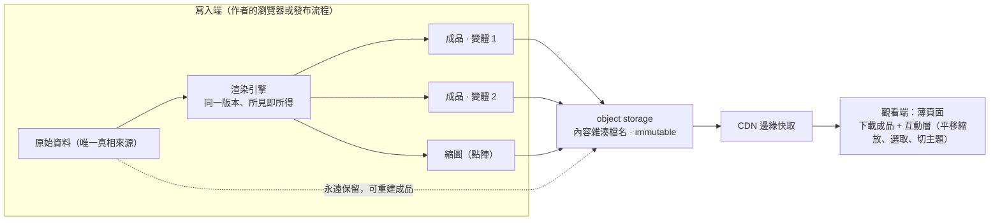

# Render once, serve many：把「觀看時渲染」搬到寫入端，訪客只拿成品

> **Pattern 一句話**：內容在**寫入**時改變、在**觀看**時被重複消費，就在寫入端渲染一次、存成
> 帶內容雜湊的不可變成品，觀看端只做下載與互動。成品的變體（主題、尺寸）由產生成品的引擎
> 一次做齊，觀看端不重算；成品記錄引擎版本，過時可偵測；沿用舊路徑的觀看端只當過渡 shim，
> 有明確刪除條件。

## 問題

唯讀分享頁、預覽、embed 這類頁面常見的實作是：觀看時載入完整渲染引擎，從原始資料現場算出
畫面。它能動，但成本結構是錯的：

- **工作量乘錯了邊。** 一份內容只在作者儲存時改變，卻被看很多次。每次觀看都重做一次「載入
  引擎、解碼資料、抓字型、渲染」，等於把一次性的工作乘上觀看次數。
- **觀看端承擔引擎的所有依賴。** 引擎需要 wasm、worker、內嵌字型、特定 CSP 放寬，這些全部
  變成公開頁面的攻擊面與失敗面，而公開頁面正是最該收緊的地方。
- **不會執行 JS 的消費者拿不到畫面。** 社群平台的連結預覽、搜尋引擎、RSS 閱讀器只抓靜態
  資源；「觀看時渲染」的架構永遠給不出 `og:image`。
- **主題與變體在觀看端重算，容易和引擎不同步。** 例如深色模式：引擎除了整體反轉還會對圖片
  做反向處理；觀看端若自己加濾鏡，就得把引擎邏輯抄一份，之後引擎一改就分歧。

## Pattern

### 1. 渲染發生在寫入端，成品是不可變資產

規則：

- **原始資料仍是唯一真相來源**，成品是它的衍生快取。任何成品都必須能從原始資料重建；
  成品損壞或格式升級時，重建而不是修補。
- **成品不可變、以內容定址。** 檔名含內容雜湊，回應標頭 `immutable`；替換成品就是寫新檔、
  改指標、把舊 key 排進刪除佇列（與 [Transactional Outbox](./transactional-outbox.md) 同型）。
- **成品記錄產生它的引擎版本。** 引擎升版後舊成品外觀凍結在舊版；用版本欄位偵測落差，決定
  「下次寫入時重渲染」或「批次重渲染」。沒有這個欄位，過時是看不見的。

### 2. 變體由引擎一次做齊，觀看端只選擇不計算

觀看端會需要的每一種呈現（淺色／深色、不同尺寸、不同格式），都在寫入端由**同一個引擎**
產生一份，觀看端只做「載哪一份」。判準：**觀看端一旦需要知道引擎的內部規則才能正確呈現，
就該多存一個變體。** 多一個幾十到幾百 KB 的檔案，換觀看端零特例、永不與引擎分歧。

點陣縮圖是必備變體之一：它服務不執行 JS 的消費者（連結預覽、列表、搜尋），這是觀看時渲染
架構結構上做不到的事。

### 3. 成品引用共享資源，而不是內嵌

字型、大型圖片這類**跨成品共用**的資源，成品裡只放引用（URL 加 `unicode-range` 一類的
宣告），由瀏覽器按需載入並跨成品快取。內嵌（base64）只保留給「檔案必須離開瀏覽器」的
匯出情境。兩者的取捨：內嵌的成品自包含、首次顯示無閃動、但每個成品都重複攜帶字型且體積大；
引用的成品小、共享快取、但首次顯示要等資源到達（用 `font-display: block` 或等待
`document.fonts.ready` 處理）。判準是**這個成品會不會離開你的頁面**。

### 4. 寫入端在哪裡：作者的瀏覽器優先，保留搬到伺服器的形狀

在作者的瀏覽器渲染有兩個決定性優點：引擎版本與作者眼前的一模一樣（所見即所得），以及
不需要在伺服器上模擬 DOM／canvas。代價是無法伺服器端批次重渲染。做法是把「原始資料 →
成品」寫成**一個純函式模組**，瀏覽器與 headless 環境都能呼叫；資料格式不因執行位置而異。
需要伺服器端能力（API 產圖、大規模回填）時，搬的是執行位置，不是格式。

### 5. 舊路徑只當過渡 shim

已有內容沒有成品時，觀看端保留舊的「觀看時渲染」當 fallback，並用寫入事件（下次儲存）或
一次性回填補齊。fallback 是 shim：定義刪除條件（所有內容都有成品），到達後刪除舊路徑、
收緊觀看端的 CSP。這遵循 [演進與清理紀律](./evolution-and-cleanup.md)：shim 不長住。

## 評估

適用於任何「寫少讀多、觀看端不需要編輯能力」的呈現：圖表、白板、公式、文件預覽、報表、
社群卡片。核心判準是：**內容變更的頻率是否遠低於觀看頻率，且觀看端是否只需要成品而不需要
引擎的互動能力**。兩者皆是，就渲染一次。若觀看端需要即時協作狀態、互動式 embed、或觀看者
隨時可能接手編輯，這個 pattern 不適用，該掛引擎。

## Trade-offs

- **寫入變慢、失敗模式變多。** 寫入端多了渲染與上傳；要有清楚的錯誤回報，並以「無成品不得
  公開」一類的伺服器端不變式守住一致性。
- **儲存增加。** 每份內容多幾個檔案；必須納入保留矩陣與 GC，撤回公開時一併清除。
- **過時成為顯性概念。** 若成品在「發布」而非「儲存」時產生，作者需理解「公開的是哪個
  版本」；若在儲存時產生，每次儲存都付渲染成本。兩者的選擇取決於產品要不要「草稿／公開版」
  分離，成品格式不受影響。
- **成品外觀凍結在產生時的引擎版本。** 這通常是作者想要的（分享出去的圖不會自己變），但
  需要版本欄位讓落差可被偵測。
- **過渡期雙路徑。** fallback 與成品路徑並存的期間，兩者都要測。刪除條件寫在 plan 裡。

## 本專案中的實例

- 計畫：[plans/19](../../plans/19-publish-time-rendered-artifacts.md)（發布時渲染成品，含
  D1「儲存時 vs 發布時」、D2「兩份 SVG」、D3「圖片先內嵌」的決策與 trade-off）；前置
  [plans/18](../../plans/18-published-viewer-fonts-via-css.md)（字型改引用）。
- 既有先例：`apps/web/src/hooks/use-cloud-upload.ts` 在每次雲端儲存後產生並上傳 PNG 縮圖，
  即「寫入端渲染」的最小版本；成品刪除走 `deferred_file_cleanup` outbox
  （[data-lifecycle](../architecture/data-lifecycle.md)）。
- 前身與對照：[以引擎的靜態匯出當唯讀 Viewer](./static-export-as-read-only-viewer.md)
  記錄了「觀看時渲染」版本的隱含依賴與量測成本，是本 pattern 的動機。
- 相關 pattern：[Transactional Outbox](./transactional-outbox.md)、
  [版本與相容性](./versioning-and-compatibility.md)、[演進與清理紀律](./evolution-and-cleanup.md)。
