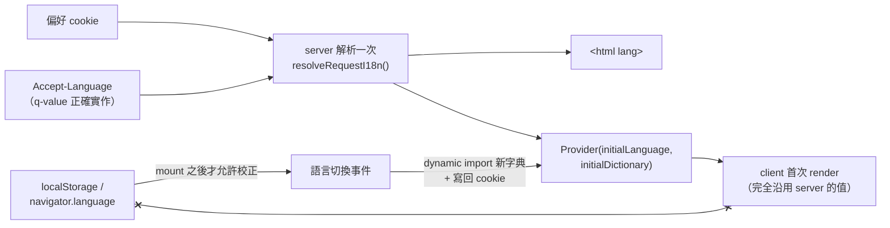

# Server-Resolved i18n：hydration 安全的語言解析與型別安全字典

> **Pattern 一句話**：語言在 server 決定一次，client 首次 render 完全沿用；
> 字典的 key 由主語言檔的型別推導，缺譯是編譯錯誤；每份語言各自 dynamic import
> 成獨立 chunk。

## 問題

SSR 應用的 i18n 有三個經典事故：server 與 client 各自推導語言造成 hydration
mismatch（整個子樹 text 不一致）；翻譯 key 打錯字在 runtime 才以 raw key 現形；
所有語言檔被打進共用 bundle。

## Pattern

### 1. 語言解析單一來源，首次 render 不得自行推導

（`x--x`：render 期間讀 client 端來源會造成 hydration mismatch。）

client Provider 的第一個 render **只用 server 傳入的值**；render 期間讀
`localStorage`／`navigator.language` 都會造成 server HTML 與 hydration 不一致。
mount 之後才允許校正。

### 2. 權威來源與快取分清楚

若頁面內嵌的第三方元件有自己的語言來源（例如讀某個 localStorage key），
讓那個來源當 client 端權威、cookie 只當「讓 server 能提前渲染正確語言」的快取，
由 Provider 在切換時寫回。選錯權威的代價是畫面分裂（app 字串與內嵌元件不同語言）；
選對的代價只是 cookie 過期時 hydration 後閃一次——取代價小的那邊，並把取捨寫下來。

### 3. 字典型別從主語言檔推導

- `AppTranslationKey = keyof typeof en`（`import type`，零 runtime bytes）；
- 其他語言檔用 `satisfies AppDictionary` 釘住——**缺 key、多 key 都是編譯錯誤**；
- `t()` 只接受 `AppTranslationKey`；key 存進常數或當 prop 傳遞時型別必須跟著走。
  打錯字是編譯錯誤，不是 runtime 的 key echo。

### 4. 載入與邊界紀律

- 禁止在 client module 靜態 import 字典；唯一載入點是 dynamic import——
  每份語言一個 chunk，切換語言才抓第二份；
- 語言切換走單一事件通道 + 跨分頁 storage 事件，用單調的 request 世代丟棄
  過期的 in-flight 載入；
- 非 UI 程式碼不做翻譯：流程函式開對話框、等結果，文案由元件以 key 解析；
  已解析的字串只能當純 props 下傳，不得存進 module 狀態（語言切換時會過期）；
- 會**取代整個 root layout** 的錯誤頁（global error boundary）不得依賴 Provider——
  它渲染時 Provider 已不存在。做成純呈現元件，由呼叫端傳入文案；
  最外層傳固定 fallback，route 層的錯誤頁才走翻譯。

## 評估

- 「型別推導字典」以零 runtime 成本買到完整性檢查，是 hand-rolled i18n
  相對於重型函式庫的甜蜜點；
- 「global error 不依賴 Provider」是一條普遍規則的特例：**任何渲染在
  Provider 樹之外的 UI，都不得依賴 Provider**——先枚舉哪些 UI 在樹外。

## Trade-offs

- 讀 cookie 使 root layout 變成 dynamic render；對本來就逐請求渲染的應用是
  已接受的成本，對想全靜態的站是實質代價。
- hand-rolled 方案沒有複數、格式化等進階功能；需要時再評估函式庫，
  但語言解析的 pattern（本文 §1–2）與函式庫無關、照樣適用。

## 本專案中的實例

- 全套設計與不變量：[i18n architecture](../architecture/i18n-architecture.md)。
- 實作：`apps/web/src/lib/i18n/`、`src/hooks/i18n-context.tsx`；
  測試 `tests/i18n-provider.test.tsx`、`tests/i18n-request-language.test.ts`。
