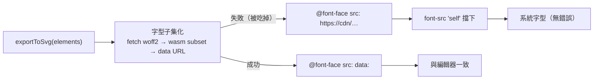

# 以引擎的靜態匯出當唯讀 Viewer：隱含依賴、保真設定與手勢層

> **Pattern 一句話**：唯讀頁面不掛編輯器，改渲染引擎的**靜態匯出物**（SVG）再自己補平移縮放。
> 代價是匯出流程的隱含依賴（字型、wasm、CSP）與編輯器的保真設定（背景、主題）全部變成
> 你的責任，而且失敗多半是**靜默降級**而不是錯誤——必須驗證產物本身，不能只看呼叫有沒有
> throw。

## 問題

公開分享、embed、預覽等唯讀場景，掛完整編輯器成本太高（bundle、記憶體、要餵一份唯讀的
互動狀態）。引擎通常有 `exportToSvg` 一類的靜態匯出 API，拿它渲染再套一層 CSS transform
就是一個 viewer。但接下來三類問題會在 production 才浮現，而且都不報錯：

1. **匯出物在編輯器裡「順便」成立的前提，在 viewer 裡不成立。** 編輯器 mount 時把字型註冊進
   `document.fonts`，匯出的 SVG 文字因此正常；viewer 沒有編輯器，沒有人替它宣告字型，引擎
   預設的補法是匯出時把字型**內嵌**成 `@font-face`。而內嵌流程走 WebAssembly（字型子集化），
   受頁面 CSP 管；一失敗，引擎不 throw，把來源退回第三方 CDN URL，再被 `font-src` 擋下——結果
   是系統字型，沒有任何錯誤。（§1b 是本專案的解法：自己宣告，不靠內嵌。）
2. **保真設定被當成樣式決策。** 「不要匯出背景，讓頁面主題色當底」看起來只是視覺選擇，實際
   丟掉了編輯器裡「元素顏色相對於場景背景」的對比關係：深色場景上的淺色線條在淺色頁面上消失。
3. **效能提示與畫質互斥。** `will-change: transform` 讓平移縮放留在 compositor，但被提升的
   layer 只點陣化一次、之後純 bitmap 縮放；向量文字放大後就糊。永遠開著就是永遠糊。

## Pattern

### 1. 把匯出流程的隱含依賴列成清單，並驗證產物

引擎預設的內嵌字型路徑長這樣（本專案的 viewer 已改走 §1b，不再經過它）：

做法：

- **枚舉依賴**：匯出流程碰到的每個「環境能力」——網路（字型 URL 是否自託管）、字型宣告
  （頁面要載入 `fonts.css`，`font-src 'self'`）、圖片來源（`img-src data:`）。若沿用引擎的
  內嵌字型路徑，還會多出 wasm（`script-src` 要 `'wasm-unsafe-eval'`）、內嵌字型
  （`font-src data:`）與 worker（`worker-src`）——這正是 §1b 把它們從訪客頁面移除的原因。
  每一項對應到 CSP 或部署設定裡的一行，並在該行註解寫明是誰需要。
- **驗證產物而非呼叫**：對匯出物做結構性斷言——`<text font-family>` 請求的每個家族都要有
  `@font-face`（`document.fonts.check()`）、不得出現第三方 host；文字元素數量與輸入相符。
  把它放進走查清單，且**在 production 等價的 CSP 下**跑（dev 常因 `'unsafe-eval'` 而掩蓋
  wasm 問題）。
- **對「引擎自己的 fallback」保持懷疑**：能吃錯誤再退回 CDN 的程式庫，在 CSP 收斂後其 fallback
  形同壞掉；你的 fallback（例如 `skipInliningFonts`）根本不會被觸發。

### 1b. 宣告從出貨資產推導，不從引擎內部借

引擎的字型載入常靠內部類別（註冊 FontFace、附 unicode-range），套件不一定公開。別因此
把「引擎沒公開」等同「做不到」：涵蓋字元在字型檔的 cmap table、字重在 OS/2 table，都是
**出貨資產本身的內容**。build 時解析這些檔案產生一份 `fonts.css`，匯出時關掉內嵌
（`skipInliningFonts`），頁面載入 CSS，瀏覽器就用原生的 unicode-range 按需載入。這比等引擎
公開 API 穩：引擎改變註冊方式不影響你，資料來源永遠是你已經自託管的那批檔案。

唯一不能從檔案推導的是 `font-family` **名稱**：匯出物寫的是引擎自己的家族字串，而 woff2 的
name table 可能不同（本專案九個家族有四個不同：`Cascadia Code`／`Cascadia`、
`Comic Shanns Regular`／`Comic Shanns`、`Nunito ExtraLight Medium`／`Nunito`、
`Xiaolai SC`／`Xiaolai`）。名稱要對齊引擎**公開**的家族常數，並用測試釘住「CSS 家族集合 ＝
引擎常數集合」，引擎新增或改名家族時測試先失敗，而不是訪客頁面靜默落到系統字型。
代價是多一個 build 期解析步驟，以及 cmap 算出的範圍可能比引擎手寫的略寬（多抓一個小檔）。
同家族的子集 cmap 會互相重疊（切檔工具把常用字放進每個子集），而 `@font-face` 對同一
codepoint 是後宣告者勝；產生時要讓每個 codepoint 只屬於一條規則（大子集先認領、後者扣除），
否則純拉丁文字會抓到字母序最後的檔案。

### 2. 保真設定以「重現編輯器」為準，不以頁面樣式為準

匯出 API 的選項（背景、主題濾鏡、frame 裁切、embed 是否渲染）每一個都是編輯器行為的
子集開關。預設策略：**照編輯器的做**——背景要匯出，viewport 再讀取匯出物裡的背景色補滿
SVG 以外的區域。注意主題濾鏡的位置：引擎可能把 dark mode 當成 SVG 根節點上的 CSS
`filter`，背景矩形保留的是**原色**；直接拿原色鋪 viewport 會在深色主題下得到白底。正確做法
是把矩形的 fill 與根節點的 filter 一起讀回，鋪在 SVG 後面的一層 backdrop 上並套同一個
filter——顏色與濾鏡都來自匯出物本身，不在自己這邊重算色彩。只有在確定不影響元素可辨識性
時才偏離，並把理由寫在選項旁邊。

### 3. 效能提示只在手勢期間開

`will-change` 一類的 compositor 提示，改成**手勢範圍**：pointerdown／wheel 開始時加上、
所有 pointer 放開且 wheel 停止一段 idle 後移除。瀏覽器會在移除時以最終比例重新點陣化，
兼得平移時的流暢與靜止時的清晰。wheel 沒有結束事件，用短 idle timer 收斂。

### 4. 靜態產物上的互動要有模式，而不是一律攔截

匯出的 SVG `<text>` 是真 DOM，拖拉平移會同時觸發瀏覽器文字選取。不要用全域
`user-select: none` 一刀砍——那也砍掉「複製圖上文字」這個唯讀頁最有價值的能力。改成兩個
明確模式（比照編輯器的 hand／selection 工具與快捷鍵）：

| 模式 | 拖拉 | 文字選取 | 滾輪／pinch |
| --- | --- | --- | --- |
| Hand | 平移 | 關（`select-none`） | 縮放 |
| Select | 不處理（交給瀏覽器選字） | 開 | 縮放 |

觸控是例外：觸控沒有「拖拉選字」，所以兩個模式下觸控都保留平移與 pinch。按住 Space
臨時切回平移，與編輯器一致。

## 評估

適用於任何「以第三方引擎的靜態匯出當唯讀畫面」的場景（圖表、公式、地圖、文件預覽）。
核心判準是：**匯出流程在編輯器裡有哪些前提是被順便滿足的？**把答案列出來，就是 viewer
的依賴清單與走查清單。

## Trade-offs

- 靜態匯出無法呈現 iframe／embed 類元素（引擎只畫佈局框加連結）；需要時只能掛編輯器。
- 手勢範圍的 `will-change` 在手勢結束時多一次重新點陣化；大型場景會有一次可見的閃動。
- 「照編輯器的做」意味 viewport 外圍會出現場景背景色而非頁面主題色；這是刻意的。

## 本專案中的實例

- viewer：`apps/web/src/components/excalidraw/published-scene-viewer.tsx`（模式切換、背景讀取、
  `exportBackground: true`）；手勢層：`src/hooks/excalidraw/use-svg-pan-zoom.ts`
  （`panEnabled`、手勢範圍的 `will-change`）；純函式測試 `tests/svg-pan-zoom.test.ts`。
- 字型（§1b 的實作）：`apps/web/scripts/excalidraw-fonts-css.mjs` 在 `sync-excalidraw-assets.mjs`
  複製字型後，以 fontkit 讀每個 woff2 的 cmap／OS/2，產生 `public/excalidraw-assets/fonts.css`
  （230 條 `@font-face`，Xiaolai 209、Excalifont 7；`font-display: block`）；家族名稱由
  `CANVAS_FONT_FAMILY_BY_DIR` 對齊上游公開的 `FONT_FAMILY`，`tests/excalidraw-fonts-css.test.ts`
  釘住集合相等。`app/p/[slug]/layout.tsx` 以 `<link rel="stylesheet" precedence>` 載入該 CSS，
  viewer 以 `skipInliningFonts: true` 匯出，並以 `document.fonts.load(font, chars)` 明確請求
  `<text>` 用到的家族與字元、到齊（或 3 秒 deadline）後才淡入——不用 `document.fonts.ready`，
  它只反映瀏覽器已經開始的載入，取決於是否已對掛載的 SVG 跑過 layout。改前每次開頁
  （與每次切換主題）都重跑「fetch 子集檔 → wasm 子集化 → 內嵌」，中文場景約 50 個子集檔、
  約 3 MB、主執行緒約 1 秒；改後訪客頁面零字型運算，只下載文字用到的檔案。`fonts.css` 檔名
  無雜湊，維持 Next 預設 `max-age=0` + ETag；字型檔本身沿用 `next.config.ts` 的 `immutable`。
  量測時 Network 仍會出現約 230 個對 `https://esm.sh/@excalidraw/…/fonts/…` 的 **blocked**
  項目（status 0、零流量）：上游算文字 metrics 時初始化 `Fonts` registry，為每個字型檔
  `new FontFace()` 並在 src 候選清單附上 esm.sh fallback，Chrome 在建構時就對該跨源 URL 做
  CSP 檢查而留下紀錄；這在改走 CSS 之前就存在，被 `font-src 'self'` 擋下，不是字型下載。
- CSP 依賴：`src/config/security-headers.ts` 的 `font-src 'self'`（`data:` 已隨本做法移除）；
  `'wasm-unsafe-eval'` 仍保留給工作區「下載 SVG／PNG」，`/p` 不再依賴。推導見
  [web-csp-design](../architecture/web-csp-design.md)；字型自託管見
  `scripts/sync-excalidraw-assets.mjs` 與 [web-security-headers](../operations/web-security-headers.md)。
- 兩套登錄方式並存：編輯器用上游 FontFace API，viewer 用我們產的 CSS；資料來源是同一批
  檔案，上游改切檔方式時 CSS 自動跟上，但家族名稱表需隨 `FONT_FAMILY` 變動（由測試把關）。
- 後續方向：[Render once, serve many](./render-once-serve-many.md)（把渲染從觀看時搬到寫入端），
  對應 [plans/19](../../plans/19-publish-time-rendered-artifacts.md)。
- 相關 pattern：[第三方引擎的 Adapter 邊界](./third-party-engine-adapter.md)、
  [CSP 與 Code Delivery](./csp-and-code-delivery.md)。
