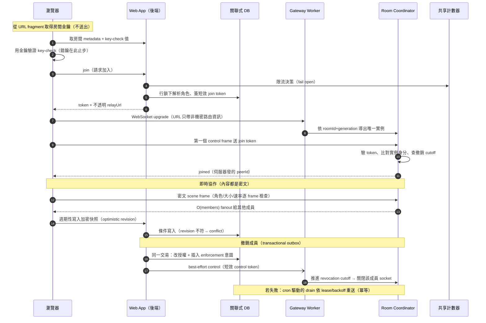

# 系統總覽：整體架構與端到端 Data Flow

> 這篇是 `system-design/` 的地圖：先看懂整個系統由哪些角色組成、資料怎麼流，
> 再進入各篇 pattern。圖中的命名是通用角色名（Web App、Coordinator、Object Storage），
> 括號內才是本專案的具體選型——套用到其他專案時，替換括號內的東西即可。

## 系統架構圖

```mermaid
flowchart LR
    subgraph Browser["瀏覽器（不可信環境）"]
        UI["產品 UI"]
        Adapter["引擎 Adapter<br/>（Excalidraw 唯一邊界）"]
        Session["協作 Session<br/>（E2EE 加解密、佇列、恢復）"]
        Key["房間金鑰<br/>（只存在 URL fragment 與記憶體）"]
    end

    subgraph WebPlatform["Web 平台（Vercel）"]
        Web["Web App<br/>SSR + API（tRPC / server actions）"]
        Auth["身分驗證<br/>（Better Auth）"]
    end

    subgraph DataLayer["資料層"]
        PG[("關聯式 DB（PostgreSQL）<br/>權威資料 + 兩個 outbox")]
        OS[("Object Storage（UploadThing）<br/>大型二進位／密文資產")]
        Redis[("共享計數器（Upstash Redis）<br/>只存限流視窗")]
    end

    subgraph EdgePlatform["Edge 平台（Cloudflare）"]
        GW["Thin Gateway Worker<br/>驗 token、路由，無狀態"]
        DO["Room Coordinator<br/>（Durable Object，一房一實例）<br/>只存 coordination metadata"]
        Cron["分鐘級 Cron trigger"]
    end

    UI --> Adapter
    UI -->|"HTTPS：登入、房間 API、<br/>快照、資產 metadata"| Web
    Web --> Auth
    Web -->|"交易 + 行鎖 + outbox"| PG
    Web -->|"presign 上傳／下載 URL"| OS
    Web -->|"限流決策（單次呼叫）"| Redis
    Session <-->|"WebSocket：E2EE 密文 frame<br/>（gateway 與 DO 都解不開）"| GW
    GW -->|"依 roomId+generation<br/>導出唯一實例"| DO
    Web -->|"HTTPS control：<br/>短效簽章 token"| GW
    Cron -->|"drain ping（不帶資料）"| Web
    Browser -->|"密文資產直傳"| OS

    Key -. "永不離開瀏覽器" .-> Session
```

三條關鍵的信任邊界（詳見 [E2EE 金鑰生命週期](./e2ee-key-lifecycle.md)）：

1. **內容機密性**：場景內容只以密文通過 Gateway／Coordinator／DB／Storage，
   這四者都沒有金鑰；
2. **授權**：由 Web App 的 DB 決定、以短效簽章 token 傳遞，Gateway 與 Coordinator
   逐跳重新驗證（見 [分層授權](./layered-authorization.md)）；
3. **Code delivery**：瀏覽器執行的程式碼本身是一條被明文接受的信任邊界
   （見 [CSP 與 code delivery](./csp-and-code-delivery.md)）。

## 端到端 Data Flow：加入房間 → 即時協作 → 快照 → 撤銷

## 元件 × Pattern 對照

| 元件 | 適用的 pattern 文件 |
| --- | --- |
| 引擎 Adapter | [第三方引擎 Adapter](./third-party-engine-adapter.md)、[模組邊界](./module-boundaries.md) |
| Web App API 層 | [分層授權](./layered-authorization.md)、[封閉結果型別](./typed-results-and-pure-decisions.md)、[防禦性邊界](./defensive-boundaries.md)、[上限是防護不是容量](./limits-as-protection-not-capacity.md) |
| 關聯式 DB | [Transactional outbox](./transactional-outbox.md)、[資料生命週期與 GC](./data-lifecycle-and-gc.md)、[版本與相容性](./versioning-and-compatibility.md) |
| 共享計數器 | [防禦性邊界](./defensive-boundaries.md) §5、[Client 寫入節奏與 writer 選舉](./client-write-pacing-and-writer-election.md) §3 |
| Gateway + Coordinator | [即時協作房間](./realtime-room-coordination.md)、[成本感知的有狀態服務](./cost-aware-stateful-services.md)、[上限是防護不是容量](./limits-as-protection-not-capacity.md)、[隱私安全 observability](./privacy-safe-observability.md) |
| 協作 Session（client） | [E2EE 金鑰生命週期](./e2ee-key-lifecycle.md)、[即時協作房間](./realtime-room-coordination.md) §6、[Client 寫入節奏與 writer 選舉](./client-write-pacing-and-writer-election.md)、[遠端狀態回灌的重入抑制](./reentrancy-suppression-for-echoed-remote-state.md) |
| 瀏覽器 UI 殼 | [持久工作區與 overlay routing](./persistent-shell-overlay-routing.md)、[Server 端解析狀態的 hydration 邊界](./hydration-boundary-for-server-resolved-state.md) |
| Headers／部署／CI | [CSP 與 code delivery](./csp-and-code-delivery.md)、[Config 與部署是受測工件](./config-and-deployment-as-artifacts.md)、[測試作為契約](./testing-as-contracts.md)、[演進與清理紀律](./evolution-and-cleanup.md)、[記錄下來的拒絕](./recorded-refusals.md) |
