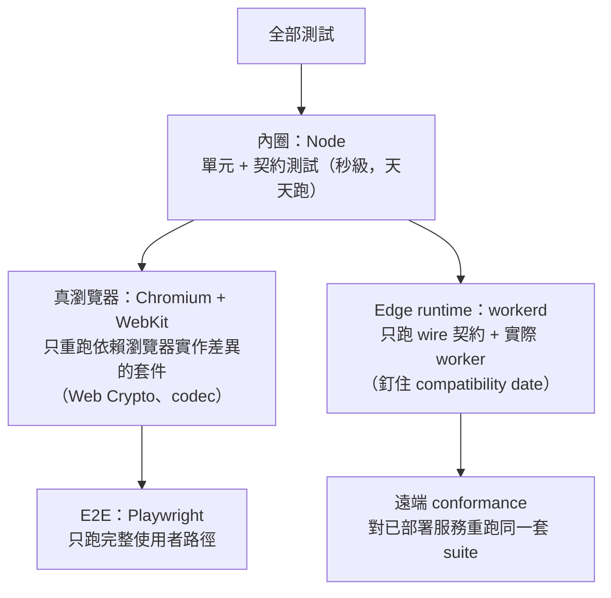

# 測試作為契約：tripwire、differential、conformance 與成本分層

> **Pattern 一句話**：最有價值的測試不是覆蓋率，而是**契約釘住**——邊界測試讓違規
> 無法合併、tripwire 讓上游變化自動現身、同一套 conformance suite 在多個 runtime
> 重跑、效能預算綁定固定 fixture；昂貴的執行環境只留給非它不可的斷言。

## 問題

「測試」常被理解為「驗證這個函式算得對」，於是架構規則、部署設定、效能、
跨 runtime 行為這些真正昂貴的故障面反而沒有任何機器防線——它們只存在於
文件與資深工程師的記憶裡。

## Pattern

### 1. 契約測試：以不變量命名，釘住決策

為每個重要決策寫一個以「不變量」命名的測試檔：`security-headers`（政策精確等於
核准清單）、`package-contract`（entry 集合、依賴純度、key material 限定檔案）、
`workspace-routes`（walk 檔案系統，斷言每個 modal 頁都有註冊）、
`config-audit`（部署設定逐欄位）、`logging-contract`（禁止欄位掃描）。

特徵：這類測試**很少改**，改它就是改決策——diff 裡出現契約測試的變更，
就是 review 應該放大鏡檢視的位置。

### 2. Tripwire：讓「別人的變化」自動現身

- 型別 tripwire：`as const satisfies readonly (keyof T)[]` 讓 allowlist 在上游改名時
  編譯失敗；`assertNoUnauditedKeys<Exclude<keyof T, Audited>>()`（約束為 never）
  讓上游**新增**未審核的表面時編譯失敗；
- 已知缺口也釘測試：上游哪天修好了你 workaround 的問題，測試失敗提醒你刪掉 workaround；
- 模組載入期 assertion：兩個常數之間的等價論證（「限流 refill 上限 ≤ 休眠門檻，
  所以重建滿桶是安全的」）直接寫成 module-load 時的 throw——未來任何人改動其中
  一個常數，啟動即爆，論證永不過期。

### 3. Differential：與被包裝物逐項對照

包裝第三方演算法時，每個 fixture 跑兩遍（原生組合 vs 包裝層），斷言完整結果相同。
「我們沒有第二套演算法」從口號變成可執行的證明。fixture 目錄以**被鎖定的上游版本**
命名（`fixtures/engine-0.18.1/`），升級時新舊 fixture 的 diff 就是行為變化清單。

### 4. Conformance：一套黑箱 suite、多個宿主

協定／編解碼這類「必須在所有 runtime 行為一致」的模組，寫一套 framework-free 的
黑箱 conformance suite，然後在每個宿主重跑：Node、真瀏覽器（Chromium 與 WebKit——
Web Crypto 是不同實作）、edge runtime（釘住 compatibility date）、
以及**對已部署服務遠端重跑**。無法遠端覆蓋的少數情境明文列出並委派給其他機制，
不假裝有覆蓋。

### 5. 成本分層：昂貴環境只跑非它不可的斷言

| 層 | 執行環境 | 跑什麼 |
| --- | --- | --- |
| 內圈 | Node | 絕大多數單元／契約測試（快，天天跑） |
| 真瀏覽器 | Chromium + WebKit | 只有依賴瀏覽器實作差異的套件（crypto、codec） |
| Edge runtime | workerd | 只有 wire 契約與實際 worker |
| E2E | Playwright | 只有整條使用者路徑（單 worker、明確的 webServer 配置） |

效能測試同樣分層：**結構性斷言永遠執行**（payload 成比例、零複製、通知次數精確），
**數字預算放在明確的 opt-in flag 之後**並校準到記錄在文件裡的機器等級——
CI 機器的抖動不該讓效能測試變成大家習慣重跑的雜訊。

### 6. 效能預算綁定固定 fixture

預算（p95、bundle 大小、記憶體 delta）與固定 fixture 一起鎖定成文件；比較時
不得縮小 fixture、剔除慢的 iteration、或把成本移到未計量的地方。超出預算的選項
只有兩個：縮減設計，或取得明確的架構決策把預算改掉——**把 regression 改寫成
新 baseline 不是選項**。

### 7. 測試資料的跨套件存取也走公開 entry

fixture 需要被其他 package 的測試使用時，開一個 `./testing` 公開 entry 提供路徑
與讀取函式——相對路徑穿越（`../../../packages/...`）繞過邊界，且目錄搬動時
靜默壞掉。

## 評估

- 「契約測試 + tripwire」的組合讓**架構**獲得與**行為**同等級的迴歸防護，
  這是文件永遠做不到的；
- 成本分層防止測試套件劣化成「太慢所以沒人跑」；
- module-load assertion 是被低估的工具：任何「A 之所以安全是因為 B」的論證
  都可以寫成一行啟動檢查。

## Trade-offs

- 契約測試在大型重構時是阻力（這是它的功能，但要有心理準備逐一重新決策）；
- differential 與多宿主 conformance 的建置成本高，保留給「錯了會靜默資料損毀
  或跨 runtime 分岔」的模組。

## 本專案中的實例

- 契約測試群：`packages/collaboration/tests/package-contract.test.ts`、
  `apps/web/tests/security-headers.test.ts`、`apps/web/tests/workspace-routes.test.ts`、
  `apps/collaboration-do/tests/config-audit.test.ts`。
- tripwire：`packages/excalidraw-adapter/tests/upstream-capability-audit.test.ts`、
  `room-policy.ts` 的 module-load assertion。
- differential + 版本命名 fixture：`tests/reconcile-differential.test.ts`、
  `tests/fixtures/excalidraw-0.18.1/`。
- conformance 多宿主：`packages/collaboration/src/protocol-conformance.ts`
  （workerd 內 + 遠端對已部署 Worker）、browser project 只重跑 4 個 crypto 套件。
- 效能預算與 fixture：[excalidraw baseline](../performance/excalidraw-baseline.md)、
  [reconciliation adapter](../performance/reconciliation-adapter.md)、
  `ENFORCE_EXCALIDRAW_PERFORMANCE_BUDGETS` opt-in。
