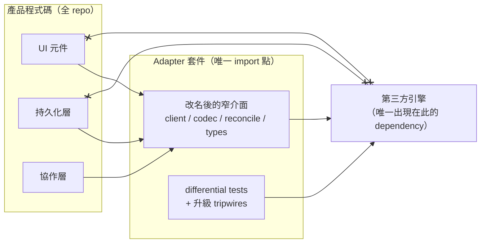
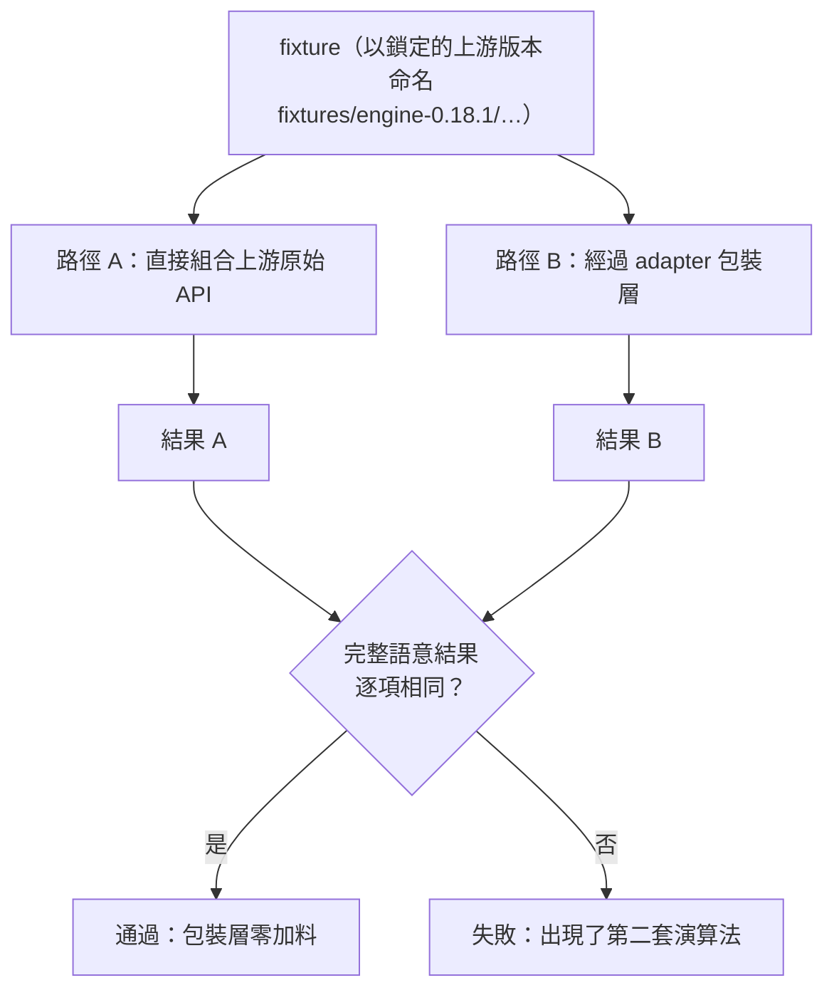

# 第三方引擎的 Adapter 邊界（Anti-Corruption Layer）

> **Pattern 一句話**：把大型第三方引擎（編輯器、canvas、地圖、富文字……）關進一個
> 專屬的 adapter 套件：全 repo 只有它能 import 上游、只暴露改名後的窄介面、
> 用 differential test 證明「沒有第二套演算法」、用型別 tripwire 讓上游升級時
> 自動指出所有需要重新審視的表面。

## 問題

產品建立在一個功能龐大的第三方引擎上，但引擎的公開介面永遠不完全符合產品需求。
未設邊界的整合會自然演化出三種病：

1. 上游的型別與符號滲透到整個 codebase，升級時全 repo 一起爆；
2. 有人「只是想微調一下」開始複製上游的內部邏輯（合併、排序、序列化），
   從此產品擁有一份永遠追不上上游的分岔實作；
3. 繞過公開 API 的 hack（DOM 選擇器、私有模組、patch）散落各處，每次升級都是排雷。

## Pattern



（`x--x`：產品程式碼直接 import 引擎，會同時被 lint 與 AST 測試擋下。）

### 1. 唯一的 import 點 + 改名再輸出

上游套件只出現在一個 adapter package 的 `dependencies` 裡；全 repo 其他地方 import 它
都是 lint error + 測試失敗。adapter 對外輸出時**改名成宿主的命名空間**
（`Engine → HostCanvas`、`restore → restoreScene`）——下游程式碼從此拼不出任何上游符號，
「哪些程式碼受上游升級影響」變成一個 grep 就能回答的問題。

介面窄化的兩個技巧：

- **Props allowlist**：不透傳整包上游 props，而是 `Pick<UpstreamProps, ...17 個明確核准的鍵>`，
  每個非顯然的鍵附註為什麼需要；
- **型別用推導不用重述**：`type ExportOptions = Parameters<typeof upstreamExport>[0]`——
  包裝層無法與引擎 drift。

### 2. 明文列出「上游擁有、我們不得重寫」的清單

element 模型、排序、undo/redo、序列化語意、衝突合併……這些寫成清單放進架構契約。
需要這些能力時只能**經 adapter 呼叫上游**。公開 API 不夠用時，走正式的 gap audit
流程（用 lockfile 解析的上游原始碼證明缺口、記錄成文件、由 owner 決定），
預設答案是「接受產品限制」，不是 patch。

### 3. 保留原生資料模型，不做第二套 schema

儲存與傳輸都用上游的原生資料形狀，**不投影成自有 schema**。原生欄位
（版本戳、fractional index、tombstone、未知的未來欄位）原樣保留；產品自己的
metadata（名稱、擁有者、分類）放關聯式欄位，不混進文件本體。
讀取時做 **canonicalize-on-read**：契約外的欄位在讀取時剝除、不再寫回——
比「拒收」寬容、比「原樣搬運」乾淨。

### 4. Differential test：證明「零第二套演算法」

包裝了上游的演算法（例如衝突合併），就把每個 fixture **跑兩次**：一次直接組合上游原始
API、一次走 adapter，斷言完整語意結果逐項相同。這是「我們沒有加料」的機器可查證明，
也是 adapter 存在正當性的核心證據。



### 5. 升級 tripwire：上游「新增」也要炸

大部分測試只在上游**移除**東西時失敗；同樣重要的是上游**新增**了你還沒審視的表面。
型別層技巧：

```ts
// audited 是已審核鍵名的 union；上游新增任何鍵，Exclude 就不再是 never，
// 這一行立刻編譯失敗，逼你把新鍵歸類（採用／拒用／記錄 gap）。
assertNoUnauditedKeys<Exclude<keyof UpstreamSurface, AuditedKeys>>();
```

搭配 runtime 的 `Object.keys(upstream)` snapshot，以及「每次升級必須同時跑
typecheck 與 test」的規則。已知的上游缺口也各釘一個測試——**上游哪天把缺口補上，
測試會失敗提醒你移除 workaround**。

### 6. 上游危險預設的收窄，在 adapter 層做

上游功能若有不安全預設（無界下載、任意 URL fetch、以頁面權限執行第三方 script 的
embed），在 adapter 包裝層攔截：關掉上游的入口、換成自己有界、有 origin 檢查、
有 byte cap 的實作。收窄的順序常常是正確性關鍵（例如：在第一個 `await` 之前同步
清除 URL 中的 token，趕在上游自己的 listener 之前）。

### 7. 消滅 vendor fallback 用 build step，不用 runtime 分支

上游寫死了第三方 CDN fallback（字型、資產）？正解不是 patch 上游，而是：
build 時把資產從 lockfile 解析的同一版本複製到自家 origin、設定上游的資產路徑
指向自己，讓 CDN 從「每次都走的正常路徑」降級為「永不觸發的錯誤路徑」，
再用 CSP 把錯誤路徑也擋掉。判準是**正常路徑的網路行為**，
不是 vendor 程式碼裡有沒有那個字串。

## 評估

- 這是整個專案裡槓桿最大的單一決策：上游升級的爆炸半徑從「全 repo」縮到「一個套件
  的測試套件」，而且 tripwire 會自動列出待審清單。
- differential test 的思路可推廣到任何「包裝別人演算法」的場合：包裝的正確性標準
  就是「與不包裝完全等價」。
- 「不重寫上游」是紀律不是能力問題——寫下清單並強制，比相信自己不會手癢有效。

## Trade-offs

- 上游公開 API 的缺口變成產品限制，需要組織上接受「這個功能做不了」的答案。
- adapter 本身的測試投資不小（differential fixtures、capability audit）；
  對小型或易替換的依賴不值得，這是為「產品建立在其上」等級的引擎準備的。

## 本專案中的實例

- adapter 套件：`packages/excalidraw-adapter`（5 個 subpath entry、改名輸出、
  props allowlist、`assertNoUnauditedKeys` tripwire、reconcile differential tests、
  library 下載的 byte-capped 收窄）。
- 不得重寫清單與 gap 流程：[architecture contract](../architecture/architecture-contract.md)、
  [ADR 0001](../adr/0001-excalidraw-persistence-boundary.md)、
  [public API gap audit](../architecture/excalidraw-public-api-gap-audit.md)。
- 字型自託管與 esm.sh fallback 的 trade-off 推導：
  [ADR-0004](../adr/0004-code-delivery-trust-boundary.md)。
