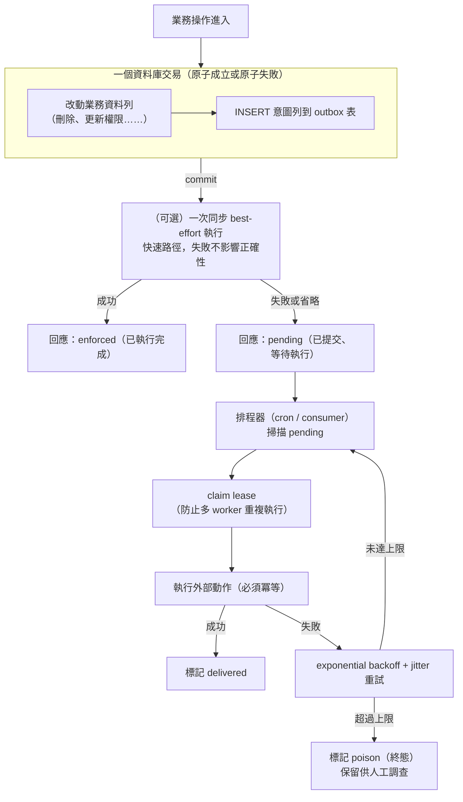
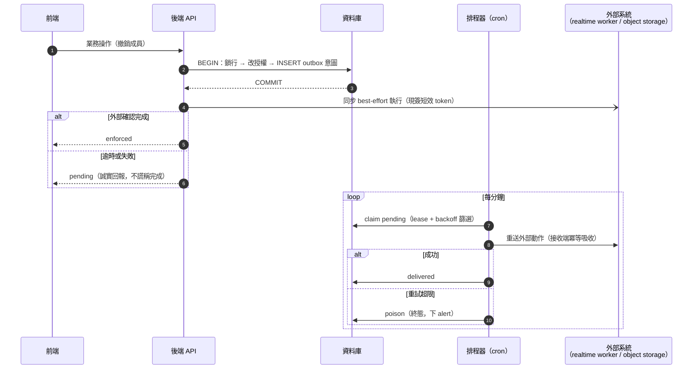

# Transactional Outbox：跨系統一致性的通用解法

> **Pattern 一句話**：當一個業務操作需要同時改動「交易性資料庫」和「無法參與交易的外部系統」
> 時，不要直接呼叫外部系統——把「要對外部系統做的事」以資料列的形式寫進同一個資料庫交易，
> 再由獨立的排程器非同步地執行並重試。

## 問題

幾乎每個系統都會遇到這個形狀的問題：

- 刪除資料列時，要同時刪除 object storage 上對應的檔案；
- 更新權限時，要同時通知即時服務踢掉已連線的使用者；
- 建立訂單時，要同時發出通知或呼叫第三方 API。

資料庫交易保證自己的原子性，但 object storage、WebSocket 服務、第三方 API 都無法加入這個
交易。直接在交易前後呼叫外部系統，必然出現兩種失敗模式之一：

1. **先外部、後交易**：外部動作成功後交易失敗 → 外部系統已改變，資料庫卻沒有紀錄
   （例如：檔案被刪了，資料列還指著它）。
2. **先交易、後外部**：交易成功後外部呼叫失敗（或 process 被中斷）→ 資料庫已改變，
   外部系統永遠不會被通知（例如：資料列刪了，檔案永遠變成孤兒，而且沒有任何索引能再找到它）。

## Pattern

放到「前端 → 後端 → worker」的實際溝通脈絡裡，時序如下（以「撤銷協作成員」為例）：

關鍵設計點：

1. **意圖與業務改動在同一交易內**。這是整個 pattern 的核心：資料庫的原子性被「借用」來保證
   「業務狀態」與「該執行的外部動作」永不脫勾。
2. **外部動作必須冪等**。排程器可能在「執行成功但標記 delivered 前」當機而重送；接收端要能
   安全吸收重複投遞（常用手法：以單調遞增的 revision 取 max、以唯一 ID 去重）。
3. **同步快速路徑是體驗最佳化，不是正確性機制**。commit 後立刻嘗試一次，可以讓使用者馬上
   看到結果；但即使這一步整個省略，系統仍然正確。回應可以誠實區分兩種狀態：
   「已執行完成」與「已提交、等待執行」。
4. **poison 是終態，不是刪除**。無限重試會讓一筆壞資料永久占用排程器；直接刪除則抹掉了
   故障證據。標記終態、設定有界保留期（例如成功列保留 7 天、poison 列保留 30 天）。
5. **pending 永不過期清除**。還沒執行的意圖是「欠著的債」，清掉它等於默默放棄一致性。

## 評估：為什麼這個 pattern 值得學

- **它把分散式一致性問題降階成單機交易問題**。不需要 2PC、不需要 saga framework，
  只需要一張表和一個 cron。
- **失敗模式全部可見**：pending 積壓、poison 出現都是可以下 alert 的具體訊號，
  而「inline 呼叫失敗後被吞掉」是完全不可觀測的。
- **同一個機制可以承載多種外部系統**。檔案清理、即時通知、webhook 都是同一形狀。

## Trade-offs 與不適用的情況

- 外部動作變成**最終一致**：commit 到實際執行之間有延遲（取決於排程頻率）。若業務要求
  「回應返回時外部動作必定已完成」，這個 pattern 不夠，需要同步等待（並接受可用性耦合）。
- 需要額外的營運件：排程器、監控積壓的 alert、poison 的處理流程。
- 排程器的執行平台是個現實問題：serverless 平台的 cron 精度和頻率各有限制，
  有時需要借用另一個平台的排程器來打自己的 drain endpoint。選型時把「誰來當時鐘」
  當成一個明確的架構決策，而不是事後補救。

## 本專案中的實例

Drawstuff 用同一個 outbox 形狀承載兩種完全不同的外部系統：

- `deferred_file_cleanup`：任何讓 object storage 物件變成孤兒的刪除（場景、房間、帳號、
  縮圖替換），都在同一交易內把 storage key 寫進佇列，由 bounded 排程 job 執行實際刪除。
  見 [data lifecycle](../architecture/data-lifecycle.md)。
- `collaboration_control_outbox`：協作房間的授權變更（踢人、關房、世代輪替）在同一交易內
  寫入 enforcement 意圖，由每分鐘的排程 drain 到 Durable Object；投遞以 revision-max 冪等，
  回應區分 `enforced` 與 `pending`。見
  [collaboration system design](../architecture/collaboration-system-design.md)。

「誰來當時鐘」的實例：web 平台（Vercel Hobby）的 cron 只有每日精度，因此分鐘級 drain
由 Cloudflare Worker 的 cron trigger 代打，而每週的清理仍留在 web 平台的 cron。
