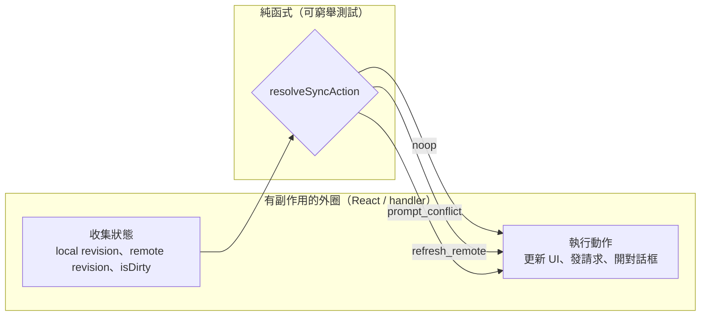

# 封閉結果型別與純決策函式

> **Pattern 一句話**：domain service 的結果用封閉的 discriminated union 表達，
> 由各個 transport（RPC、server action、REST）各自翻譯成自己的錯誤語彙；
> 複雜的分支決策抽成不碰 I/O、不碰 framework 的純函式，讓它可以被直接測試。

## 問題

同一個業務操作（儲存文件）常常有多個入口：RPC endpoint、form action、背景 job。
天真的做法是每個入口各寫一份「驗證 + 授權 + 寫入 + 錯誤處理」，然後三份慢慢分岔。
另一個常見病是用 exception 表達業務結果：「版本衝突」「資產缺失」被 throw 出來，
呼叫端只能靠 message 字串或 instanceof 猜。

## Pattern

### 1. Service 回傳結果 union，transport 負責翻譯

```ts
type SaveResult =
  | { status: "success"; revision: number }
  | { status: "conflict"; remoteRevision: number }
  | { status: "missing_assets"; missingFileIds: string[] }
  | { status: "forbidden" };
```

- service 內含完整的授權與交易邏輯，**只有一份**；
- RPC router 把 union 翻成 RPC error code；server action 翻成可序列化的
  `{ data | error, code }`；每個 transport 是薄薄的翻譯層；
- exception 只留給真正的意外（bug、基礎設施故障），業務上可預期的失敗
  全部是 union 的一個分支——呼叫端被型別系統強迫窮舉處理。

### 2. 錯誤碼是封閉註冊表，UI 對碼分支

維護一個 `const` 物件作為全 app 錯誤碼註冊表，型別從它推導。UI 依碼決定行為與翻譯，
**永不 parse 人類可讀訊息**。同理，任何跨界通知（HTTP 429 的 retry 時間、
WebSocket close 的原因）都用機器可讀欄位承載，訊息文字只給人看。

### 3. 決策抽成純函式

任何「輸入幾個狀態值 → 輸出一個動作」的邏輯，抽成不 import framework、
不碰 I/O 的純函式：

```ts
resolveSyncAction(localRevision, remoteRevision, isDirty)
  → "noop" | "refresh_remote" | "prompt_conflict"
```



- React hook / route handler 只負責把狀態餵進去、把結果 render 出來；
- 決策表可以窮舉測試，不需要 mock 半個世界；
- 更大的狀態（例如連線恢復）做成純 state machine：phase 明確、事件驅動、
  時間當參數傳入而不是內部讀 clock——整條恢復路徑不用等待任何真實計時器就能測完。

### 4. 封閉列舉 + 「預設值靠結構決定」

列舉（close code、失敗原因、關閉理由）保持封閉，並想清楚**未列出的值落到哪一邊**。
例如斷線原因「只枚舉 terminal 的碼，其餘一律 retryable」——未來新增一個容量類的
close code，client 不需要升級就自動用正確的（可重試）行為處理它。
預設方向本身是個設計決策：選擇讓「遺漏」造成的錯誤是良性的那一邊。

## 評估

- 「一個 service、多個薄 transport」直接消滅了授權邏輯重複——重複的授權檢查
  是最危險的重複，因為分岔的那一份就是漏洞。
- 純決策函式讓最容易出 bug 的分支邏輯獲得最便宜的測試；
  它同時是最好的文件：決策表一眼看完。
- 「封閉 union + 窮舉」把「忘記處理某種失敗」從 runtime 事故變成編譯錯誤。

## Trade-offs

- 每個 transport 要寫一層翻譯樣板；在只有一個入口的小系統裡看起來多餘
  （但第二個入口出現的那天就回本）。
- 結果 union 的粒度需要判斷：太細會把 transport 翻譯層變成巨型 switch，
  太粗又回到「猜錯誤原因」的老路。

## 本專案中的實例

- `saveOwnedScene` 一份 service、tRPC router 與 server action 兩個翻譯層
  （`apps/web/src/server/scene/save-owned-scene.ts`）。
- 錯誤碼註冊表：`apps/web/src/lib/errors.ts`。
- 純決策函式：`resolveSceneSyncAction`（`src/lib/scene-sync.ts`）、
  房間狀態 reducer（`src/lib/collab/room-state-reducer.ts`，八個 useState 收斂成
  一台具名事件機）、恢復 state machine（`packages/collaboration/src/recovery.ts`）。
- 「只枚舉 terminal、其餘 retryable」：`packages/collaboration/src/relay-protocol.ts`
  的 close code → disconnect reason 映射。
