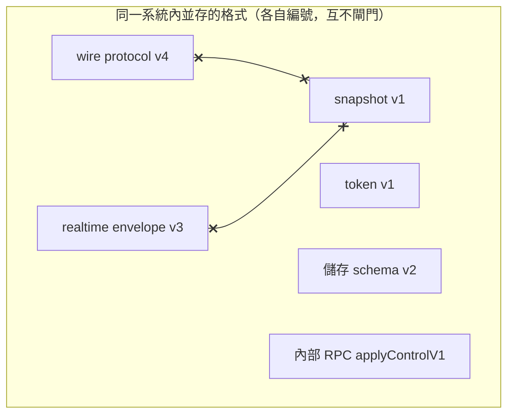
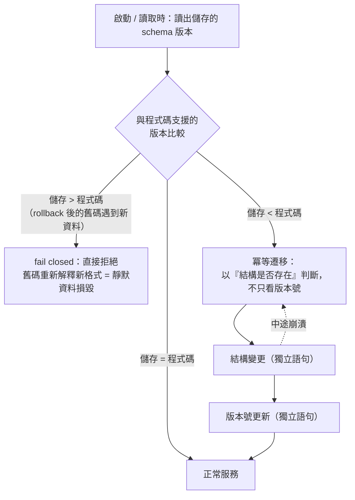

# 版本與相容性：每種格式一個版本號，skew 規則明文化

> **Pattern 一句話**：傳輸協定、持久文件、加密封裝、內部 RPC、資料庫 schema——
> 每一種格式有**自己的**版本號，彼此永不互為相容性閘門；每一條邊界明文寫下
> 「新舊版本相遇時誰讓誰」，且「儲存的版本比程式碼新」一律 fail closed。

## 問題

系統裡其實同時存在很多種「格式」：wire protocol、存檔格式、token 格式、
內部服務間的 RPC、DB schema、上游引擎的檔案格式。用一個全域版本號管它們，
會讓一次傳輸協定升級「順便」宣告所有存檔過期；不寫下 skew 規則，
則每次 rolling deploy 都是一次新舊版本相遇的即興演出。

## Pattern

### 1. 版本號 per format，明文禁止互相閘門

為每種格式獨立編號並寫下理由。最重要的一條推論是加密系統的：
**傳輸版本只放進傳輸訊息的 AAD；持久密文的 AAD 只綁自己的格式版本**——
否則升級一次協定，所有存檔密文變成不可解。格式版本以 AAD 綁定而不是
進入金鑰衍生，這樣格式修訂不會把活躍資源的金鑰整個換掉。

（`x--x`：傳輸版本升級**不得**使持久資料失效——這是分開編號要守住的核心性質。）

### 2. Skew 規則按邊界性質選擇

| 邊界 | 規則 | 理由 |
| --- | --- | --- |
| 對外 wire protocol | 版本是 schema 的 literal，不符直接 parse 失敗；**另設一個寬鬆探測器**辨識「過舊的 client」 | 嚴格保證安全；寬鬆探測讓舊 client 收到「請重新整理」而不是「你壞了」。只探測「比我舊」——client 比 server 新代表 server 正在 rollout，重整無濟於事 |
| 內部 RPC（同一系統的兩個部署單元） | request 用 strict schema；response 用非 strict；新欄位只能 optional；破壞性變更開 `V2` handler，舊 handler 活過整個部署窗 | rolling deploy 期間新舊必然共存；strict request 防走私、寬鬆 response 讓舊端自動剝除新端的附加欄位 |
| 持久儲存 schema | 讀到**比程式碼新**的版本 → 直接拒絕啟動；升級遷移以「結構是否存在」判斷而非只看版本號，保持冪等；版本號更新與結構變更分開提交，中途崩潰下一輪自癒 | 舊程式碼重新解釋新格式的資料是靜默資料損毀 |
| 存檔文件 | versioned reader 是受測契約：有 fixture、有 owner、有移除條件；已退役的格式**明確拒絕**並帶錯誤碼，不讓它 fall through 到會誤讀的通用 reader | 「碰巧能 parse」是最危險的相容性 |

「儲存的版本 vs 程式碼的版本」相遇時的決策流：

### 3. 禁止 silent fallback 與無期限 shim

相容性 reader 只能讀，不得成為新 writer 的靜默備援；不允許 catch-all downgrade。
每個 reader 必須能回答：它服務哪些真實存在的舊資料？誰擁有它？什麼證據出現時移除？
（例：對儲存資料做一次 audit，證明某格式零筆存量 → 刪除該 reader。）
讀取時的修補 shim 用一次性的 backfill 取代，跑完就刪。

### 4. 版本命名空間的另一個應用：計數器與快取

限流 namespace、快取 key 也帶版本（`...:ratelimit:v1:`）。演算法或 key 語意改變
就換 v2，讓新舊語意的計數永不混算——比「清空舊資料」更簡單且無需協調。

## 評估

- 「per-format 版本」幾乎零成本（就是多幾個常數），但它預先拆除了未來最痛的地雷：
  格式之間的意外耦合只有在事故發生時才會被發現。
- 「儲存版本比程式碼新 → fail closed」是所有規則裡最不能省的一條：
  它防的是 rollback 之後舊程式碼靜默毀損新資料。
- skew 表逼你在設計時就回答 rolling deploy 的問題，而不是在事故 postmortem 裡回答。

## Trade-offs

- 破壞性變更的成本變高（V2 handler、雙活期、移除條件）；這是刻意的——
  成本應該落在做破壞性變更的人身上，而不是攤給所有讀舊資料的路徑。
- 每個版本 reader 都要 fixture 與 owner，紀律要求不低；換來的是可以放心刪東西。

## 本專案中的實例

- 六個獨立版本號（wire v4、token v1、realtime envelope v3、snapshot、keycheck、
  DO SQLite schema v2）與 decoupling 理由：`packages/collaboration/src/messages.ts`、
  `realtime-crypto.ts`。
- 寬鬆版本探測（過舊 client → close code「請重整」）：`src/relay-protocol.ts`。
- 內部 RPC 的 V1/V2 規則：`apps/collaboration-do/src/control.ts` docstring。
- 「儲存 schema 比程式碼新 → throw」與冪等遷移：`apps/collaboration-do/src/room.ts`
  的 `ensureSchema`。
- 退役格式的明確拒絕（帶錯誤碼，不 fall through）：
  `packages/excalidraw-adapter/src/document-v4.ts` 的 `ParseDrawstuffDocumentResult`。
- 禁 silent fallback／shim 的契約：[ADR 0001](../adr/0001-excalidraw-persistence-boundary.md)、
  [engineering conventions](../operations/engineering-conventions.md)。
