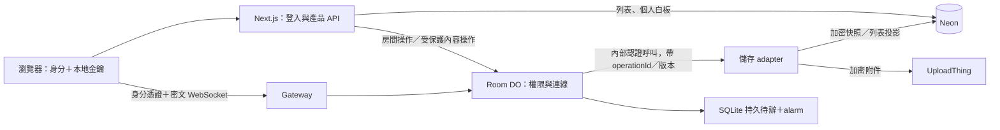

# 18B — 共編授權權威重置

- 狀態：規劃中，尚未實作。2026-09-23 由原 18B（房間保留期）、18C（DO 授權權威）、
  18D §4（帳號／白板退休）、19 §3–§4（獨立房間資料模型）與 20（帳號允許清單）**合併**為單一計畫。
- 前置：**無**。與 [18A](18a-collaboration-storage-ux.md) 沒有硬性前後相依，可並行；保存確認的產品契約沿用 18A。
- 後續：[18C](18c-collaboration-surface.md)（房間列表、金鑰體驗、獨立建房 UX、全產品加密告知）。
- 本文件描述目標，不代表現況。

## 0. 前提：這份計畫與舊版的每一處差異都來自這裡

1. **目前只有擁有者一人使用共編，且僅為測試。** 沒有其他使用者、沒有需要保住的房間內容。
2. **共編資料可以整批刪除重建。** 包含 `collaboration_room`／`_member`／`_snapshot`／`_asset`、
   `collaboration_control_outbox`、Room DO 的 SQLite 狀態，以及 UploadThing 上的共編密文物件。
3. **必須保留：** 登入帳號（`user`）、個人雲端場景（`scene`、`shared_scene`、published 內容）
   及其附件。刪共編資料不得波及它們。
4. **不採用中繼解法。** 不做向後相容、不做雙寫、不做逐房間切換、不做「先在 Neon 做一次再搬到 DO」。
   一次部署等於一次破壞性重置。
5. **Neon free tier 的額度本月已用盡，下月 1 日恢復**（2026-09-23）。在那之前開發是
   「改程式碼 ＋ 本機可跑的驗證」，需要打到 Neon 的重置與驗收在**額度恢復後依清單執行**
   （§8 P3）。這不改變目標設計，只改變驗證順序與可宣稱的完成度（§0.4）。

   **明確否決的中途措施：**把 `* * * * *` 的 cron 調慢或關掉可以止住閒置喚醒，但本月額度已經耗盡，
   省不到任何東西；而 §8 P3 本來就會整段刪掉那個 cron。依前提 4，不做這個調整。

因此本計畫**沒有**：漸進式 schema 約束流程、backfill、audit、逐房間凍結與匯入、authorityEpoch 的過渡
期、混合版本相容部署、舊 control outbox 的逐筆對帳。**允許停機**，但重置前須停止測試流量與舊背景寫入；
切換與回滾都依 §8 P3 的簡短清單執行，不因零使用者就假設沒有 cron、alarm 或在途 callback。

原本 18B／18C／18D／19／20 之間的分割線，幾乎全部是**漸進遷移的階段界線**。沒有遷移之後，它們是同一次
schema 與授權權威改動的不同面向；分開做等於自己製造一連串中繼狀態，違反前提 4。

### 0.1 為什麼是現在做，而不是等有使用者再做

零使用者是做破壞性架構變更唯一便宜的時機。原 18C 的 P3（逐房間遷移）與回滾協定是整個計畫最貴、最危險
的一段；它的成本完全來自「有不能丟的資料」。一旦有真實使用者，這段就會回來，而且會更貴。

**如果這個架構遲早要做，現在做的成本是以後的一小部分。** 反過來說，如果評估後認為不該做，也要在這裡
明確結案，而不是無限期擱置一份會持續腐化的計畫。

### 0.2 成本不是本計畫的理由

原 18C §0 的結論維持有效並在此定案：

- **現況不是輪詢撤權。** `apps/web/src/server/collab/control-outbox.ts` 是 transactional outbox：授權
  變更與強制執行意圖同交易 commit，commit 後同步 best-effort dispatch，UI 立刻得到回應。
  `* * * * *` 的 Cloudflare cron（`apps/collaboration-do/src/outbox-drain.ts`）只是同步派送失敗時的修復
  路徑。
- **唯一真正的持續成本是 Neon 永遠無法 autosuspend**：每分鐘一次 drain 查詢，即使 outbox 為空。
- 這個成本有一個約一天工的便宜解法（Cloudflare 端 pending 旗標 ＋ 每小時保底 sweep），
  **實作曾經存在於工作區，2026-09-23 依前提 4 刪除**：本計畫完成後 control outbox 整個消失，那份實作
  100% 是拋棄式的。

**所以：本計畫買的是授權正確性與獨立房間能力，不是成本。** 它還**新增**一段 Cloudflare → Vercel → Neon
的跨雲呼叫成本（§8 P0 定義方法，P3 量測）。任何以「省錢」為名重啟這個工程的說法都已被否決。

### 0.3 本計畫真正買到的東西

- 撤權從「DB 交易 → outbox → 跨服務派送」變成 DO 本地交易，消除 DB 到即時連線撤權的派送競態；
  內容儲存屏障仍可能 `pending`，不能宣稱所有入口都只靠本地交易完成。
- 房間存在與授權不再依賴 scene ownership，這是獨立房間（未儲存畫布直接共編）的前提。
- 房間不再有到期時間，改由允許清單控制「誰進得來」。
- 代價是每次持久內容寫入多一段跨雲呼叫，以及 §4.4 的儲存屏障——這是本計畫最大的複雜度來源。

### 0.4 驗證策略：Neon 不可用期間怎麼開發

前提 5 聽起來像是「什麼都不能驗證」，實際上不是。**這個 repo 的測試本來就不打 Neon。**
`apps/web/tests/support/pglite-db.ts` 用 PGlite（WASM 版的真實 PostgreSQL）在記憶體裡跑，
並用 `drizzle-kit/api` 的 `pushSchema` 推真正的 schema，所以 `pnpm test` 全程與 Neon 無關。

驗證分層如下；真實 SQL 併發驗證不必等待 Neon 額度恢復：

| 層                        | 工具                                      | 現在可否做          | 涵蓋什麼                                                                                        |
| ------------------------- | ----------------------------------------- | ------------------- | ----------------------------------------------------------------------------------------------- |
| L1 程式碼                 | `pnpm check`                              | 可以                | 型別、lint、knip、既有單元與整合測試                                                            |
| L2 SQL 語意               | PGlite（`openTestDatabase`）              | 可以                | 最終 schema、FK、約束、條件式寫入與去重                                                         |
| L2′ Worker runtime        | repo 已安裝的 `@cloudflare/vitest-plugin` | 可以                | DO SQLite、alarm、WebSocket、重啟與撤權                                                         |
| L2″ 真實多連線 PostgreSQL | 本機 Postgres（可用 Docker）              | 可以，且為必要 gate | `FOR UPDATE` 阻塞、保存／取消／撤權競態、退休凍結與登記、投影併發                               |
| L3 部署環境               | Neon、Vercel、Cloudflare、UploadThing     | 等服務可用          | Neon driver／pool 行為、部署 schema diff、完整 payload、跨雲延遲、autosuspend、production smoke |

PGlite 是單連線嵌入式 PostgreSQL，不能代替多個 session 互相阻塞的競態測試。
**本機 Postgres 是 P0 屏障原型與 P2 整合驗證的必要工具**；不得把核心正確性留到重置當天才驗證。

PGlite 在空白 DB 推 schema 只證明最終形狀合法。P2 另用本機 Postgres 的舊 schema 與非敏感 fixture
演練重置、升版及回滾，驗證個人場景與附件引用保留。P3 套用前仍須檢視 Neon 實際 schema diff，
確認不碰 `user`、`scene`、`shared_scene`、published 內容及個人附件。

驗收分成三道 gate，避免「必須部署後才能驗證，卻要求驗證完才准部署」：

1. **實作前 P0：** 私有附件可行性、最大 payload 設計、真實多連線儲存屏障原型通過，才進 P1／P2。
2. **部署前 P2：** L1／L2／L2′／L2″、故障恢復、重置與回滾演練通過；L3 測量方法與門檻已寫定。
3. **部署後 P3：** 先做受控重置部署，再做 L3 驗收。通過 smoke 才恢復入口；全部 L3 完成才可宣稱計畫完成。

額度恢復日是可開始 P3 的時間，不是必須當天通過的期限；未通過就保持停用或依清單回滾。

## 1. 範圍

本次納入：

- 房間建立、加入、角色、踢人、關閉的權威遷移至 Room DO。
- **房間保留期移除**：房間永不自動到期（原 18B）。
- **帳號允許清單**：owner 以帳號信箱指定誰可以首次加入（原 20）。
- **獨立房間資料模型**：房間不需要來源 scene（原 19 §4），第一次 schema 就做對。
- 快照與附件的內容操作改走 DO 授權與儲存屏障。
- Room DO 小型持久待辦、alarm 與可靠交付；完整快照不持久暫存於 DO。
- 房間初始化狀態機、owner 初始化 API、可靠列表投影及分頁查詢契約。
- **帳號／白板退休協定**（原 18D §4），以按主體分割的 **Lifecycle DO** 執行（§7.1 已定案）。
- 一次破壞性重置的執行程序與驗收。

本次不做：

- 「我的房間」列表 UI、本機金鑰體驗、獨立建房的瀏覽器流程、全產品加密告知
  → [18C](18c-collaboration-surface.md)。
- 共編儲存 UX 與本機快取邊界 → [18A](18a-collaboration-storage-ux.md)。
- 將個人雲端場景改為 E2EE；組織／團隊繼承式權限。
- 更換 Neon、搬畫布到 R2、改用 tldraw sync 或更換 Excalidraw。
- 自動輪替房間秘密金鑰、伺服器持有解密金鑰、跨裝置自動金鑰恢復。
- 群組／網域層級允許規則（例如「@example.com 全部可加入」）。
- 寄送任何郵件。信箱只是帳號查詢鍵（§5.2）。
- 宣稱故障時按下按鈕即全球失效，或事先承諾固定月費與 compute 節省比例。

## 2. 最終責任分工

| 元件                       | 最終責任與權威                                                                                                 |
| -------------------------- | -------------------------------------------------------------------------------------------------------------- |
| 瀏覽器                     | 明文畫布、房間秘密、加解密、Excalidraw 合併                                                                    |
| Next.js／登入服務          | 驗證有效帳號及 session、列表 UI、服務端資料 API                                                                |
| Gateway Worker             | 驗證可信身分憑證、路由 roomId、限制流量                                                                        |
| 每房間一個 Room DO＋SQLite | 房間存在與狀態、owner、成員角色、**允許清單**、撤權、連結加入規則、授權 revision、已處理 operationId、本地待辦 |
| Neon                       | 帳號、個人白板、共編快照、房間列表投影、生命週期登記                                                           |
| UploadThing                | 圖片／附件 bytes                                                                                               |

Neon 的房間列保留作為快照 FK、可選 scene 關聯與列表資料。**它仍存在，不代表它仍是授權權威。**
從舊角色副本簽發房間權限的路徑一律刪除，不保留。

圖中的 adapter 初期沿用 Next.js 的 server-only DB／檔案程式，新增內部端點；不要求 DO 直連 PostgreSQL。
多一段 Cloudflare → Vercel 呼叫的延遲與維運成本須納入量測（§8 P0）。

## 3. Schema：一次做對，不預留遷移

沒有資料要保住，所以不存在「先 nullable、再 backfill、再上約束」的漸進流程。**目標 schema 直接是最終
形狀**，`db:push` 一次到位。

| 改動                                     | 內容                                                                                                                              | 取代了哪個舊計畫的遷移段                      |
| ---------------------------------------- | --------------------------------------------------------------------------------------------------------------------------------- | --------------------------------------------- |
| `collaborationRoom.expiresAt`            | **刪除欄位**，連同 `collaboration_room_status_expires_at_idx` 一併重新設計                                                        | 原 18B §4 步驟 3 的四階段約束流程             |
| `collaborationRoom.sceneId`              | **改為 nullable**，移除 `onDelete: "cascade"` 的必要性假設；scene 關聯降為可選的產品關係                                          | 原 19 §4 的「落地 18C 的 scene 綁定遷移清單」 |
| `collaboration_room_active_scene_unique` | 重新評估：partial unique index 對 NULL 不生效，但它仍是一處 scene 綁定。決定保留（限制「同一 scene 最多一個 active room」）或移除 | 原 18C §2 的「預留契約」                      |
| `getActiveForScene`                      | 保留為產品查詢，但不得是房間存在或授權的必要入口                                                                                  | 同上                                          |
| 允許清單                                 | 以 roomId 為 parent 的清單；**權威在 Room DO 的 SQLite**，Neon 只在需要顯示時保留投影                                             | 原 20 §6 的「18C P3 匯入清單要加上這張表」    |
| `collaboration_control_outbox`           | 本計畫完成後**整表刪除**（Room DO 本地 outbox 取代）                                                                              | 原 18C P4 的「確認全部房間已接管才停舊 cron」 |
| join token 的 `rexp` claim               | **移除**，`COLLABORATION_PROTOCOL_VERSION` 由 4 升為 5                                                                            | 原 18B §3                                     |

### 3.1 `rexp` 與 `retireScene` 的順序問題已經消失

原 18B §2.2 指出一個真實缺陷：`retireScene`（`apps/web/src/server/admin/retirement.ts`）只做
「收集儲存 key → enqueue 清理 → `tx.delete(scene)`」，**從不呼叫 `endRoom`、不 enqueue 任何 control
event**。房間列靠 FK cascade 消失，Room DO 完全不知情，已連線的 socket 不會被關閉。今天這個窗口的上界
是 `rexp`（DO 每個 frame 都檢查 `attachment.roomExpiresAt`）；移除到期後就沒有上界。

原計畫因此要求「先補 `retireScene` 的 `end-room`，再移除 `rexp`」。**在本計畫中這個排序限制消失**：
`rexp` 的移除與 §7 的完整退休協定在同一次部署交付，中間不存在「已移除 `rexp` 但退休還沒接管」的狀態。

協定升版的代價很低：部署落差路徑已經實作——專屬的 `unsupportedProtocolVersion` 關閉碼、關閉原因同時
寫出兩邊版本、client 有 `DEFAULT_PROTOCOL_SKEW_WINDOW_MS`（5 分鐘）的獨立退避視窗且不吃一般重試預算。
在只有擁有者一人的前提下，最壞情況是自己的分頁被關掉後重新整理。

### 3.2 房間保留期：永不自動到期

- 房間沒有到期時間。終止只由 owner／管理員明確關閉、刪除，或帳號／白板退休流程觸發。
- **join 憑證有效期（`exp`）與房間保存期限是兩件事**，短效 join token 仍然短效，不受影響。
- `ttlMinutes` 這個 `create` 輸入**沒有任何呼叫端**（UI 沒有對應控制項），一併移除。
  一個從未被使用的參數不是彈性，是待清理的死設定。
- 日後若需要有時限的分享，應設計為**每個分享連結各自的有效期**，而不是復活房間層級的到期欄位。

**接受的後果：**沒有到期時間的 active 房間永遠不會進入清理工作的回收條件，只要 owner 不明確結束，
房間的加密快照與附件就一直佔用儲存。以目前規模可接受，但必須是明示的接受（§8 驗收）。
`server/maintenance/jobs.ts` 的 `collab-room-retention` 目前以 `status='active' AND expiresAt < cutoff`
為唯一回收條件，必須改為只依賴明確關閉與退休流程。

外洩連結的對策是**撤銷與允許清單**，不是等待到期：到期只是讓所有人在同一時刻一起被擋住，允許清單則是
從一開始就只讓該進來的人進來（§5）。

## 4. 授權權威

### 4.1 DO 定址：確定採用 roomId

現況 DO 實例由 `roomChannelKey(roomId, authGeneration)` 定址：gateway 以
`env.COLLABORATION_ROOM.getByName(identity.channelKey)` 取得 stub，Object 再從 `ctx.id.name` 重新推導
並比對（`apps/collaboration-do/src/gateway.ts`、`src/room.ts`）。

**這與「DO 是授權權威」直接衝突。** 一旦成員名單、允許清單與撤權 tombstone 存在 DO 的 SQLite 裡，
`rotateGeneration` 就會把流量路由到一個**全新的空 DO**：成員、角色、允許清單與撤權紀錄全部歸零，被踢掉
的人在新世代裡沒有任何撤權紀錄。而 generation rotation 是 owner 現在就能按下的產品操作。

**決定：DO 改以 `roomId` 定址，authGeneration 降為 DO 內部狀態。** 原計畫列出的兩個選項中，選項 B
（維持定址、每次輪替做跨實例狀態交接）的成本是把一個常態產品操作變成分散式交接問題；選項 A 唯一的代價
是「需要一次受控的實例交接」，而**在本計畫的前提下沒有狀態要交接**——舊 DO 連同舊房間一起丟棄。

要改的地方：gateway 的 channelKey 契約、Object 的自我比對、既有 relay URL 路徑
（`/v1/rooms/:roomId/generations/:authGeneration/socket`）。加密仍以 authGeneration 作為 HKDF salt 的
一部分，**授權定址與加密 derivation 是兩件事，本次明確分開**。

### 4.2 建立房間

1. 入口驗證帳號；scene ownership 檢查只在「從既有 scene 開房」這條路徑保留，**不是房間存在的必要條件**。
   分配穩定 roomId、operationId，先持久登記 owner（及可選 scene）與房間的建立意圖，避免退休流程漏掉
   正在建立的房間。
2. Room DO 以冪等操作保存初始 owner、狀態、允許清單模式與協定版本；房間在初始化完成前不能接受一般 join。
3. 由本地持久待辦建立 Neon 房間列與 owner 列表投影。metadata 建好只代表可開始上傳，
   **初始快照與所需附件確認持久化後才可 ready／分享**；列表投影落後不阻擋 ready。
   中途失敗回傳處理中，同一建立 operationId 可重試，不建立第二個房間。
4. 建立意圖尚未送達 DO 時由客戶端重試／後續同一建立請求恢復；未初始化的意圖不得被當成已成功房間。

固定 roomId 對應同一個 DO。遇到不存在的 ID 必須拒絕，不能把 DO 平台的「首次呼叫會建立 instance」誤當
產品授權建立房間。

#### 4.2.1 初始化與投影是本計畫的後端交付

- 持久狀態至少區分 `initializing`、`ready`、`ended`；保存建立 operationId、owner、key-check、
  初始化內容版本與進度。狀態可查詢，DO 重啟不能回到未初始化或自行產生新金鑰。
- `initializing` 不接受一般 join／寫入；經目前 owner 身分與生命週期凍結檢查的初始化 API，
  可上傳／finalize 附件、讀寫初始快照與完成初始化。不能要求先一般 join 才能初始化。
- 完成初始化需核對 key-check、指定 revision／checksum 的初始快照及附件清單均已持久可用，
  並與關房／退休排序。瀏覽器負責從明文提取完整引用清單並解密驗證；伺服器只驗證所宣告的
  附件 ID／版本與儲存結果，不能假裝能讀懂密文。空白畫布也要明確保存合法的空快照。
- 建立 operationId 與各次內容保存 operationId 分開；同一保存操作不可在重試時換 payload。
  內容變更後須在舊操作結果確定後，以新 operationId／expectedRevision 保存。
- 初始化逾時或使用者放棄時，先使初始化終止、拒絕晚到 finalize，再由持久待辦清理孤立密文。
  P0 固定逾時政策；不能依賴瀏覽器保持在線，也不能把缺 payload 的保存待辦永久留在 pending。
- Room DO 與 Neon 的初始化 schema、查詢／重試／取消／完成 API、附件清理均在 P1／P2 完成；
  18C 只接上瀏覽器加密、畫布凍結、進度與缺鑰 UI。
- 列表投影後端同樣在 P1／P2 完成：房間建立、成員加入、改角色、撤權、關閉在本地交易產生事件；
  Neon 以 roomId／subject／單調版本條件式 upsert 或 tombstone，晚到事件不得復活已刪列。
  schema、索引與穩定 cursor 分頁查詢均不依賴 scene inner join，角色投影不授權；房間標籤是
  明示的可見 metadata，預設不取自畫布內容。不逐筆同步畫筆，也不新增排序 heartbeat。

### 4.3 加入、重進、踢人與改角色

- 所有加入均要求有效身分，入口不再簽發可覆蓋 DO 最新角色的授權。DO 依本地規則決定角色。
- **授權解析順序：** `owner → 有效成員列 → 允許清單（§5） → linkRole → 拒絕`。
- 首次持連結加入依解析順序建立成員；被撤權成員保留撤權紀錄，不得因持有舊連結被自動重新授權。
  只有合法管理操作可以重新授權。
- 重進使用同一 roomId 與房間秘密，取得加密快照並在瀏覽器解密。
- DO 可休眠，但重要狀態須在 SQLite。快照在 Neon、附件在既有儲存；休眠不刪除任一資料。
- 踢人／改角色：DO 在本地交易驗證操作者、修改成員、增加 authRevision、保存 operationId 結果與待辦，
  持久化後更新連線判斷並關閉目標使用者的所有 socket。每次訊息接收與轉送選取接收者都遵守最新狀態；
  不能只靠 close handshake 或前端跳轉。
- DO 重啟後先恢復權限再處理訊息，核對既有 WebSocket attachments；舊角色 attachment 不得覆蓋 SQLite。
  單執行緒不代表跨 await 自動原子，權限操作的排序需明確實作。

以下為授權管理操作的結果，不是快照保存成功回應（保存見 §4.4.1）：

- `accepted/pending`：已保存操作，但仍有必要的儲存拒絕／在途操作屏障未確認。
- `enforced`：該房間後續新加入、既有收發與內容操作均已受新權限限制；不是只有 socket close 呼叫成功。
- `projectionPending`：真正撤權已生效，但「我的房間」顯示副本仍待同步。這不阻擋 `enforced`。

請求沒到 DO，或回覆遺失時，不能顯示成功；用 operationId 查詢結果。已送出的訊息、已下載的內容不能收回。
一般踢人不更換 root key、authGeneration 或房間通道；授權 revision 與加密 derivation 識別分開。

**撤權不等於密碼學撤銷。** 收回讀取能力需要一把新的房間金鑰只交給留下的成員；只推進 generation 而沿用
同一把 root key 不構成密碼學撤銷（見 [E2EE 與金鑰生命週期](../docs/system-design/e2ee-key-lifecycle.md)）。
本計畫不改變這個分界。

### 4.4 儲存屏障：本計畫最大的複雜度

保留 `collaboration_snapshot` 的密文、checksum、cryptoVersion 與 expectedRevision 條件式寫入，也保留
owned-scene 儲存的獨立生命週期。不得把共編快照自動蓋回 `scene.scene_data`，或擅自擴大對個人白板的存取權。

內容操作流程為「可信身分 → Room DO 驗證／排序 → 內部儲存 adapter → Neon」。舊的客戶端直達快照 API
必須改為經過此路徑；adapter 不可讓客戶端拿自填 role 繞過 DO。

**不能只先問 DO 一次 yes，再任由 Next.js 日後寫 DB。** 否則授權後、寫入前踢人，仍有競態。契約：

- 每個儲存操作綁 roomId、操作類型、actor、operationId、authorityEpoch 與版本；內部服務認證、冪等結果
  均需驗證。
- DO 保存尚未確定完成的操作 metadata 與順序，不保存完整密文 payload；adapter 以 DB 交易執行 epoch fence、條件式寫入與去重，逾時後能查詢
  結果，重送不得覆寫較新的快照。
- 撤權先阻擋該成員新操作與即時訊息，再完成／隔離撤權前已接受的寫入。adapter 確認屏障前不宣稱全入口
  `enforced`。可允許撤權前接受的寫入在屏障前完成，但不得讓其在撤權完成後才改變最新資料。
- 在途讀取回到 DO 時重新核對權限，再回傳密文。已交付到網路的 bytes 不可回收。
- adapter／DB 故障時內容操作拒絕或保持未完成，不能退回相信舊的 DB 角色。即時訊息可能繼續，但 UI 必須
  顯示尚未成功持久儲存。

**這一項與資料量、使用者數完全無關，前提 1–4 一點也簡化不了它。** 實作第一階段須用故障原型驗證此屏障，
而非只完成 RPC 接線（§8 P0）。

#### 4.4.1 首版保存：Neon 確認後才算成功

**DO 不持久暫存完整畫布，也不承諾只收到操作意圖就會在瀏覽器離開後補完保存。**
這是適合本產品保存承諾的取捨，不是 outbox 模式的通用要求。

- 瀏覽器捕捉一致快照並加密；DO 驗證／排序後，經 adapter 將完整密文寫入 Neon。
  圖片 bytes 仍獨立放 UploadThing。DO 僅持久保存 operationId、actor、版本、checksum、期限與結果。
- adapter 在同一 DB 交易提交快照與操作成功結果；只有此結果確認後才回覆 `written`。
  `pending`／收到請求／WebSocket 已送出都不能顯示已保存。跨成員確認沿用 18A §3.1。
- 同一 operationId 綁定不可變的 room、actor、generation、epoch、expectedRevision 與密文 checksum；
  重送不同內容拒絕。瀏覽器在未完成期間保留同一份密文於記憶體，不能每次重新加密後沿用操作編號。
- 操作狀態至少區分 `pending`、`written`、`cancelled`／明確拒絕；逾時本身不是取消，
  查不到結果也不代表沒有在途 DB 交易。

| 故障                              | 必須如何收尾                                                                                                                                          |
| --------------------------------- | ----------------------------------------------------------------------------------------------------------------------------------------------------- |
| Neon 已 commit，回應遺失／DO 重啟 | 持久查詢成功結果，回傳原 revision；不重寫、不誤判取消                                                                                                 |
| 尚未 commit，瀏覽器仍在           | 查詢狀態後，以相同 operationId 與密文重送；條件式寫入／去重避免覆蓋新版                                                                               |
| 瀏覽器消失，payload 不再可得      | DO 的持久期限與 alarm 啟動 adapter 取消；取消與寫入取同一鎖／fence 排序。若已 commit 則回報成功，否則持久記錄取消並拒絕晚到寫入，確認後才結束 pending |
| adapter／DB 不可用                | 保持未確認並有界退避；不能只刪 DO 紀錄當作已取消，也不能宣稱撤權已全入口 enforced                                                                     |

取消結果的保留與 epoch fence 必須足以拒絕延遲請求，即使一般 operationId 結果已過保留期；
P0 固定期限、重放拒絕與清理規則。瀏覽器離開不會永久阻擋退休，但 provider 持續故障仍可 pending。
未確認變更可能在瀏覽器退出時遺失；已確認快照必須可恢復。首版不新增遠端 payload staging 或離線快取。

#### 4.4.2 大小與效能邊界

- 保留目前 4 MiB 快照明文上限，另計密文封裝與 HTTP metadata；超限明確拒絕，不能靜默截斷。
- 大快照讀寫改用 binary body 的受保護端點，涵蓋瀏覽器到入口、DO 到 adapter、讀取回程；
  不把最大快照包進 Base64 JSON（4 MiB 會膨脹至約 5.33 MiB）。小型控制 metadata 仍可使用 JSON。
  所有跳點均驗證實際 bytes 與上限，不能只信 Content-Length；P0 驗證最大合法 payload 與超限拒絕。
- DO 不落地完整 payload，也不代表 bytes 不經 DO。採有界轉送／緩衝與每房間併發上限，
  避免大 JSON、多份無界複製或整個房間鎖等待外部 I/O。即時訊息不逐筆查 Neon，
  儲存／附件慢請求不得阻塞房間全部訊息與本地撤權判斷。
- 外部 I/O 不放入 `blockConcurrencyWhile()`；以短本地交易、持久操作狀態與 adapter fence 排序。
  大快照與慢附件傳輸期間仍須測即時 fanout 與撤權延遲。

平台限制依 2026-09-23 查核：[DO SQLite 單列／BLOB 為 2 MB](https://developers.cloudflare.com/durable-objects/platform/limits/)，
[Vercel Function request／response payload 為 4.5 MB](https://vercel.com/docs/functions/limitations#request-body-size)。
實作時核對部署 runtime 與封裝後實際大小；不得以本機成功代替部署環境最大 payload 驗收。

### 4.5 附件存取

保留 UploadThing，但檔案索引／上傳確認／下載入口都經相同房間授權。上傳允許檔案先存在隔離區；只有通過
最新授權、版本與去重的 finalize 才能成為房間附件，失敗檔案加入清理待辦。

受保護附件不得繼續暴露永久可直接下載的 URL。首選私有物件＋經授權的代理讀取；**必須先驗證 UploadThing
現有方案與 API 是否支援**。若只能使用預簽 URL，必須明確記錄有效期內不可收回的窗口，不能宣稱附件與 DO
撤權同時失效。若既有 provider 無法滿足選定契約，這是上線阻擋項，另立最小附件存取方案，不默默搬到 R2。

**這一項同樣不受前提影響，而且可能直接否決整個方案，所以在 P0 最先做（§8 P0）。**

## 5. 帳號允許清單

### 5.1 目標契約

今天的加入條件是「有完整連結 ＋ 有登入」——登入成哪個帳號不重要。`linkRole` 預設是 `none`
（invite-only），但**沒有任何方式在對方加入之前把他加為成員**，所以 `none` 等於沒人進得來，owner 只能把
`linkRole` 打開成 `viewer`／`editor`，被迫退回「有連結就能進」。缺的不是一套系統，是解析順序裡的一層。

- owner 可以維護一份**帳號信箱允許清單**。清單非空且房間為限定模式時，只有清單上的帳號能首次加入。
- 首次加入成功即建立一般成員列，之後沿用既有的角色、撤權與 tombstone 語意。允許清單只決定
  **能不能首次進來**，不取代成員列。
- owner 永遠被允許，不需要出現在清單上，也不能把自己從房間中移除。
- 從清單移除某人時，必須同時撤銷他既有的成員資格並關閉現存 socket，否則清單只是裝飾。
  重用 §4.3 的撤權路徑。
- **解密金鑰仍然只在連結的 fragment 裡。** 這是在連結之外加一道門，不是取代連結。兩者疊加——攻擊者需要
  同時取得連結**且**能以清單上的帳號登入。

### 5.2 三個設計決定

**比對規則：不分大小寫的精確比對，不做 dot／plus 正規化。** `user.email` 存的是 Google 回傳的帳號信箱
（Google OAuth 是唯一登入方式，`lib/auth/index.ts`；`user.email` 是 `notNull().unique()`）。Gmail 把
`a.b@gmail.com` 與 `ab@gmail.com` 視為同一信箱，但 Google Workspace 自訂網域**不會**。一條「聰明」的
正規化規則會在自訂網域上把兩個不同的人視為同一人——這是授權判斷，寧可讓使用者多打對一次。
UI 必須說明「請填對方登入用的 Google 帳號信箱」。

**不驗證帳號是否存在——清單是「信箱」不是「使用者」。** 加入清單時不查 `user` 表、不回報該信箱是否有
帳號。這一個決定同時解掉三件事：

- **不產生帳號存在性 oracle。** 否則任何人都能開一個房間來探測某個信箱有沒有註冊。本 repo 既有慣例
  明確避免洩漏存在性（`scene.ts` 的 `deleteScene`：缺場景與非擁有者同樣回 FORBIDDEN）。
- **不需要「待處理邀請」機制。** 對方還沒註冊也沒關係，他哪天用該信箱登入 Google 並打開連結時自然通過。
- **不需要寄信。** 通知對方本來就是 owner 用自己習慣的管道做的事（他本來就得把連結給對方）。
  **本計畫不引入郵件寄送、郵件模板、寄件網域或任何 email provider。**

代價是**打錯字會靜默失敗**。緩解方式是 UI 而非後端：清單顯示每一筆的狀態（「尚未加入」／「已加入」
＋最後加入時間）。不要用「此信箱沒有帳號」來解決，那會把 oracle 加回來。

**模式是一個選擇，不是兩個可互相矛盾的開關。** 允許清單只在 `linkRole` 為 `none` 時有意義。UI 必須呈現
為單一的「誰可以加入」選擇：

| 選項                     | 實際狀態                                        |
| ------------------------ | ----------------------------------------------- |
| 只有我指定的人           | `linkRole = none` ＋ 允許清單生效               |
| 有連結的任何人（需登入） | `linkRole = viewer` 或 `editor`，清單不參與判斷 |

切換到限定模式時，**既有成員列不受影響**：他們是已經明確授權過的人，owner 可以逐一移除。

### 5.3 資料

- 清單以 roomId 為 parent，**權威在 Room DO 的 SQLite**：roomId、正規化後用於比對的信箱鍵、原始輸入
  （供顯示）、預設角色、建立者、建立時間。roomId 與信箱鍵為唯一鍵。
- 每房間的清單長度設上限，沿用既有「限制是保護不是容量」的作法，超限明確拒絕。
- 信箱是可見 metadata：**伺服器會在對方加入之前就知道 owner 想分享給誰。** 這要明確寫進威脅模型，
  不能宣稱房間 metadata 只包含已加入的人。不做雜湊儲存——owner 必須能看見與管理自己的清單。
- 清單內容不進日誌、分析或錯誤回報。

## 6. 可靠交付：Room DO 本地 outbox

Outbox 是自己實作、存在 DO SQLite 的持久待辦清單，不是額外的 Cloudflare 服務。
它用於列表投影、儲存結果查詢／取消、撤權屏障與清理等小型工作，由 alarm 驅動；
不承載完整畫布或圖片，不是所有功能共用一個全域 DO。

- 業務狀態、operationId、待辦及可靠 alarm 安排需在本地原子保存；驗證使用的 SQLite／alarm API 交易語意。
- 有 pending 才排程，完成且無 pending 後停止。下一次 alarm 依最早重試時間安排，不用固定分鐘 heartbeat。
- pending 包含 backoff、領取中的工作及待人工處理失敗，不能用 due=0 推論沒有待辦。
- 接收端去重與單調版本；重複交付正常，晚到結果不能倒退狀態。
- 有界批次、退避、重試告警、持久錯誤與人工重送；平台內建 alarm 重試不是永久可靠交付的替代品。
- 不在 Room DO／outbox 持久保存完整快照、其分塊或逐筆筆畫歷史。沒有 payload 的保存依 §4.4.1
  查結果或取消，不把「稍後重送整份畫布」當成伺服器能獨立完成的待辦。
- 為 pending 數量／bytes、重試次數、最老年齡與 operationId 結果保留設界限並監控；達上限時拒絕新增需持久
  交付的一般操作並回報，不丟棄尚未完成的安全工作。
- 撤權／關房／退休與操作取消保留獨立容量及優先權；一般保存／列表投影不得耗盡這份預算。
  P0 固定各類上限與安全工作合併規則，重複撤權不能無界增長。一般 queue 滿載時仍可原子保存
  撤權與待辦、阻擋即時收發，DB 屏障未確認則維持 pending；安全預算耗盡時採明確的拒絕／房間
  停用政策，不能回報成功或默默捨棄安全工作。
- 撤權 tombstone 與允許清單移除紀錄需保留足以拒絕舊連結／proof 的狀態，不能套用一般短 TTL 刪除。

DO alarm 只喚醒 DO，有待同步資料時才碰 Neon。持續失敗重試仍可能讓 Neon 啟用；這應被觀測為未完成工作，
而非假稱永遠能休眠。

## 7. 帳號／白板退休

「所有使用者都登入」只保證有身分，不會自動使既有 socket 或已簽發憑證失效。現有 `retireAccount` 與
`retireScene`（`apps/web/src/server/admin/retirement.ts`）在權威搬到 DO 之後若只 cascade 刪 DB，
就會留下「DB 已刪、DO 仍在授權」——本計畫明確禁止的狀態。

**必要的正確性契約（不可妥協，與規模無關）：**

1. 呼叫尚未送達 DO 前沒有破壞性副作用，使用者可重試。
2. 先凍結帳號／白板、撤銷 session、阻擋新的建立與加入登記，再列出所需房間。
3. 逐房間執行 owner 房間關閉／普通成員撤權；每筆有版本、去重與執行確認。DO 在本地保留終態，
   晚到加入請求不能復活權限。
4. **全部必要房間與儲存屏障確認後，才完成 Neon 資料刪除與附件清理 enqueue。** UI 在完成前顯示處理中。
5. 覆蓋**所有**入口：管理員、本人刪除、scene 刪除、任何直接 cascade 呼叫端。禁止繞過退休協定的產品
   刪除路徑。

**房間清單不能只查最終一致的「我的房間」投影。** 每次房間建立／首次成員啟用前，要在 Neon 的生命週期
登記中可靠註冊 roomId 與 subject；登記與帳號／白板凍結以同一鎖定規則排序。登記未成功就不能啟用成員。
這個登記可以保守多列，但不可漏列。**登記必須以 owner／帳號為主體，scene 只是可選欄位**——獨立房間沒有
scene，帳號退休不能只透過 scene 找房間。

退休時包含已登記但仍在建立／加入中的房間；房間收到對已刪主體的終態後，必須拒絕晚到的初始化或加入
proof。以單調 lifecycle 版本／終態驗證，禁止單靠 token 到期解決競態。

不提供 provider outage 下全站撤權的固定時間上限；未確認房間仍為 pending。

### 7.1 執行機制：按主體分割的 Lifecycle DO（2026-09-23 定案）

**決定：採用 Lifecycle DO，不採用同步退休。**

流程：

1. Next.js 驗證管理員／owner，把 operationId 與目標交給**按主體分割的 Lifecycle DO**；
   先持久保存退休意圖及喚醒，再改 DB。
2. Lifecycle DO 以 alarm 自行推進 §7 的 1–5 步，並在本地 SQLite 保存逐房間進度。
   原 request 消失、function timeout、部署中斷都不影響完成。
3. 每一步的結果可用 operationId 查詢；UI 在完成前顯示處理中，失敗可恢復。

**為什麼不是同步退休。** 曾評估過「在一個 request 內跑完凍結 → 逐房間 DO 關閉確認 → 刪 DB」。
它的中斷狀態是安全的（凍結已生效、已關的房間不會復活），但**不完整且沒有人會發現**：

- 退休要對 N 個房間逐一呼叫 DO 並等待確認。房間數一多，**serverless function timeout 從偶發變成必然**，
  這不是罕見故障而是常態。
- 失敗模式特別糟：使用者按下「刪除帳號」之後，可能認為已經刪除，實際上資料還在，而且沒有任何機制
  會發現有一個退休卡在一半。對刪除請求而言這是資料完整性與隱私問題，不是體驗問題。
- 「需要再按一次」不是可接受的恢復機制——使用者沒有理由知道要按第二次。

**成本比直覺低。** 本計畫 §6 本來就要為 Room DO 建立持久待辦、alarm 排程、operationId 冪等、backoff、
poison 處理與有界批次。Lifecycle DO 是**把同一個 pattern 再用一次**，不是新的子系統；增量是一個 DO
class、一張進度表與一組故障測試。

**誠實的反面：**這是本計畫中「為了尚未到來的規模而做」最明顯的一處。若日後必須砍範圍，它是第一順位
候選——但理由會是「先不做」，不是「同步版才對」。無論如何，§7 的 1–5 正確性契約不可妥協：
**先確認 DO 側關閉與儲存屏障，才刪 Neon 資料。**

## 8. 實作順序

不做漸進遷移；P0 是實作前可行性 gate，P1／P2 完成程式與部署前驗證，P3 受控停機部署後做 L3。
18A 可與 P0 並行；18C 可依已固定 API 開發畫面，production 開放須等待 18A／18B 驗收。

### P0 — 實作前可否決驗證

不需要 Neon，以下通過才開始 P1／P2：

- 驗證 UploadThing 私有物件與授權代理讀取；若選預簽 URL，固定並揭露不可撤回窗口。
  與 §4.5 契約不符時先決定最小替代方案。
- 在 Worker runtime ＋本機多連線 Postgres 做 §4.4 故障原型：保存與撤權並行、commit 後回應遺失、
  相同操作重送、取消與延遲寫入競爭、瀏覽器消失及 DO 重啟。PGlite 不能代替鎖競態。
- 驗證 binary 快照完整往返、最大合法大小與超限拒絕；確認 DO 不落地 payload，
  保存延遲不阻塞即時收發。部署平台實際 body 上限另列 P3 的 L3 驗收。
- 固定操作期限、取消／結果保留、初始化 ready 與逾時清理、queue 各類預算及安全保留容量。
- 新增 ADR，區分授權 revision、authorityEpoch、加密 authGeneration，以及管理操作 pending 與保存成功。
- 列出 join、內容 API、附件 URL／callback、刪除與 token 簽發入口，作為 P2 無旁路檢查表。
- 寫定效能測量場景、樣本數與可接受的 join／保存／撤權 p95、p99 門檻，再做量測；
  即時傳輸沿用現有 SLO。現有 `pnpm cf:loadtest` 只測 WebSocket，必須擴充或新增完整保存／附件／
  撤權 harness，不能用 fanout 數字代替持久保存延遲。涵蓋典型與最大畫布、冷／熱啟動、
  保存與撤權並行、慢附件、DB 故障恢復；L3 記錄跨雲各段與端到端延遲。

不因只有一人就省略合成負載驗證；本次不做免費額度尖峰容量認證，不宣稱已驗證容量上限。

### P1 — 共用契約與資料底座

- `packages/collaboration`：可信身分與內部操作 schema、operationId、版本、錯誤、enforcement 狀態，
  不引入 browser-only code 到 server 協定。移除 `rexp`，協定版本升至 5。
- `apps/collaboration-do`：Room DO 的 SQLite schema（房間狀態、成員、允許清單、撤權 tombstone、
  本地待辦）、本地交易／去重／alarm，以及 §4.1 的 roomId 定址。
- `apps/collaboration-do`：**Lifecycle DO**（按主體分割）的 SQLite schema 與退休進度狀態機；
  重用 Room DO 的 alarm／冪等／backoff pattern，不另建一套。
- `apps/web/src/server/db/schema.ts`：§3 表格的最終形狀一次到位；生命週期登記以帳號為主體、scene 可選。
- §4.2.1 初始化狀態、可靠列表投影與 cursor 查詢 schema；§4.4.1 保存／取消結果與 fence，
  §6 各類待辦預算。DO 不加入完整畫布 payload 欄位。
- **用 PGlite 的 `pushSchema` 驗證最終 schema**（`apps/web/tests/support/pglite-db.ts` 已經這樣做）：
  FK cascade、partial unique index 對 NULL 的行為、check constraint 全部在 L2 可證。
  不需要漸進式約束流程，也不需要 Neon。

### P2 — 串接新權威與所有入口

- 房間 router、Gateway、DO 依新契約運作；角色不再由 DB 副本授予。
- 快照／附件改走 DO 授權與儲存屏障，**既有 API 不能留下旁路**（對照 P0 的入口清單）。
- 允許清單的 CRUD 與解析順序、`linkRole` 的單一模式 UI。
- §7 的退休協定經 Lifecycle DO 接上**所有**刪除入口（管理員、本人刪除、scene 刪除、直接 cascade 呼叫端），並通過故障測試。
- 移除 `ttlMinutes` 輸入、TTL 常數、`resolveRoomAccess` 的 `expired` 分支，調整 admin 顯示與清理工作的
  候選來源。
- 完成 §4.2.1 初始化與列表投影後端；尚未 ready 的 owner 可走專用初始化 API，一般成員不可寫入。
- 接入 18A 保存確認契約；擴充完整內容路徑 harness，跑 L1／L2／L2′／L2″ 與滿載安全工作測試。
- 在本機舊 schema fixture 演練重置、升版及回滾；檢查個人資料內容與附件引用，不只比較列數。
- 舊 outbox／drain route／minute cron／舊權限 writer 的程式碼在此移除，作為同一次部署 artifact；
  production 舊排程在 P3 維護窗口停止，不做長期相容 flag。

### P3 — 允許停機的一次重置與部署 `[L3]`

需要 Neon 可用及 P2 部署前 gate 通過；事先寫成可執行清單。零正式使用者允許停機，
不需零停機遷移或 web／Worker 混合版本相容，但必須確定沒有舊背景工作寫入。

1. 關閉測試分頁，暫停共編入口及會碰共編資料的退休／清理入口；停止舊 cron，
   排空或隔離舊 DO alarm、在途請求與 UploadThing callback。列出具體停止／拒絕方式，
   確認不再有舊 DB writer；`unsupportedProtocolVersion` 只保護相關 WebSocket 路徑。
2. 檢視 Neon 實際 schema diff；確認只改共編相關表與索引，保留帳號、個人場景、分享、發布與附件。
   在刪除 DB 列之前保存可重試的共編物件清理清單與舊 DO 識別，排除所有個人附件。
3. 清除共編資料與其物件；`collaboration_control_outbox` 沒有 room FK，須另外清。
   舊 DO 停止接收／執行工作後清理狀態；若留下不可達儲存，記錄識別與處置，不能稱為已全刪。
4. 套最終 schema，部署已通過 P2 的 web／Worker artifact。**在已隔離流量與背景寫入的窗口內，
   web／Worker 先後不限**；確認舊 drain、minute cron 與權限 writer 均已移除，舊 callback 不會重建資料。
5. 以測試入口建立房間，驗證建房、最大 payload 保存／讀取、撤權、退休與個人資料未受影響。
   Smoke 未通過不恢復入口；通過後恢復入口並完成 §9 其餘 L3，包括延遲、隔日重進與閒置觀測。
   跨日觀測不必硬塞在額度恢復當天；全部通過後才宣稱完成。

**回滾：** 同樣先停止入口、新版 alarm／背景工作與在途寫入，保存新共編物件清理清單，
清除可丟棄的共編資料，再恢復已演練的舊 schema 與配套 web／Worker，smoke 後恢復入口。
不能直接將舊版程式接上新版 schema。此回滾只適用仍無需保留共編內容時；18C 開放真實使用後不得沿用。

## 9. 驗收矩陣

標 `[L3]` 的項目需部署環境，部署後驗收；`[L2″]` 是本機多連線 Postgres 的部署前必要 gate。
其餘使用 PGlite／Worker runtime／client 測試；不得以 mock 或 PGlite 取代真實鎖競態。

| 情境                                        | 必須證明的結果                                                                                              |
| ------------------------------------------- | ----------------------------------------------------------------------------------------------------------- |
| **個人資料未受影響** `[L3]`                 | 重置前後，既有個人場景、附件、分享與發布內容完全可用；`scene` 相關列數不變                                  |
| §4.5 附件私有化 `[L3]`                      | 受保護附件沒有永久可直接下載的 URL；若只能預簽，窗口已明確記錄且不宣稱與撤權同時失效                        |
| §4.4 儲存屏障 `[L2″]`                       | 踢人與 snapshot put 並行時，撤權完成後不出現晚到的未授權寫入；timeout 查詢／重送不覆蓋新版                  |
| 保存回應遺失／瀏覽器消失 `[L2″]`            | commit 可查；取消與寫入排序，晚到寫入拒絕；DO 重啟不遺失操作，無 payload 不永久卡住退休                     |
| 最大快照與超限 `[L3]`                       | binary 完整往返與解密成功，無 Base64 放大／DO payload 落地；超限明確拒絕，保存期間即時流量不被外部 I/O 鎖住 |
| 一般 queue 滿載                             | 撤權／關房／取消仍可持久接手並先阻擋收發；安全預算耗盡有明確政策，不誤報 enforced                           |
| 初始化與 ready `[L2″]`                      | owner 專用入口可用、一般 join 被擋；快照與宣告附件確認後才 ready；取消／退休後晚到 finalize 不復活          |
| 列表投影 `[L2″]`                            | 亂序／重送／刪除後晚到不倒退或復活；分頁包含無 scene 房間，投影落後不授權                                   |
| §4.1 定址                                   | generation rotation 後成員、允許清單與撤權 tombstone 不歸零                                                 |
| 建房中途 DB／DO crash、重送                 | 不產生重複可用房間；未初始化房間拒絕加入；可用同 operationId 恢復                                           |
| 三人共編踢掉 C                              | A/B 保持原金鑰；C 舊 socket 收發、舊 join proof 與新內容操作被拒絕                                          |
| DO 休眠／重啟                               | 從 SQLite 恢復權限，既有 socket 不沿用過期角色                                                              |
| Neon 故障 `[L3]`                            | 保存明確失敗或未完成，不以空畫布覆寫；房間本地撤權仍阻擋訊息                                                |
| 完整連結重進、隔日重進 `[L3]`               | 房間不因任何 TTL 關閉；同一連結與金鑰恢復既有內容                                                           |
| 清理工作                                    | 沒有到期時間的 active 房間不會被誤回收；ended 房間仍在寬限期後回收                                          |
| join token                                  | 房間保存期限改變不縮短或延長 join 憑證有效期（那是 `exp`，與已移除的 `rexp` 無關）                          |
| **儲存成長的明示接受**                      | 文件記錄「active 房間不再自動回收」，並確認 owner 有可發現的結束入口                                        |
| 限定模式 + 有連結但不在清單                 | 拒絕加入；錯誤訊息不透露清單內容，也不透露該信箱是否有帳號                                                  |
| 限定模式 + 在清單                           | 依清單的預設角色建立成員列，之後沿用既有角色與撤權語意                                                      |
| 清單中的信箱尚未註冊                        | 不報錯、不需額外操作；該人日後以該信箱登入並開啟連結即可加入                                                |
| 從清單移除已加入者                          | 成員列被撤銷、現存 socket 被關閉，沿用 `enforced`／`pending` 語意                                           |
| 大小寫與空白                                | 不分大小寫比對成功、前後空白去除；**不**對 dot／plus 正規化                                                 |
| 模式切換                                    | UI 是單一選擇，不可能同時「設了清單」又「連結公開」；切到限定模式後既有成員仍在且可逐一移除                 |
| 帳號存在性                                  | 新增清單項目的回應，對已註冊與未註冊信箱完全相同                                                            |
| **刪除來源場景與現存連線** `[L3]`           | 刪 scene 時現存 socket 被明確關閉；移除 `rexp` 後不存在沒有上界的未通知窗口                                 |
| 帳號／scene 退休與建房／加入並行 `[L2″]`    | 登記完整（含無 scene 房間與建立中房間）、凍結後不能啟用新成員、延遲 proof 無法復活已刪主體                  |
| 退休入口盤點                                | 管理員、本人刪除、scene 刪除與任何直接 cascade 呼叫都走同一協定，無旁路                                     |
| 退休中斷（Lifecycle 開始後原 request 消失） | 持久 alarm 繼續凍結、撤權與清理直到完成，結果可用 operationId 查詢；不需要使用者再次操作                    |
| 獨立房間契約                                | DO 授權不以 scene 為必要輸入；`sceneId` 為 NULL 的房間可建立、加入、儲存與退休                              |
| 舊路徑已刪除                                | `collaboration_control_outbox`、drain route、minute cron 與舊權限 writer 在 repo 中不存在                   |
| 無使用者、無待辦的受控閒置觀測 `[L3]`       | 房間授權造成的週期 Neon 查詢為零，並記錄實際 autosuspend                                                    |
| 延遲 `[L3]`                                 | 對照 P0 事先寫下的上限，量測 join／保存／撤權 p95、p99 與樣本數                                             |
| 成本 `[L3]`                                 | 記錄新增的跨雲呼叫成本。§0.2 已把成本從主要理由降級，但本計畫**新增**成本，仍須量測                         |
| 原存檔生命週期                              | 個人白板與共編快照仍不互相覆寫，圖片引用與清理一致                                                          |

測試使用 Worker runtime 驗證 DO／alarm／WebSocket，真實 PostgreSQL 驗證交易鎖、fence 與並行競態；
只用 mock 不足以宣稱通過。

## 10. 完成定義與文件更新

- §9 通過；執行 `pnpm format:check`、`pnpm lint`、`pnpm typecheck`、`pnpm test`、`pnpm knip`
  （即 `pnpm check`），不啟動新的 dev server。
- 更新 architecture contract、collaboration system design、威脅模型（T7 的範圍縮小、允許清單的可見
  metadata）、E2EE/key lifecycle、資料生命週期、admin data retirement、outbox、SLO §1 的 Room TTL 列
  與 §10 的 enforcement latency 段、部署 runbook，清除與本決策衝突的說法。
- `docs/learning/` 的協作架構系列標示「目標設計、尚未實作」；實作後同步更新狀態，並修正指向本 plan 的
  inbound 連結。
- 將 §4.2 的可選 scene 契約與獨立房間結論交接給 [18C](18c-collaboration-surface.md)。
- 完成後依 `plans/README.md` 規則把長期契約歸位，修正引用並移除本 plan。
